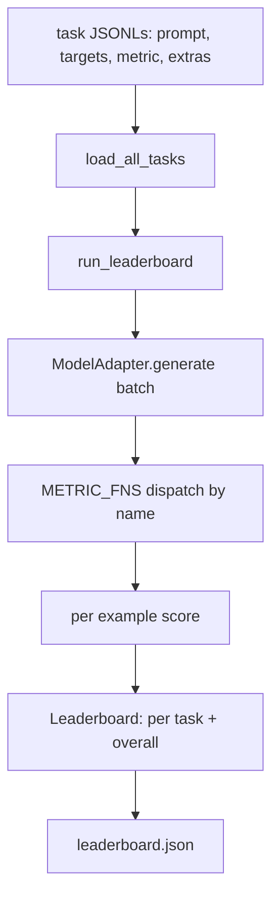
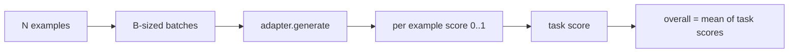

# Đánh giá Model ngôn ngữ Harness

> Một model làm tốt một nhiệm vụ mà bạn không thể xác định là một model làm tốt một cách tình cờ. harness là định nghĩa nhiệm vụ, số liệu, người chạy và bảng xếp hạng, trong một hình dạng ngắn, có thể hoán đổi.

**Loại:** Xây dựng
**Ngôn ngữ:** Python
**Kiến thức tiên quyết:** Giai đoạn 19 bài học 42 đến 45
**Thời lượng:** ~90 phút

## Mục tiêu học tập

- Xác định tác vụ dưới dạng tệp JSONL với `prompt`, `targets`, `metric` và `extras` tùy chọn cho mỗi ví dụ.
- Triển khai năm chỉ số: đối sánh chính xác, rouge-l F1, kiểm tra thực thi, trắc nghiệm và chứa chuỗi con.
- Xây dựng một trình chạy batches ví dụ cho mỗi tác vụ và gửi đến bộ điều hợp model có thể hoán đổi.
- Phát ra JSON bảng xếp hạng với điểm số cho mỗi nhiệm vụ, độ trễ và mức trung bình tổng thể có thể tái tạo.

## Vấn đề

Một ngôn ngữ mới model cập bến mỗi tuần. Tuyên bố tiếp thị là nó hoạt động tốt. Câu hỏi trung thực là: à ở cái gì? Câu trả lời trung thực là bảng xếp hạng mà bạn tự viết, bởi vì bảng xếp hạng của nhà cung cấp là bảng xếp hạng mà họ đã điều chỉnh.

Không có harness trong repo bạn so sánh hai models bằng rung cảm. Với một harness, bạn so sánh chúng theo điểm số trên một bộ nhiệm vụ cố định với một số liệu cố định, trên đầu ra JSON bạn có thể khác biệt. harness là hợp đồng giữa lần chạy ngày hôm qua và lần chạy hôm nay. Nếu không có nó, hồi quy ship.

Bẫy đang lắp quá mức harness vào một model duy nhất. Sửa lỗi là cùng một cái bẫy ngược lại: harness đủ nhỏ để đọc trong mười lăm phút, các tác vụ đủ nhỏ để ship trong repo, các số liệu được viết từ đầu để đồng nghiệp có thể kiểm tra chúng và bộ điều hợp là nơi duy nhất tồn tại model mã cụ thể. Hoán đổi bộ điều hợp, bảng xếp hạng di chuyển; hoán đổi nhiệm vụ, bảng xếp hạng di chuyển. Không có gì khác nên di chuyển.

## Khái niệm



### Thông số kỹ thuật nhiệm vụ

Mỗi ví dụ là một dòng JSONL:

```json
{"id": "arith-00", "prompt": "compute: 2 + 2", "targets": ["4"], "metric": "exact_match"}
```

Đối với các chỉ số cần người trợ giúp tính điểm, `extras` mang payload phụ:

```json
{
  "id": "code-00",
  "prompt": "python: write a function f that doubles its input",
  "targets": ["ok"],
  "metric": "code_exec",
  "extras": {"io_pairs": [[1, 2], [3, 6]]}
}
```

Nhiệm vụ là một tệp `.jsonl` trong `outputs/tasks/`. Tên tệp là tên tác vụ. Tất cả các ví dụ trong tệp đều chia sẻ một chỉ số.

### Năm nhiệm vụ cố định

| Nhiệm vụ | Số liệu | Những gì nó kiểm tra |
|------|--------|---------------|
| số học | exact_match | Độ đúng ở cấp độ Token trên một câu trả lời xác định |
| Tóm tắt | rouge_l | Dãy con phổ biến dài nhất F1 so với tóm tắt tham chiếu một dòng |
| code-exec | code_exec | Kiểm tra thực thi: hàm dự đoán phải thỏa mãn danh sách các cặp đầu vào-đầu ra |
| trắc nghiệm | multiple_choice | Chữ cái đầu tiên của dự đoán phải khớp với chữ cái được phép |
| Thế hệ | substring_contains | Văn bản dạng tự do phải chứa ít nhất một chuỗi con mục tiêu |

### Hợp đồng hệ mét

Mỗi số liệu là một hàm từ `(prediction, targets, extras) -> float in [0.0, 1.0]`. harness tính trung bình điểm cho mỗi ví dụ để có điểm nhiệm vụ, sau đó tính trung bình điểm nhiệm vụ để có được tổng thể. Các hàm số liệu rất nhỏ:

- `exact_match`: chữ thường, thu gọn khoảng trắng, bình đẳng.
- `substring_contains`: cùng chuẩn hóa, kiểm tra chuỗi con.
- `multiple_choice`: ký tự đầu tiên được viết hoa.
- `rouge_l`: Độ dài LCS chia cho độ dài dự đoán và tham chiếu, F1 precision và recall.
- `code_exec`: thực hiện dự đoán trong một không gian tên hạn chế, gọi `f(x)` trên mọi cặp đầu vào-đầu ra, đếm kết quả khớp.

Chỉ số code_exec chạy dự đoán trong không gian tên tích hợp bị tước bỏ. Bài kiểm tra khẳng định rằng `import os` bùng nổ vì `os` không có trong không gian tên; Bạn không thể truy cập hệ thống tệp từ dự đoán mã.

### Bộ chuyển đổi model

```python
class ModelAdapter(Protocol):
    def generate(self, prompts: Sequence[str]) -> List[str]: ...
    @property
    def name(self) -> str: ...
```

Bộ chuyển đổi là đường may. Bài học ships `ToyAdapter`, một công cụ khớp mẫu xác định trả về câu trả lời đúng cho mọi prompt trong năm nhiệm vụ cố định. Một adapter thực gọi model và trả về đầu ra của nó. Người harness không quan tâm cái nào.

### Người chạy

`run_task` batches `batch_size` prompts tại một thời điểm và gửi đến hàm hệ mét. `run_leaderboard` thực hiện mọi nhiệm vụ và trung bình. `write_leaderboard` phát ra JSON với một chuỗi schema để các thay đổi định dạng trong tương lai không âm thầm phá vỡ bảng thông tin.



```figure
eval-harness-matrix
```

## Tự xây dựng

`code/main.py` là artifact có thể chạy được.

### Bước 1: nhiệm vụ cố định hạt giống

`seed_fixture_tasks(target_dir)` ghi năm tệp `.jsonl`. Lần chạy đầu tiên của `main.py` sẽ gieo hạt chúng khi thư mục trống.

### Bước 2: tải tác vụ

`load_all_tasks(task_dir)` đọc mọi `.jsonl` và trả về một dict từ tên tác vụ vào danh sách các bản ghi `Example`. Dòng nhận xét bắt đầu bằng `#` và dòng trống sẽ bị bỏ qua để người đóng góp có thể chú thích tệp.

### Bước 3: triển khai chỉ số

Mỗi chỉ số là một hàm nhỏ với một đơn vị kiểm tra. Bộ kiểm tra của bài học bao gồm 13 trường hợp bao gồm chuẩn hóa, chồng chéo một phần, thực thi mã và từ chối mã không an toàn.

### Bước 4: viết người chạy

`run_task` lặp lại batches và tạo ra một `TaskResult` với điểm số, số lượng chính xác, tổng số và độ trễ. `run_leaderboard` thực hiện tất cả các nhiệm vụ và tạo ra một `Leaderboard` với mức trung bình tổng thể.

### Bước 5: phát ra JSON

`write_leaderboard` tuần tự hóa bảng. Cờ `--include-per-example` kết xuất các bản ghi cho mỗi ví dụ để bạn có thể phân biệt dự đoán so với lần chạy trước đó khi điểm số di chuyển.

Chạy nó:

```bash
python3 code/main.py
```

Người script gieo hạt các đồ đạc trong lần chạy đầu tiên, ghi điểm chúng bằng bộ chuyển đổi đồ chơi (giúp mọi vật cố định đúng) và viết `outputs/leaderboard.json`. Điểm tổng thể là 1.0 với bộ chuyển đổi đồ chơi; Kiểm tra bộ điều hợp sơ khai trong `test_main.py` cho thấy cùng một harness tạo ra 0.0 khi bộ điều hợp không thể trả lời.

## Ứng dụng

Để cắm một model thật, hãy viết một bộ chuyển đổi. Hình dạng:

```python
class HttpAdapter:
    name = "vendor.v1"

    def __init__(self, endpoint, api_key):
        self.endpoint = endpoint
        self.api_key = api_key

    def generate(self, prompts):
        out = []
        for prompt in prompts:
            response = http_post(self.endpoint, prompt, self.api_key)
            out.append(response["text"])
        return out
```

Hoán đổi `ToyAdapter` lấy `HttpAdapter` ở đầu `main()`. harness, nhiệm vụ, số liệu và bảng xếp hạng vẫn giữ nguyên.

Ba mẫu cần thực thi khi shipping harness trong một dự án thực tế:

- **Ghim các tệp nhiệm vụ.** Bảng xếp hạng. json mang nội dung tác vụ được ghim băm hoặc mang JSONL đi cùng; nếu không, điểm số sẽ di chuyển khi tệp tác vụ di chuyển và bạn không thể biết cái nào.
- **Dự đoán chênh lệch, không chỉ là điểm số.** Cờ `--include-per-example` cho phép bạn xem những gì model nói vào ngày tỷ số giảm.
- **Giới hạn kích thước batch.** Bộ điều hợp thực có rate limits. Kích thước batch nhỏ giúp harness tương thích giữa các nhà cung cấp.

## Sản phẩm bàn giao

`outputs/skill-lm-eval-harness.md` mang công thức: thông số kỹ thuật tác vụ JSONL, năm chỉ số, bộ chuyển đổi có thể hoán đổi, người chạy hàng loạt, bảng xếp hạng JSON với schema chuỗi. Các tệp nhiệm vụ trong `outputs/tasks/` là đồ đạc; Sao chép chúng vào một dự án thực sự khi mới bắt đầu.

## Bài tập

1. Thêm nhiệm vụ thứ sáu với số liệu tùy chỉnh mà bạn viết từ đầu (chồng chéo giống như BLEU, chấm điểm tham chiếu giống BLEURT, bất kỳ thứ gì có hợp đồng rõ ràng).
2. Mở rộng `code_exec` để bắt stdout và chấp nhận danh sách các stdout dự kiến làm mục tiêu.
3. Thêm lệnh khác biệt trên bảng xếp hạng: cho hai tệp `leaderboard.json`, hãy in nhiệm vụ nào đã di chuyển và bao nhiêu.
4. Độ trễ giới hạn cho mỗi ví dụ. Bao bọc cuộc gọi bộ điều hợp trong một timeout; Hiển thị một cột `timeouts` riêng biệt trong bảng xếp hạng.
5. Ghim nội dung nhiệm vụ bằng sha256 trong bảng xếp hạng để người đọc trong tương lai có thể xác minh rằng họ đã chấm điểm cùng một nhiệm vụ.

## Thuật ngữ chính

| Thuật ngữ | Những gì mọi người nói | Ý nghĩa thực sự của nó |
|------|-----------------|------------------------|
| Thông số kỹ thuật nhiệm vụ | "Định dạng đánh giá" | JSONL tệp có prompt, mục tiêu, chỉ số, các tính năng bổ sung tùy chọn cho mỗi ví dụ |
| Số liệu | "Cách bạn ghi bàn" | Hàm từ (dự đoán, mục tiêu, bổ sung) đến float trong [0, 1] |
| Bộ chuyển đổi | "Khách hàng model" | Đối tượng với phương thức generate(prompts) -> list[str]; Mã dành riêng cho model duy nhất |
| Bảng xếp hạng | "Bảng điểm" | JSON với điểm số cho mỗi nhiệm vụ, tổng số lượng, độ trễ và mức trung bình tổng thể |
| Chỉ số điều hành mã | "Chạy nó và kiểm tra" | Thực hiện dự đoán trong một không gian tên hạn chế, so sánh với các cặp đầu vào-đầu ra |

## Đọc thêm

- Lm-evaluation-harness ban đầu để tham khảo production, lớn hơn nhiều nhưng có cùng hình dạng.
- Lighteval của HuggingFace cho một triển khai thay thế của cùng một hợp đồng.
- Giai đoạn 19 bài 46 bao gồm các mô hình tích lũy gradient được sử dụng trong training stack điểm harness.
- Giai đoạn 19 bài học 47 bao gồm định dạng checkpoint mà bạn ghi điểm; Ghim hàm băm checkpoint vào bảng xếp hạng.
- Giai đoạn 19 bài 48 bao gồm các training stack phân tán đã tạo ra model được thử nghiệm.
