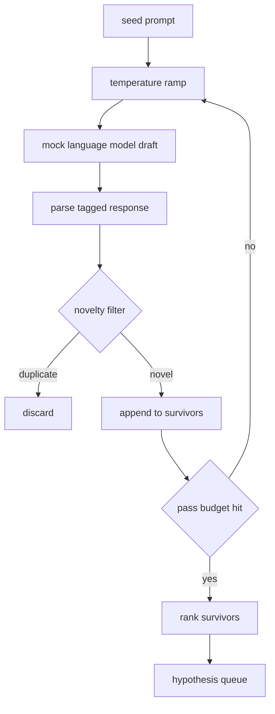

# Trình tạo giả thuyết

> Một agent nghiên cứu hỏi cùng một câu hỏi hai lần là lãng phí tokens. Bí quyết là buộc mỗi bản nháp hạ cánh ở một nơi nào đó mới.

**Loại:** Xây dựng
**Ngôn ngữ:** Python
**Kiến thức tiên quyết:** Giai đoạn 19 Bài học theo dõi A 20-29
**Thời lượng:** ~90 phút

## Mục tiêu học tập
- Lái bộ lấy mẫu từ prompt hạt giống và biến đầu ra của nó thành bản ghi giả thuyết được nhập.
- Ramp bộ lấy mẫu temperature trên mỗi lần vượt qua để bản nháp tiếp theo trôi xa hơn bản nháp cuối cùng.
- Lọc gần các bản sao với embedding model nhỏ và ngưỡng khoảng cách cosin.
- Xếp hạng những người sống sót bằng chức năng tính điểm kết hợp giữa tính mới lạ, tính cụ thể và khả năng kiểm tra.
- Giữ mọi bước xác định để cùng một hạt giống luôn tạo ra cùng một hàng đợi.

## Tại sao tạo, sau đó lọc

Một nhà lập kế hoạch hỏi một model một lần sẽ có một giả thuyết. Điều đó là tốt cho một ví dụ đã được thực hiện. Đối với một vòng lặp nghiên cứu, nó có hình dạng sai. Vòng lặp muốn một hàng xếp hạng có chiều sâu, vì vậy khi giả thuyết đầu tiên thất bại, người chạy đã chuẩn bị sẵn giả thuyết tiếp theo mà không phải trả tiền cho một đường chuyền sampling đầy đủ khác.

Hai ý tưởng kết hợp để tạo ra hàng đợi đó. Đầu tiên là tăng temperature: mỗi lần đi qua bộ lấy mẫu sẽ nâng temperature lên một bậc, vì vậy các bản nháp sau này được khuyến khích đi lang thang. Thứ hai là lọc tính mới: sau mỗi bản nháp, máy phát điện đo khoảng cách embedding từ mọi người sống sót prior và loại bỏ bất kỳ thứ gì bên trong cụm.

Bài học ships một model ngôn ngữ giả trả về các chuỗi token theo kịch bản cho các prompts cố định. Mô phỏng là đủ để thực hiện toàn bộ đường dẫn: prompt hạt giống, temperature đường dốc được áp dụng, các ứng cử viên được phân tích cú pháp, chạy bộ lọc mới, xếp hạng hàng đợi.

## Hình dạng giả thuyết

```text
Hypothesis
  id             : int           (monotonic within a run)
  text           : str           (the claim)
  variables      : list[str]     (what changes between conditions)
  metric         : str           (what the runner will measure)
  baseline_ref   : str | None    (which paper or run the comparison cites)
  draft_pass     : int           (which sampler pass produced this)
  temperature    : float         (the sampler setting at draft time)
  novelty_score  : float         (distance from prior survivors, 0..1)
  rank_score     : float         (weighted sum used for ordering)
```

`variables` và `metric` không phải là văn bản tự do. Trình phân tích cú pháp kéo chúng từ một phản hồi được gắn thẻ. Người chạy trong bài năm mươi hai đọc các trường này trực tiếp khi nó xây dựng config thí nghiệm.

`baseline_ref` là tùy chọn nhưng được khuyến khích. Người đánh giá trong bài năm mươi ba cần một đường cơ sở để so sánh. Nếu giả thuyết bỏ qua một, người đánh giá sẽ quay trở lại lần chạy trước đó trên cùng một chỉ số.

## Kiến trúc



Vòng lặp là thẳng về phía trước. Phần thú vị là mỗi hộp đều có một hợp đồng cứng.

## Temperature đường dốc

Bắt đầu từ `t_min`, kết thúc ở `t_max`, bước `(t_max - t_min) / (n_passes - 1)`. Mỗi lần vượt qua gọi bộ lấy mẫu ở temperature hiện tại, tạo ra `n_passes` giá trị cách đều từ `GeneratorConfig.schedule()`. Mô phỏng model tôn vinh temperature bằng cách chuyển đổi giữa một tập hợp nhỏ các câu trả lời theo kịch bản được khóa trên `(prompt, temp_bucket)`. Các xô là khoảng thời gian mở, vì vậy một thay đổi nhỏ trong temperature sẽ chọn một xô khác và tạo ra một bản nháp khác. Trong production bộ lấy mẫu sẽ là một model thực sự với `temperature=t` đi qua.

Lịch trình mặc định là sáu lần từ `0.2` đến `1.2`. Sáu là đủ để lấp đầy hàng đợi mà không phải trả tiền cho các mẫu mà bộ lọc mới lạ sẽ từ chối. Bên dưới `0.2` model vẹt vẹt hạt trở lại. Ở trên `1.2` các câu trả lời có xu hướng trôi dạt khỏi chủ đề và làm hỏng trình phân tích cú pháp.

## Bộ lọc mới lạ

Sau khi mỗi bản nháp được phân tích cú pháp, trình tạo sẽ nhúng văn bản và so sánh với mọi giả thuyết được chấp nhận. embedding là một túi băm nhỏ chứa tokens từ, được chuẩn hóa theo độ dài đơn vị. Khoảng cách cosin giữa hai đơn vị vectors là `1 - dot(a, b)`. Một mớn nước được thông qua nếu khoảng cách tối thiểu của nó đến bất kỳ người sống sót nào prior trên `novelty_threshold`. Mặc định là `0.25`.

embedding băm không lạ mắt. Nó là xác định, không có phụ thuộc, và đủ để nắm bắt trường hợp hiển nhiên: hai bản nháp chia sẻ hầu hết danh từ của chúng. Một triển khai production sẽ hoán đổi trong một câu nhỏ model. Giao diện vẫn giữ nguyên.

## Điểm xếp hạng

```text
rank_score = w_novelty * novelty_score
           + w_specificity * specificity_score
           + w_testability * testability_score
```

Ba điểm phụ. `novelty_score` là khoảng cách embedding tối thiểu từ prior người sống sót. `specificity_score` là số lượng các biến cụ thể trong giả thuyết chia cho số lượng mục tiêu. `testability_score` là một nếu giả thuyết chỉ định cả số liệu và đường cơ sở, một nửa nếu nó chỉ có số liệu, nếu không thì không.

Trọng số mặc định là `0.4`, `0.3` `0.3`. Các trọng số nằm trong trình tạo config vì vậy một bài học xuôi dòng có thể thay đổi chúng mà không cần phân nhánh mã.

## Ngôn ngữ giả model

```python
class MockLLM:
    def sample(self, prompt: str, temperature: float, seed: int) -> str:
        ...
```

Bộ lấy mẫu là xác định cho một `(prompt, temperature, seed)` ba. Mô phỏng giữ một bảng phản hồi theo kịch bản được khóa trên `(prompt_signature, temperature_bucket)`. Nếu bảng không có mục nhập cho khóa, bộ lấy mẫu sẽ trả về dự phòng mà trình phân tích cú pháp không thành công. Đường dẫn dự phòng được thực hiện bởi một trong các bài kiểm tra.

Hạt giống được trộn vào phản ứng để cùng một cặp `(prompt, temperature)` với các hạt khác nhau tạo ra các bản nháp khác nhau. Trong các thử nghiệm, chúng tôi ghim hạt giống để giữ cho kết quả có thể tái tạo. Trong một triển khai thực tế, hạt giống sẽ đến từ đồng hồ hệ thống hoặc bộ đếm.

## Hàng đợi đầu ra

Đầu ra là danh sách các bản ghi `Hypothesis` được sắp xếp theo `rank_score` giảm dần. Người chạy trong bài năm mươi hai bật đầu, chạy thí nghiệm, và người đánh giá trong bài năm mươi ba viết lại một phán quyết. Nếu phán quyết nói giả thuyết là sai, người chạy sẽ bật giả thuyết tiếp theo.

Hàng đợi là hữu hạn. Khi nó trống, người điều phối có thể mở rộng prompt hạt giống và chạy lại máy phát điện hoặc dừng lại và báo cáo ngân sách đã cạn kiệt.

## Cách đọc mã

`code/main.py` định nghĩa `Hypothesis`, `MockLLM`, `HypothesisGenerator` và một bản demo xác định. Trình tạo hiển thị một phương thức `run(seed_prompt)` duy nhất trả về một hàng đợi đã sắp xếp; Số lần vượt qua được đọc từ `GeneratorConfig.n_passes` chứ không phải được truyền dưới dạng đối số. embedding là một túi băm tokens. Bộ lọc mới lạ là một chức năng duy nhất. Điểm xếp hạng là một hàm duy nhất. Không có gì phụ thuộc vào `numpy`; Toán embedding là stdlib thuần túy nên bài học vẫn có thể di chuyển.

`code/tests/test_generator.py` bao gồm đường dẫn tuyến tính, đường dẫn từ chối trùng lặp, đường dẫn lỗi trình phân tích cú pháp, ranh giới đường dốc temperature và thứ tự xếp hạng.

## Vị trí này

Bài học năm mươi tạo ra hàng đợi. Bài học năm mươi mốt đứng đầu hàng đợi và thực hiện một cuộc tìm kiếm tài liệu để xác nhận hoặc bác bỏ nó. Bài năm mươi hai lấy cùng một cái đầu và chạy một thí nghiệm thực tế. Bài năm mươi ba đọc cả hai đầu ra và viết một phán quyết. Bốn bài học tạo thành một vòng lặp nghiên cứu không có con người trong đó; Một con người có thể bước vào bất kỳ ranh giới nào.
