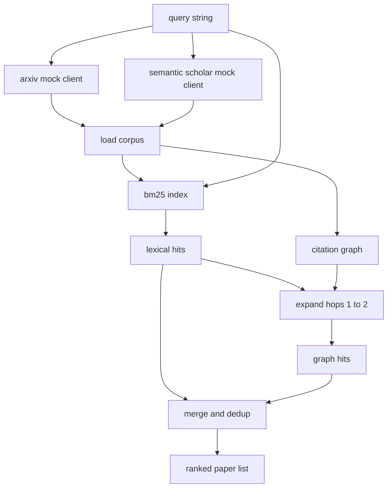

# Truy xuất tài liệu

> Một giả thuyết là rẻ. Biết liệu ai đó đã chứng minh được điều đó hay không là phần tốn kém. Xây dựng lớp truy xuất trả lời câu hỏi đó trước khi người chạy quay sandbox.

**Loại:** Xây dựng
**Ngôn ngữ:** Python
**Kiến thức tiên quyết:** Giai đoạn 19 Bài học theo dõi A 20-29
**Thời lượng:** ~90 phút

## Mục tiêu học tập
- Model một bản ghi giấy nhỏ với các trường vòng lặp sẽ đọc xuôi dòng.
- Xây dựng chỉ mục BM25 trên các bản tóm tắt chỉ với cấu trúc dữ liệu stdlib.
- Đi bộ một biểu đồ trích dẫn để hiển thị các bài báo mà tìm kiếm từ vựng đã bỏ lỡ.
- Các lần truy cập không trùng lặp trên từ vựng và đồ thị đi qua id giấy ổn định.
- Bao bọc hai APIs bên ngoài giả phía sau một máy khách duy nhất để trang web cuộc gọi ngược dòng vẫn giữ nguyên khi endpoints thực hạ cánh.

## Tại sao lại có hai thẻ truy xuất

Tìm kiếm từ khóa trên tóm tắt trả về các bài báo chia sẻ từ vựng với truy vấn. Điều đó bao phủ hầu hết bề mặt. Nó bỏ lỡ hai trường hợp. Đầu tiên là khi bài viết nền tảng sử dụng các từ vựng khác nhau; Ví dụ: một truy vấn cho "attention thưa thớt" bỏ lỡ một bài báo có tiêu đề "Lựa chọn khối trong định tuyến transformer". Thứ hai là khi bài báo liên quan là một bài báo tiếp theo trích dẫn một mỏ neo đã biết; Tìm mỏ neo và đi về phía trước sẽ hiệu quả hơn là dùng vũ lực vào hồ bơi trừu tượng.

Bài học xây dựng cả hai đường chuyền. BM25 trên các bản tóm tắt bắt được các lượt truy cập từ vựng. Biểu đồ trích dẫn duyệt mở rộng một hạt giống tiến và lùi một hoặc hai bước nhảy. Liên minh được loại bỏ trùng lặp bằng id giấy và được xếp hạng theo một điểm tổng hợp nhỏ.

## Hình dạng giấy

```text
Paper
  id          : str           (stable identifier, "p001" for the mock corpus)
  title       : str
  abstract    : str
  year        : int
  authors     : list[str]
  references  : list[str]     (paper ids this paper cites)
  citations   : list[str]     (paper ids that cite this paper)
  source      : str           (which mock api supplied it, "arxiv" or "s2")
```

Các trường tham khảo và trích dẫn tạo thành biểu đồ trích dẫn có hướng. Hai mô phỏng APIs trả về các trường chồng chéo nhưng không giống hệt nhau, vì vậy người nạp kho dữ liệu liên kết chúng trên `id`.

## Kiến trúc



Máy khách truy xuất sở hữu cả thẻ và merge. Người gọi đưa cho nó một truy vấn và nhận lại một danh sách xếp hạng trong đó mỗi mục mang các trường điểm trên mỗi giấy (`bm25_score`, `graph_distance`, `recency_score`, `final_score`) giải thích xếp hạng.

## BM25 từ đầu

Việc triển khai là Okapi BM25 tiêu chuẩn với parameters `k1=1.5` mặc định, `b=0.75`. Mục lục là hai từ điển: `term -> doc_frequency` và `term -> list of (doc_id, term_count)`. Độ dài tài liệu là số lượng token của bản tóm tắt. Độ dài tài liệu trung bình được tính một lần tại thời điểm xây dựng chỉ mục. Chấm điểm một truy vấn là tổng trên các thuật ngữ truy vấn của `idf * tf_norm` trong đó `tf_norm` là tần số thuật ngữ chuẩn hóa độ dài BM25 tiêu chuẩn.

Tokeniser được `lower` sau đó được tách ra trên các chữ và số không phải là chữ và số. Nó không có gốc. Một hệ thống production sẽ hoán đổi trong một thân nhỏ. Giao diện vẫn giữ nguyên.

```text
idf(t)      = log((N - df + 0.5) / (df + 0.5) + 1.0)
tf_norm(t)  = (f * (k1 + 1)) / (f + k1 * (1 - b + b * dl / avgdl))
score(d, q) = sum over t in q of idf(t) * tf_norm(t)
```

## Duyệt biểu đồ trích dẫn

Biểu đồ được xây dựng một lần từ kho dữ liệu. Các cạnh phía trước đi từ một bài báo đến các tài liệu tham khảo của nó. Các cạnh ngược đi từ một bài báo đến các trích dẫn của nó. Chuyến đi là một tìm kiếm đầu tiên được gieo hạt bởi các bản hit BM25 hàng đầu, giới hạn ở hai bước nhảy.

Hai bước nhảy là một trần có chủ ý. Một bước nhảy quá nông; agent thường muốn tổ tiên hoặc hậu duệ trực tiếp. Ba bước nhảy làm tăng kích thước kết quả trên một biểu đồ được kết nối và có xu hướng trôi ra khỏi chủ đề. Bài học cho thấy giới hạn bước nhảy dưới dạng núm config để một vòng xuôi dòng có thể thắt chặt nó.

## Dedup và xếp hạng

Hai đường chuyền trả về các bộ chồng chéo. Các phím merge trên id giấy. Đối với mỗi bài báo, điểm cuối cùng là một hỗn hợp có trọng số.

```text
final_score = w_bm25 * bm25_score_norm
            + w_graph * graph_score
            + w_recency * recency_score
```

`bm25_score_norm` là điểm BM25 chia cho điểm BM25 tối đa trong bộ merged (vì vậy trường nằm trong 0 đến một). `graph_score` là một cho các lần truy cập từ vựng trực tiếp, sau đó `0.6` cho một bước nhảy, `0.3` cho hai bước nhảy, nếu không thì không. `recency_score` là một đoạn đường dốc tuyến tính từ không ở năm tối thiểu của kho dữ liệu đến một ở mức tối đa.

Trọng số mặc định là `0.5`, `0.3` `0.2`. Trọng lượng config; Một chủ đề cũ có thể điều chỉnh thời gian gần đây trong khi một chủ đề chuyển động nhanh sẽ nâng cao nó.

## Kho dữ liệu giả

Kho dữ liệu là một trăm bài báo, được tạo ra bởi `build_corpus()`. Mỗi bài báo có một tiêu đề viết tay và tóm tắt về một trong năm chủ đề: attention thưa thớt, tăng cường truy xuất, bộ điều hợp cấp thấp, dataset distillation và harnesses đánh giá. Tài liệu tham khảo và trích dẫn được kết nối để mỗi chủ đề tạo thành một biểu đồ phụ được kết nối với một vài cạnh chủ đề.

Hai máy khách API giả (`ArxivMockClient`, `SemanticScholarMockClient`) đọc từ cùng một kho dữ liệu nhưng hiển thị các trường khác nhau. Arxiv trả về tiêu đề, tóm tắt, năm, tác giả. Semantic Scholar thêm tài liệu tham khảo và trích dẫn. Các công đoàn khách hàng truy xuất trên id; Xử lý bất đồng trong lĩnh vực khách hàng chéo được hoãn lại cho một bài học tiếp theo.

## Bài 52 và 53 đọc những bài nào

Người chạy trong bài năm mươi hai đọc `paper.id`, `paper.title` và ba câu trên cùng của bản tóm tắt làm bối cảnh cho thí nghiệm. Người đánh giá trong bài năm mươi ba đọc `paper.year` và `paper.references` để quy một đường cơ sở cho một bài báo cụ thể.

Ứng dụng truy xuất trả về một `RetrievalResult` với cả danh sách được xếp hạng và chỉ số cho mỗi truy vấn: số lần truy cập, điểm trung bình, điểm cao nhất, tổng thời gian truy cập. Người chạy ghi lại những điều này để observability xuống hạ lưu có thể vẽ chất lượng theo thời gian.

## Cách đọc mã

`code/main.py` định nghĩa `Paper`, `ArxivMockClient`, `SemanticScholarMockClient`, `BM25Index`, `CitationGraph`, `RetrievalClient` và bản demo xác định. Các ứng dụng giả và kho dữ liệu nằm trong cùng một tệp nên bài học vẫn có thể di chuyển. Việc triển khai BM25 là một class, sáu mươi dòng. Duyệt đồ thị là một phương pháp.

`code/tests/test_retrieval.py` bao gồm đường dẫn từ vựng, đường dẫn đồ thị, merge, loại bỏ và truy vấn trống.

## Vị trí này

Bài năm mươi tạo ra một giả thuyết. Bài năm mươi mốt tìm kiếm tài liệu để xem giả thuyết đó đã được giải quyết chưa. Bài năm mươi hai chạy thí nghiệm nếu không. Bài năm mươi ba đọc cả kết quả truy xuất và số liệu thí nghiệm để viết phán quyết. Máy khách truy xuất là rẻ nhất trong bốn giai đoạn và chạy đầu tiên trong trình điều phối.
