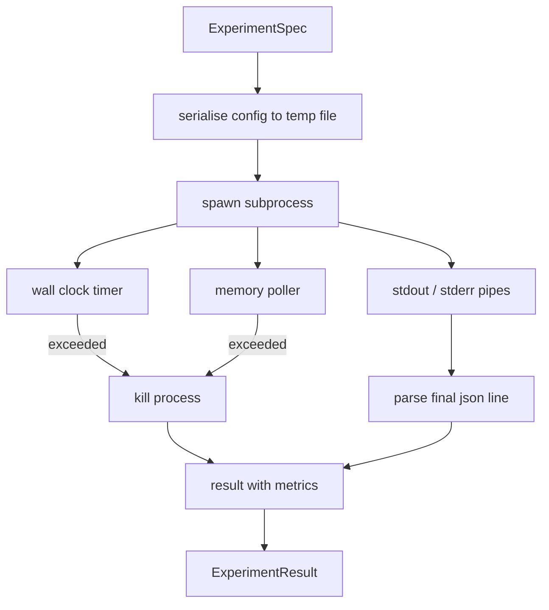

# Người chạy thử nghiệm

> Vòng lặp chỉ trung thực như các phép đo của nó. Xây dựng trình chạy lấy một thông số kỹ thuật, thực thi nó trong một quy trình con sandbox và phát ra một blob chỉ số json mà người đánh giá có thể tin tưởng.

**Loại:** Xây dựng
**Ngôn ngữ:** Python
**Kiến thức tiên quyết:** Giai đoạn 19 Bài học theo dõi A 20-29
**Thời lượng:** ~90 phút

## Mục tiêu học tập
- Mã hóa thử nghiệm dưới dạng thông số kỹ thuật được nhập mà trình chạy có thể tuần tự hóa thành một quy trình con.
- Khởi chạy một quy trình con với timeout đồng hồ treo tường cứng và nắp bộ nhớ mềm, đồng thời hiển thị cả hai dưới dạng điều kiện đầu cuối.
- Nắm bắt stdout, stderr và blob chỉ số có cấu trúc thành một bản ghi kết quả duy nhất.
- Xây dựng một bàn cắt bỏ quét từng núm configuration trên một thông số cơ sở cố định.
- Giữ mọi kết quả xác định cho một hạt giống để người đánh giá nhìn thấy các con số giống nhau qua các lần chạy.

## Tại sao lại là một quy trình con

Một vòng lặp nghiên cứu chạy mã không đáng tin cậy. Giả thuyết đến từ một người lấy mẫu, thí nghiệm script đến từ cùng một con đường; coi một trong hai là an toàn trong process là yêu cầu một sự cố khiến người điều phối sụp đổ. Các quá trình con là cách ly đơn giản nhất mà ngôn ngữ ships: một process riêng biệt, một không gian địa chỉ độc lập, một tay cầm tín hiệu ở phía mẹ.

Người chạy ở đây không thực hiện sandbox đầy đủ. Không có cgroup, không có bộ lọc seccomp, không có ánh xạ lại không gian tên. Những gì nó có là một timeout đồng hồ treo tường, một vòng lặp thăm dò để tăng trưởng bộ nhớ và một đường dẫn tiêu diệt kết thúc process trên một trong hai giới hạn. Đó là hợp đồng runtime mà mỗi sandbox phức tạp hơn gia hạn. Bài học giữ cho hợp đồng đủ nhỏ để đọc trong một lần ngồi.

## Hình dạng ExperimentSpec

```text
ExperimentSpec
  spec_id        : str            (stable id, "exp_001")
  hypothesis_id  : int            (link back to the queue from lesson 50)
  script_path    : str            (path to the python script to run)
  config         : dict           (passed to the script as one json arg)
  seed           : int            (deterministic seed for the experiment)
  wall_timeout_s : float          (hard timeout, killed on exceed)
  memory_cap_mb  : int            (soft cap, polled; killed on exceed)
  metric_keys    : list[str]      (which fields the evaluator will read)
```

script sống trên đĩa; Người chạy ghi config vào đường dẫn tệp tạm thời mà script đọc. script dự kiến sẽ in một dòng json duy nhất trên stdout có các phím là một tập hợp `metric_keys`. Bất kỳ thứ gì khác trên stdout đều bị thu thập nhưng bị bỏ qua bởi trình phân tích cú pháp số liệu.

## Kiến trúc



Người chạy là một class với một phương pháp chính. Trình thăm dò ý kiến là một thread nhỏ thức dậy một lần mỗi khoảng thời gian thăm dò và đọc quy trình con `psutil` tương đương từ hệ thống tệp proc khi có sẵn, quay trở lại không hoạt động khi nền tảng không hiển thị nó.

## Tại sao lại có giới hạn bộ nhớ mềm

Giới hạn bộ nhớ cứng cần `resource.setrlimit` và chỉ hoạt động trên POSIX. Bài học ships một cách tiếp cận di động: thăm dò kích thước đặt cư dân từ nền tảng và giết quy trình con nếu nó vượt quá giới hạn. Nắp mềm vì poller có khoảng không phải không; Một process có thể tăng đột biến trên giới hạn giữa các cuộc thăm dò và sau đó giảm trở lại. Người chạy ghi lại RSS tối đa quan sát được để người đánh giá có thể thấy mức độ gần đến giới hạn.

Trên các hệ thống không có hỗ trợ kiểm tra process, người thăm dò ý kiến ghi lại cảnh báo một lần và tự vô hiệu hóa. Đồng hồ treo tường timeout vẫn được áp dụng. Các bài kiểm tra bài học bao gồm cả hai con đường.

## Chụp stdout và stderr

Người chạy đọc cả hai đường ống đã cạn kiệt khi hoàn thành. Stdout được quét từng dòng; Dòng cuối cùng phân tích cú pháp là json với tất cả các `metric_keys` cần thiết được lấy làm blob số liệu. Các dòng json trước đó được giữ trong kết quả dưới dạng `intermediate_metrics`; Người đánh giá có thể sử dụng chúng cho các đường cong học tập.

Stderr được ghi nguyên văn vào kết quả. Người chạy không bao giờ tăng mã thoát không phải bằng không; thay vào đó, nó ghi lại mã trong kết quả. Bất kỳ lối thoát nào không đều được dán nhãn `"crash"` ngay cả khi script các chỉ số được in, vì vậy người đánh giá coi các lần chạy một phần là lỗi theo mặc định.

## Bàn cắt bỏ

```python
def ablate(base: ExperimentSpec, knob: str, values: list[Any]) -> list[ExperimentSpec]:
    ...
```

Với thông số kỹ thuật cơ sở và tên núm, trình trợ giúp trả về một thông số kỹ thuật cho mỗi giá trị với `config[knob]` bị ghi đè. Mỗi thông số kỹ thuật có một `spec_id` dẫn xuất (`f"{base.spec_id}_{knob}_{value}"`). Người chạy ships một `AblationRunner` chạy chúng theo thứ tự và trả về một `AblationTable` được khóa bởi giá trị núm.

Tại sao lại có một núm tại một thời điểm. Quét giai thừa đầy đủ bùng nổ theo cấp số nhân và tạo ra kết quả mà người đánh giá không thể giải thích. Mỗi lần một núm tạo ra một trục sạch mà người đánh giá có thể vẽ biểu đồ. Bài học chỉ hỗ trợ quét nhiều núm dưới dạng cắt bỏ núm đơn lặp đi lặp lại, do người gọi soạn thảo.

## Quyết định luận

Mỗi thông số kỹ thuật đều mang một hạt giống. Người chạy chuyển tiếp hạt giống đến script thông qua config chính sách (`config["__seed"] = spec.seed`). Thử nghiệm giả scripts `code/experiments/` tôn vinh hạt giống và tạo ra các số liệu giống hệt nhau qua các lần chạy. Người đánh giá trong bài năm mươi ba phụ thuộc vào điều này; Nếu không có quyết định luận, "hồi quy" có thể là một khởi tạo ngẫu nhiên khác.

## Thí nghiệm giả script

Bài học ships một thí nghiệm script: `code/experiments/sparsity_experiment.py`. Nó là một script thực sự đọc tệp config của nó, mô phỏng một training nhỏ chạy với một đường chuyền ngẫu nhiên numpy và in một blob số liệu json. script tôn vinh một núm `sleep_s` để kiểm tra timeouts và một núm `allocate_mb` để kiểm tra bộ thăm dò bộ nhớ.

Mô phỏng không training bất cứ điều gì có thật. Nó là một phép tính số bắt chước hình dạng của một vòng lặp training: đường cong loss, perplexity cuối cùng, thời gian tường. Điểm mấu chốt của bài học là người chạy, không phải mô phỏng. Một thí nghiệm thực sự script sẽ import một model.

## Hình dạng kết quả

```text
ExperimentResult
  spec_id              : str
  hypothesis_id        : int
  exit_code            : int
  terminal             : "ok" | "timeout" | "oom" | "crash"
  wall_time_s          : float
  peak_rss_mb          : float | None
  metrics              : dict
  intermediate_metrics : list[dict]
  stdout_tail          : str
  stderr_tail          : str
```

Người đánh giá đọc `metrics` và `terminal` trước. Nếu thiết bị đầu cuối là bất cứ thứ gì khác ngoài `"ok"` thử nghiệm được tính là chạy không thành công và phán quyết của người đánh giá là tự động. Nếu không, các chỉ số sẽ được chuyển qua bài kiểm tra ý nghĩa.

## Cách đọc mã

`code/main.py` định nghĩa `ExperimentSpec`, `ExperimentResult`, `ExperimentRunner`, `AblationRunner` và một bản demo xác định. Quản lý quy trình con là một class. Công cụ thăm dò bộ nhớ là một thread nhỏ. Trình trợ giúp cắt bỏ là một chức năng duy nhất.

`code/experiments/sparsity_experiment.py` là thí nghiệm giả được sử dụng trong các thử nghiệm. Nó đọc đường dẫn tệp config của nó từ argv và ghi một dòng chỉ số json duy nhất khi hoàn thành.

`code/tests/test_runner.py` bao gồm đường dẫn thành công, đường dẫn timeout, đường dẫn sự cố, bảng cắt bỏ và kiểm tra tính xác định trong hai lần chạy.

## Vị trí này

Bài năm mươi tạo ra giả thuyết. Bài học năm mươi mốt lọc ra bất cứ điều gì mà tài liệu đã giải quyết. Bài học năm mươi hai chạy thí nghiệm cho những gì còn lại. Bài năm mươi ba đọc kết quả, chạy kiểm tra ý nghĩa và viết phán quyết mà người điều phối lưu trữ dựa trên id giả thuyết.
