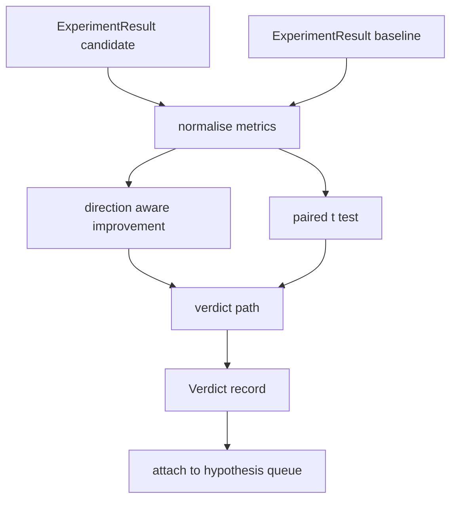

# Công cụ đánh giá kết quả

> Người chạy đã tạo ra các con số. Người đánh giá quyết định xem những con số đó là sự cải thiện, hồi quy hay nhiễu. Xây dựng lộ trình phán quyết biến các chỉ số thành một kết luận một dòng.

**Loại:** Xây dựng
**Ngôn ngữ:** Python
**Kiến thức tiên quyết:** Giai đoạn 19 Bài học theo dõi A 20-29
**Thời lượng:** ~90 phút

## Mục tiêu học tập
- So sánh một ứng cử viên chạy với đường cơ sở bằng cách sử dụng cải thiện nhận biết hướng và ngưỡng cố định.
- Chạy thử nghiệm t được ghép nối từ đầu trên mỗi chỉ số hạt giống và đọc giá trị p kết quả.
- Chuẩn hóa các chỉ số theo tỷ lệ nhật ký để báo cáo xuôi dòng có thể kết hợp chúng với các chỉ số tuyến tính.
- Phát ra phán quyết theo giả thuyết mà người điều phối có thể đính kèm vào hàng đợi từ bài năm mươi.
- Giữ cho mọi bước đều thuần khiết để các đầu vào giống nhau luôn tạo ra cùng một phán quyết.

## Tại sao nên sử dụng thử nghiệm ghép đôi

Một con số duy nhất từ người chạy không cho biết liệu sự thay đổi có thật hay không. Cùng một configuration với một hạt giống khác cho một perplexity khác nhau. Sự thay đổi có thể là nhiễu. So sánh đúng được ghép nối: cùng một hạt giống với cùng một dữ liệu, chạy một lần với ứng viên và một lần với đường cơ sở. Mỗi hạt giống đóng góp một sự khác biệt. Giá trị trung bình của những khác biệt đó là hiệu ứng. Sai số tiêu chuẩn của những khác biệt đó là sàn nhiễu.

Bài học thực hiện bài kiểm tra từ đầu. Không có `scipy.stats`. Toán học đủ nhỏ để đọc trong một màn hình.

```text
diffs    = [a_i - b_i for i in seeds]
mean     = sum(diffs) / n
variance = sum((d - mean) ** 2 for d in diffs) / (n - 1)
t_stat   = mean / sqrt(variance / n)
df       = n - 1
p_value  = two_sided_p(t_stat, df)
```

Giá trị p hai mặt sử dụng hàm beta không hoàn chỉnh được chính quy hóa. Bài học ships một triển khai nhỏ sử dụng phân số tiếp tục Lentz. Toàn bộ sự việc là sáu mươi dòng toán học stdlib.

## Cải thiện nhận biết hướng

Một số chỉ số được cải thiện khi chúng tăng lên (accuracy, thông lượng). Những người khác cải thiện khi họ đi xuống (loss, perplexity, thời gian tường). Người đánh giá mang một trường `direction` trên mỗi chỉ số.

```text
if direction == "higher_is_better":
    improvement = (candidate - baseline) / abs(baseline)
elif direction == "lower_is_better":
    improvement = (baseline - candidate) / abs(baseline)
```

Cải tiến được ký kết. Cải thiện tiêu cực trên chỉ số cao hơn là tốt hơn có nghĩa là ứng viên kém hơn. Đường dẫn phán quyết đọc dấu hiệu và độ lớn cùng nhau.

Ngưỡng cố định (`improvement_threshold=0.02`, hai phần trăm) quyết định liệu thay đổi có đủ lớn để gọi hay không. Dưới đó phán quyết là "nhiễu" bất kể giá trị p; Vòng lặp không quan tâm đến những thay đổi mà người dùng không thể đo lường.

## Kiến trúc



Người đánh giá chạy ba phép tính độc lập và kết hợp chúng trong đường dẫn phán quyết. Mỗi phép tính là một hàm thuần túy không có trạng thái chia sẻ.

## Chuẩn hóa nhật ký

Perplexity là theo cấp số nhân trong loss. Mức giảm 0,1 trong loss là mức giảm perplexity lớn hơn nhiều. So sánh perplexity trực tiếp trên hai cấu hình là tốt, nhưng kết hợp nó với các chỉ số tuyến tính trong một báo cáo duy nhất yêu cầu chuẩn hóa.

Bài học chuẩn hóa bất kỳ số liệu nào có trường `scale` được `"log"` bằng cách lấy nhật ký tự nhiên trước khi tính toán cải tiến. Ngưỡng sau đó được áp dụng trong log space. Mức giảm perplexity từ 32 xuống 28 là `log(28) - log(32) = -0.133` trên chỉ số thấp hơn là tốt hơn, cao hơn nhiều so với ngưỡng hai phần trăm.

```text
if scale == "log":
    a = log(candidate)
    b = log(baseline)
else:
    a = candidate
    b = baseline
```

Các chỉ số có `scale="linear"` (mặc định) bỏ qua quá trình chuyển đổi. Cùng một đường dẫn mã xử lý cả hai.

## Thử nghiệm ghép nối mỗi hạt giống

Người chạy từ bài học năm mươi hai phát ra một đốm màu số liệu cuối cùng mỗi lần chạy. Đối với bài kiểm tra ghép nối, người đánh giá cần một đốm màu cho mỗi hạt giống cho ứng cử viên và một đốm màu cho mỗi hạt giống cho đường cơ sở. Người điều phối chạy cùng một thí nghiệm dưới cả hai cấu hình trên một danh sách các hạt giống và đưa cho người đánh giá hai danh sách các bản ghi `ExperimentResult`.

Người đánh giá ghép chúng theo hạt giống (hạt giống sống trong `result.metrics["seed"]`) và đi theo số liệu được yêu cầu. Nếu các hạt giống không khớp giữa hai danh sách, người đánh giá sẽ đưa ra `PairingError`. Trình điều phối nên chạy lại.

## Hình dạng phán quyết

```text
Verdict
  hypothesis_id          : int
  metric                 : str
  direction              : "higher_is_better" | "lower_is_better"
  scale                  : "linear" | "log"
  candidate_mean         : float
  baseline_mean          : float
  improvement            : float       (signed, fraction; see direction rules)
  p_value                : float | None  (None if n < 2)
  significance_threshold : float
  improvement_threshold  : float
  verdict                : "improved" | "regressed" | "noise" | "failed"
  rationale              : str
```

Đường dẫn phán quyết là một bảng quyết định nhỏ:

```text
1. If any candidate result has terminal != "ok": verdict = "failed"
2. else if |improvement| < improvement_threshold:  verdict = "noise"
3. else if p_value is None or p_value > significance: verdict = "noise"
4. else if improvement > 0:                          verdict = "improved"
5. else:                                             verdict = "regressed"
```

Cơ sở lý luận là một câu mà con người có thể đọc được một dòng mà người điều phối có thể ghi lại dựa trên id giả thuyết.

## Cách đọc mã

`code/main.py` định nghĩa `MetricSpec`, `Verdict`, `Evaluator`, thống kê t và trình trợ giúp beta không đầy đủ, và một bản demo xác định. Bài kiểm tra t được thực hiện trong toán học stdlib thuần túy; numpy chỉ được sử dụng để đọc danh sách chỉ số và tính toán phương tiện và phương sai.

`code/tests/test_evaluator.py` bao gồm đường dẫn được cải thiện, đường dẫn hồi quy, đường dẫn nhiễu (cải thiện nhỏ), đường dẫn nhiễu (n thấp), đường dẫn đầu cuối bị lỗi, đường dẫn chuẩn hóa nhật ký, kiểm tra t so với giá trị tham chiếu đã biết và lỗi ghép nối.

## Vị trí này

Bài học năm mươi tạo ra hàng đợi giả thuyết. Bài học năm mươi mốt lọc ra bất cứ điều gì mà tài liệu giải quyết. Bài học năm mươi hai đã chạy thí nghiệm theo cấu hình ứng cử viên và đường cơ sở trên các hạt giống. Bài năm mươi ba đọc những lần chạy đó và viết phán quyết. Người dàn nhạc khâu bốn cái lại với nhau:

```text
for hypothesis in queue:
    literature = retrieval.search(hypothesis.text)
    if literature_settles(hypothesis, literature):
        attach(hypothesis, verdict="settled")
        continue
    candidates = runner.run_all(specs_for(hypothesis))
    baselines  = runner.run_all(baseline_specs_for(hypothesis))
    metric_spec = MetricSpec("perplexity", direction=LOWER, scale=LOG)
    verdict = evaluator.evaluate(hypothesis.id, metric_spec, candidates, baselines)
    attach(hypothesis, verdict)
```

Người dàn nhạc đó không có trong bài học này; Bốn bài học được soạn thành nó mà không có bất kỳ chất keo nào ngoài các lớp dữ liệu mà mỗi bài học xác định.
