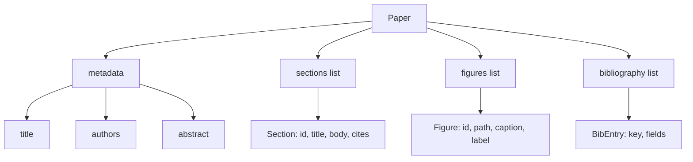
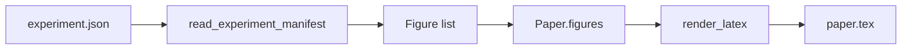
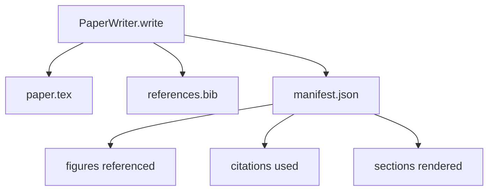

# Người viết giấy

> Bộ xương LaTeX là một hợp đồng giữa nhà nghiên cứu và người sắp chữ. Nếu hợp đồng gặp lỗi, tài liệu không biên soạn và lỗi là lớn. Xây dựng bộ xương trước, sau đó lấp đầy nó.

**Loại:** Xây dựng
**Ngôn ngữ:** Python
**Kiến thức tiên quyết:** Giai đoạn 19 bài 50-53
**Thời lượng:** ~90 phút

## Mục tiêu học tập

- Coi một bài nghiên cứu như một artifact có cấu trúc với biểu đồ phần đã biết, không phải là tài liệu dạng tự do.
- Tạo một bộ xương LaTeX khai báo các khóa trừu tượng, phần, khe hình và thư mục của nó trước khi bất kỳ văn xuôi nào được viết.
- Đưa các số liệu từ đầu ra thí nghiệm (đường dẫn và chú thích) vào khung thông qua cơ chế khe xác định.
- Nối dây một trình tạo văn xuôi giả lấp đầy từng phần từ một dàn ý có cấu trúc để harness có thể kiểm tra được mà không cần model.
- Phát ra một `paper.tex` duy nhất cộng với một `references.bib` cộng với một bản kê khai liệt kê mọi số liệu được tham chiếu và mọi trích dẫn được sử dụng.

## Tại sao lại là một bộ xương đầu tiên

Một bản nháp bắt đầu bằng văn xuôi tích lũy nợ cơ cấu. Phần giới thiệu phát triển ba đoạn nên có trong công việc liên quan. Một hình được tham chiếu trước khi nó được xác định. Thư mục kết thúc với ba phím cho cùng một bài báo. Vào thời điểm tác giả nhận thấy, chi phí viết lại cao hơn chi phí viết.

Một bộ xương đảo ngược điều đó. Cấu trúc được khai báo trước dưới dạng dữ liệu. Các phần là các vị trí có tên và thứ tự. Hình là các vị trí có id và chú thích. Các khóa thư mục được khai báo ở trên cùng với các mục mà chúng trỏ vào. Văn xuôi được tạo vào các vị trí đó tại một thời điểm. harness có thể xác nhận, trước khi bất kỳ văn xuôi nào được viết, rằng mọi nhân vật đều có một vị trí, mọi trích dẫn đều có một mục nhập và mọi phần đều xuất hiện trong mục lục.

Đây là nguyên tắc tương tự mà các bài học trước đó áp dụng cho kế hoạch, lệnh gọi công cụ và traces. Cấu trúc là hợp đồng.

## Hình dạng giấy

Mọi trường đều đơn giản Python dữ liệu. Trình kết xuất là một hàm thuần túy từ `Paper` sang chuỗi LaTeX. Người harness có thể xem xét nội tâm bài trước khi kết xuất: đếm các phần, liệt kê các tệp hình bị thiếu, kiểm tra xem mọi `\cite{key}` có `BibEntry` phù hợp hay không.

## Hợp đồng render

Trình kết xuất đảm bảo ba thuộc tính. Đầu tiên, mỗi khe hình trong bộ xương phát ra một khối `\begin{figure}` với nhãn ổn định của dạng `fig:<id>`. Thứ hai, mỗi phần phát ra một `\section{}` với một nhãn ổn định của hình thức `sec:<id>` vì vậy tham chiếu chéo hoạt động. Thứ ba, thư mục phát ra một khối `\bibliography` có `references.bib` chứa chính xác các mục được khai báo trên giấy, không hơn không kém.

Vi phạm bất kỳ điều nào trong số này là lỗi hiển thị chứ không phải cảnh báo. Bộ xương là hợp đồng; Một kết xuất âm thầm rơi một con số là một sự phá vỡ hợp đồng.

## Chèn hình từ các thí nghiệm

Các bài học trước đó trong bài hát này đã tạo ra kết quả thử nghiệm như JSON biểu hiện. Mỗi tệp kê khai mang một danh sách các artifacts với đường dẫn và chú thích ngắn. Người viết bài đọc bản kê khai đó và tạo ra các hồ sơ `Figure`.

Việc tiêm là xác định. Id hình có nguồn gốc từ tên thí nghiệm cộng với bộ đếm đơn điệu. Phụ đề đến từ bản kê khai. Các đường dẫn được chuẩn hóa liên quan đến thư mục đầu ra của bài báo, vì vậy LaTeX biên dịch ngay cả khi đầu ra thử nghiệm nằm ở nơi khác trên đĩa.

## Trình tạo văn xuôi chế giễu

Bài học không kêu gọi một model. Một `MockProseGenerator` đọc hình dạng phác thảo và phát ra văn xuôi một cách xác định. Hình dạng phác thảo là một chuỗi ngắn cho mỗi phần. Trình tạo mở rộng chuỗi đó thành hai đoạn ngắn với tiêu đề phần được đan xen. Văn xuôi được tạo ra đặt tên các số liệu và trích dẫn chính xác khi dàn ý khai báo chúng.

Điều này đủ để kiểm tra mọi hành vi của người viết. Một triển khai thực sự sẽ hoán đổi máy phát điện cho một cuộc gọi model. harness xung quanh nó không thay đổi. Đó là giá trị của việc tuyên bố trình tạo văn xuôi là một có thể gọi: bài kiểm tra thay thế một phép xác định, production thay thế một model, rest của pipeline là giống hệt nhau.

## Đầu ra tệp kê khai

Trình ghi phát ba tệp vào thư mục đầu ra.

Bản kê khai là những gì một người đánh giá hạ nguồn hoặc vòng lặp phê bình đọc. Nó không phân tích cú pháp LaTeX; nó đọc bản kê khai. Bài học tiếp theo, vòng lặp phê bình, lấy tệp kê khai này làm đầu vào và tạo ra một danh sách phản hồi. Đó là lý do tại sao bản kê khai là một phần của hợp đồng và LaTeX thì không.

## Cổng xác thực

Người viết chạy bốn cổng trước khi viết bất kỳ tệp nào.

1. Mỗi id số liệu là duy nhất trong bài báo.
2. Trường `cites` của mỗi phần tham chiếu đến một khóa thư mục được khai báo trên giấy.
3. Bản tóm tắt không trống rỗng.
4. Tiêu đề không trống.

Một cánh cổng thất bại sẽ nâng cao `PaperValidationError` với một lý do chính xác. harness hiển thị lý do là chế độ lỗi. Không có ghi một phần: cả ba tệp đều được phát ra hoặc không có.

## Cách đọc mã

`code/main.py` định nghĩa `Paper`, `Section`, `Figure`, `BibEntry`, `PaperValidationError`, `MockProseGenerator`, `PaperWriter` và hàm `render_latex`. Phương thức `write` lấy một thư mục đầu ra và phát ra `paper.tex`, `references.bib` và `manifest.json`. Trình trợ giúp `read_experiment_manifest` chuyển đổi danh sách các tệp kê khai thử nghiệm thành bản ghi `Figure`.

`code/tests/test_paper_writer.py` bao gồm: kết xuất khung xương không có phần, kết xuất đầy đủ với hai phần và hai hình, cổng trích dẫn bị thiếu, cổng id hình trùng lặp, nội dung kê khai và hợp đồng chuỗi LaTeX (mỗi phần phát ra một `\section{}`, mỗi hình phát ra một `\begin{figure}`).

## Tiến xa hơn

Hai phần mở rộng mà một triển khai thực sự sẽ muốn. Đầu tiên, kết xuất đa định dạng: cùng một hình dạng `Paper` biên dịch thành Markdown cho các bài đăng trên blog và HTML để xem trước. Trình kết xuất trở thành một chiến lược trên `Paper`. Thứ hai, làm giàu trích dẫn: người viết lấy các mục BibTeX từ một khóa trích dẫn, được cung cấp một bộ nhớ đệm cục bộ của DOI. Cả hai đều tăng thêm giá trị, cả hai đều có thể được thêm vào mà không cần chạm vào hợp đồng xương.

Bộ xương là đặt cược. Các phần, số liệu và trích dẫn được khai báo dưới dạng dữ liệu, văn xuôi được tạo thành các vị trí, bản kê khai được phát ra cùng với LaTeX. Mọi cải tiến khác đều sáng tác trên đầu.
