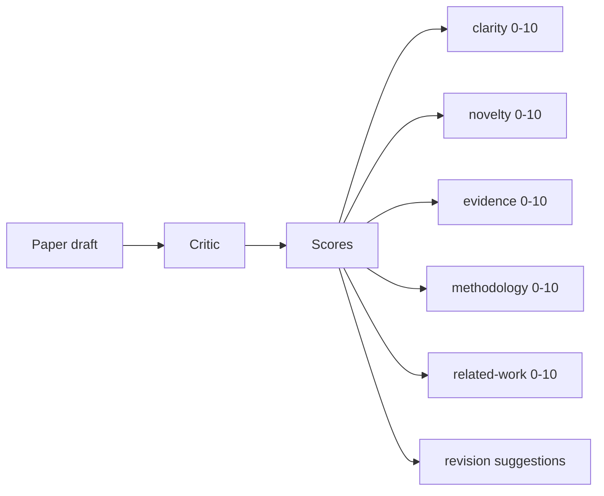
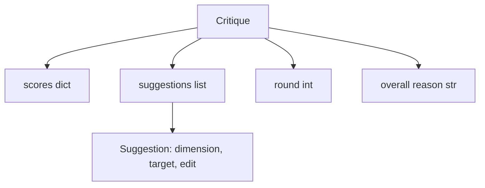
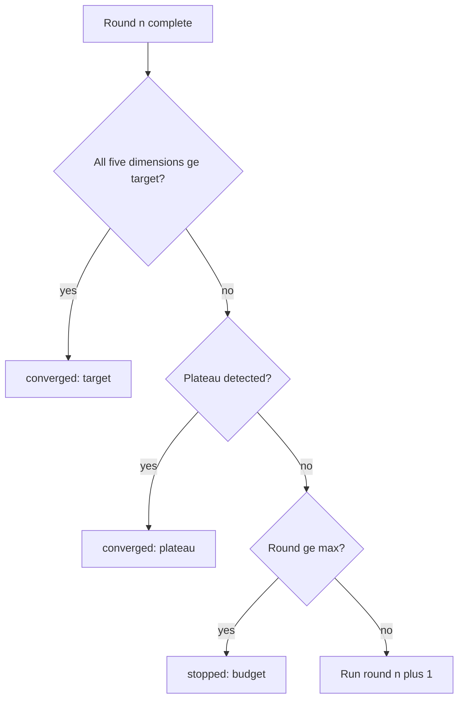
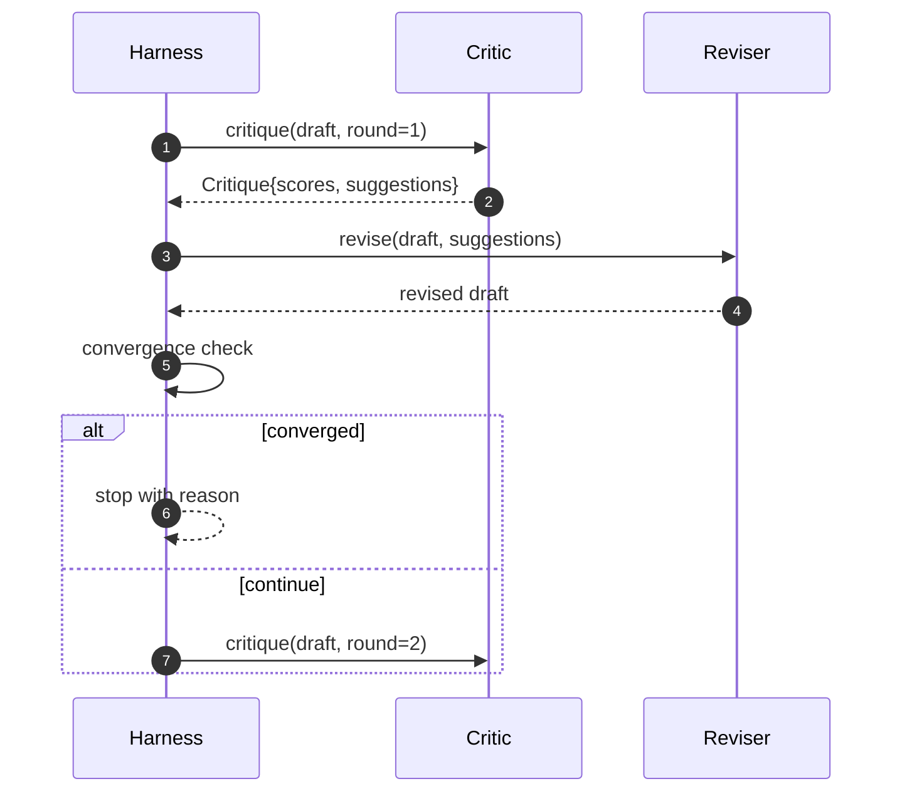

# Vòng lặp phê bình

> Một nhà phê bình trở lại "trông ổn" ngay lần đầu tiên gặp lỗi. Một nhà phê bình luôn trả lời "cần làm việc" sẽ gặp lỗi. Nhà phê bình thú vị là người hội tụ, và bạn phải thiết kế sự hội tụ.

**Loại:** Xây dựng
**Ngôn ngữ:** Python
**Kiến thức tiên quyết:** Giai đoạn 19 bài 50-53
**Thời lượng:** ~90 phút

## Mục tiêu học tập

- Chấm điểm một bản nháp trên năm khía cạnh cố định: rõ ràng, mới lạ, bằng chứng, phương pháp luận, công việc liên quan.
- Áp dụng phê bình của mỗi vòng như một sự khác biệt sửa đổi có cấu trúc thay vì viết lại dạng tự do.
- Phát hiện sự hội tụ bằng cách so sánh điểm số giữa các vòng; dừng lại trên cao nguyên, đạt mục tiêu hoặc cạn kiệt ngân sách.
- Giới hạn với ngân sách lặp lại tối đa để một nhà phê bình không hội tụ không chạy mãi mãi.
- Phát ra trace mỗi vòng để bảng điều khiển hoặc giai đoạn tiếp theo có thể hiển thị quỹ đạo điểm số.

## Tại sao lại có năm chiều cố định

Một nhà phê bình dạng tự do là một model trả về một đoạn gợi ý. Bản sửa đổi của vòng tiếp theo coi đoạn văn là bối cảnh xung quanh. Liệu việc viết lại có giải quyết được những lời chỉ trích hay không là không thể kiểm chứng được vì những lời chỉ trích chưa bao giờ có cấu trúc.

Năm chiều cung cấp cho harness một hợp đồng.



Điểm số là một vector. harness theo dõi từng chiều qua các vòng. Một bản sửa đổi nâng cao sự rõ ràng nhưng chứa bằng chứng là một hồi quy về bằng chứng và kiểm tra hội tụ nhìn thấy điều đó. Một nhà phê bình chỉ model không thể đưa ra sự đảm bảo đó.

## Hình dạng phê bình



Mỗi đề xuất đều mang kích thước mà nó cải thiện, phần mà nó nhắm mục tiêu và một hướng dẫn `edit` mà người sửa đổi có thể áp dụng. Người sửa đổi cũng là một người có thể gọi. Bài học ships một trình sửa đổi xác định diễn giải hướng dẫn sửa đổi như một thao tác nối vào phần. Một người sửa đổi theo hướng model sẽ diễn giải cùng một lĩnh vực như một prompt. Hợp đồng không thay đổi.

## Quy tắc hội tụ, theo thứ tự

Vòng lặp phê bình kết thúc khi bất kỳ một trong ba điều kiện kích hoạt.



Mục tiêu là trường hợp nghiêm ngặt nhất: mỗi một trong năm khía cạnh (rõ ràng, mới lạ, bằng chứng, phương pháp luận, related_work) phải đạt `>= target_score` (`8.0` mặc định) trước khi vòng lặp trả về thành công. Một giá trị trung bình cao với một chiều yếu là không đủ. Phát hiện cao nguyên so sánh giá trị trung bình của vòng hiện tại với giá trị trung bình của vòng trước. Nếu cải thiện dưới `plateau_epsilon` (`0.1` mặc định) trong hai vòng liên tiếp, vòng lặp sẽ thoát ra với `plateau`. Ngân sách là giới hạn cứng cho các vòng (mặc định `5`) và thoát ra với `budget`.

Thứ tự quan trọng. Mục tiêu chiến thắng trên cao nguyên chiến thắng ngân sách. Nếu vòng ba trúng mục tiêu trong cùng một lần lặp lại cũng sẽ trigger một cao nguyên, kết quả là `target` chứ không phải `plateau`.

## Tại sao phát hiện cao nguyên chạy qua hai vòng

Một cao nguyên một vòng là nhiễu. Một nhà phê bình thực sự trả về một điểm số hơi khác nhau mỗi lần lặp lại ngay cả trên một bản nháp cố định, bởi vì tính điểm xác định vẫn phụ thuộc vào đề xuất nào đã được áp dụng và theo thứ tự nào. Yêu cầu hai vòng cao nguyên liên tiếp lọc ra nhiễu. Nếu harness báo cáo ổn định, dự thảo đã thực sự ngừng cải thiện.

## Nhà phê bình quyết định trong bài học này

Bài học không kêu gọi một model. Nhà phê bình shipped là một người có thể gọi được chấm điểm một bản nháp dựa trên ba tín hiệu: chiều dài phần trung bình (độ rõ ràng), số lượng số liệu và số lượng trích dẫn (bằng chứng) và một trường `originality_tag` trên siêu dữ liệu giấy (tính mới). Người sửa đổi biết cách đẩy mỗi điểm lên trên.

```text
clarity      grows when the average section body length increases
novelty      grows when originality_tag is set to "high"
evidence     grows when a section's figure_refs is non-empty
methodology  grows when a section titled "Method" exists with body
related-work grows when a section titled "Related Work" exists with body
```

Người sửa đổi giải thích mỗi đề xuất như một phần phụ có mục tiêu. Sau vòng một, harness có thể quan sát tỷ số tăng lên. Các bài kiểm tra sử dụng thuộc tính này để khẳng định vòng lặp làm giảm khoảng cách.

## Hợp đồng vòng lặp đầy đủ



harness sở hữu bộ đếm tròn, trace và kiểm tra hội tụ. Nhà phê bình sở hữu điểm số. Người sửa đổi sở hữu sự khác biệt. Không ai trong số ba người chạm vào trạng thái của những người khác.

## Đầu ra Trace

Mỗi vòng phát ra một sự kiện trace với số vòng, vector điểm, số lượng đề xuất và phán quyết hội tụ. Toàn bộ trace được trả lại cùng với bản nháp cuối cùng. Bảng thông tin xuôi dòng có thể hiển thị biểu đồ điểm số mỗi vòng. Bài học tiếp theo, trình lập lịch lặp lại, đọc trace để quyết định xem branch có đáng để giữ lại hay không.

## Ngân sách bảo vệ chống lại những người chỉ trích xấu

Một nhà phê bình đưa ra các đề xuất không bao giờ cải thiện điểm số sẽ khóa vòng lặp vào trần lặp lại tối đa. trace làm cho điều đó có thể nhìn thấy được: năm vòng, điểm số bằng phẳng, phán quyết `budget`. Người dùng đọc đó như một lỗi chỉ trích, không phải là một lỗi nháp. Phương án thay thế, chỉ xuất hiện bản nháp cuối cùng, che giấu chẩn đoán. Thiết kế Trace tiên làm nổi bật nó.

## Cách đọc mã

`code/main.py` định nghĩa `Critique`, `Suggestion`, giao thức `Critic`, giao thức `Reviser`, `CriticLoop` và một nhà máy `make_deterministic_critic_pair` trả về nhà phê bình xác định và trình sửa đổi phù hợp. Một hình dạng `Paper` tối thiểu được bao gồm để bài học độc lập.

`code/tests/test_critic_loop.py` bao gồm: cải thiện đơn điệu sau vòng một, hội tụ mục tiêu trên bản nháp được điều chỉnh, phát hiện bình nguyên sau hai vòng phẳng, cạn kiệt ngân sách khi không có đề xuất nào được cải thiện, ứng dụng gợi ý của người sửa đổi và hình dạng trace.

## Tiến xa hơn

Hai phần mở rộng mà một triển khai thực sự sẽ muốn. Thứ nhất, trọng số kích thước: một bài báo cho một hội thảo có trọng lượng mới cao hơn phương pháp luận; một tạp chí cân nhắc nghịch đảo. Kiểm tra hội tụ trở thành giá trị trung bình có trọng số. Thứ hai, các nhà phê bình ghép đôi: một nhà phê bình chấm điểm, một nhà phê bình thứ hai đánh giá các đề xuất trước khi người phê bình nhìn thấy chúng. Cả hai đều tăng thêm giá trị, cả hai đều sáng tác trên cùng một hình dạng `Critique`.

Đặt cược là điểm số vector. Một khi phê bình được cấu trúc, mọi cải tiến khác, quy tắc hội tụ, bảng điều khiển, nhà phê bình ghép đôi, sẽ xuất hiện mà không thay đổi vòng lặp.
