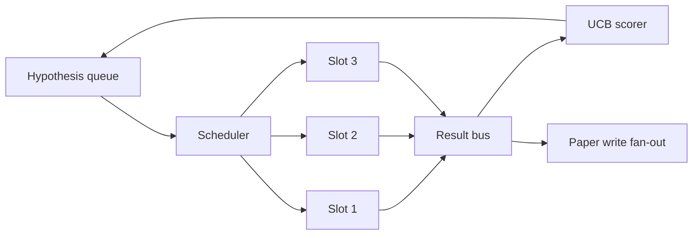
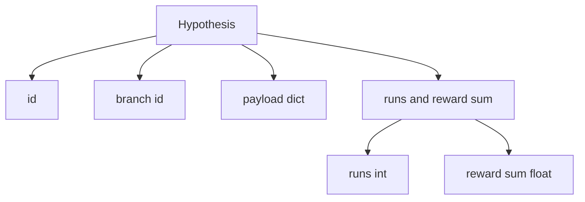
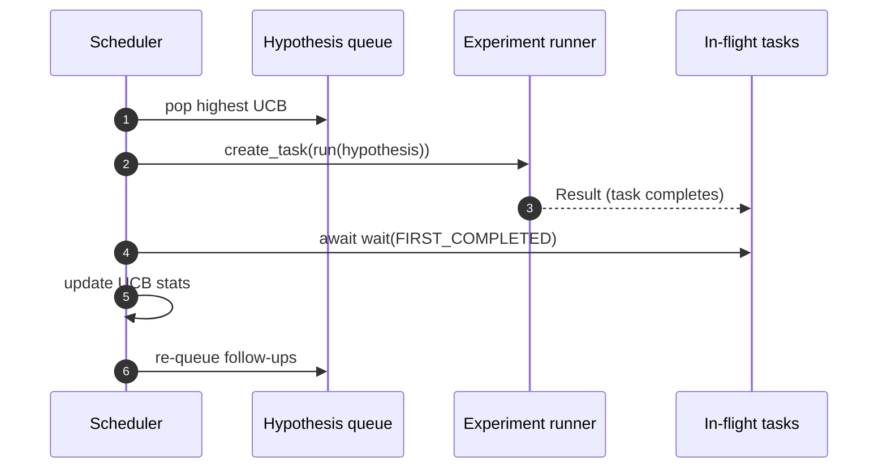

# Bộ lập lịch lặp lại

> Một vòng lặp nghiên cứu không có bộ lập lịch là một hàng đợi với ảo tưởng. Bộ lập lịch là nơi vòng lặp quyết định những gì nên ngừng khám phá và quyết định đó là toàn bộ trò chơi.

**Loại:** Xây dựng
**Ngôn ngữ:** Python
**Kiến thức tiên quyết:** Giai đoạn 19 bài 50-53
**Thời lượng:** ~90 phút

## Mục tiêu học tập

- Model quy trình nghiên cứu dưới dạng hàng đợi giả thuyết cung cấp các vị trí thử nghiệm song song có kết quả quay trở lại.
- Chạy nhiều thử nghiệm đồng thời với asyncio để bộ lập lịch có thể giữ cho tất cả các vị trí bận rộn.
- Chấm điểm từng giả thuyết branch với UCB để người lập lịch có thể cắt tỉa branches năng suất thấp mà không từ bỏ việc khám phá.
- Quạt kết quả đã hoàn thành sang giai đoạn viết giấy và giai đoạn xếp hàng lại để branch năng suất cao tạo ra các giả thuyết tiếp theo.
- Hiển thị một trace mỗi lần lặp lại với điểm số branch, tỷ lệ chiếm vị trí và quyết định cắt tỉa.

## Tại sao lại là một bộ lập lịch, không phải một danh sách công việc

Danh sách công việc phẳng chạy các công việc theo thứ tự gửi. Điều đó tốt khi mỗi công việc độc lập. Nghiên cứu không độc lập: một phát hiện từ thí nghiệm ba thay đổi mức độ ưu tiên của thí nghiệm bốn và năm. Một bộ lập lịch đọc kết quả phân bổ và sắp xếp lại hàng đợi sẽ hoàn thành nhiều công việc hữu ích hơn trên mỗi đơn vị điện toán.

Sự lựa chọn thiết kế thú vị là quy tắc tính điểm. Một cầu thủ ghi bàn tham lam luôn chọn người dẫn đầu hiện tại và không bao giờ khám phá. Một cầu thủ ghi bàn đồng phục không bao giờ khai thác. UCB (giới hạn tin cậy trên) là con đường trung gian: khai thác người dẫn đầu trong khi dành năng lực cho những branches đã được thử nghiệm ít hơn.

## Hình dạng hệ thống



Hàng đợi chứa các giả thuyết. Bộ lập lịch chọn giả thuyết UCB cao nhất khi một vị trí trống. Mỗi vị trí chạy một thử nghiệm không đồng bộ. Các thí nghiệm đã hoàn thành quạt kết quả của họ lên xe buýt. Xe buýt cập nhật số liệu thống kê của UCB về branch ban đầu và quạt ra giai đoạn viết giấy khi lợi nhuận của branch vượt qua ngưỡng.

## Hình dạng giả thuyết



`branch` là chìa khóa cho số liệu thống kê của UCB. Nhiều giả thuyết có thể chia sẻ một branch (branch là hướng nghiên cứu; giả thuyết là một thử nghiệm trong đó). `runs` là số lần thử nghiệm đã hoàn thành cho branch đó `reward_sum` là phần thưởng tích lũy. UCB đọc cả hai.

## Chấm điểm UCB

Công thức UCB được sử dụng trong bài học này là UCB1 cổ điển.

```text
ucb(branch) = mean_reward(branch) + c * sqrt( ln(total_runs) / runs(branch) )
```

`total_runs` là số lượng của tất cả các thử nghiệm đã hoàn thành trên tất cả các branches. `c` là trọng lượng thăm dò; bài học mặc định là `sqrt(2)`. Một branch không chạy sẽ `+inf` nên những branches chưa thử luôn được lên lịch trước. Một branch có phần thưởng trung bình cao sẽ giữ điểm cao cho đến khi branches khác bắt kịp; Một branch chạy nhiều lần mà không có nhiều phần thưởng sẽ bị lu mờ bởi các lựa chọn thay thế ít chạy hơn.

Cổng cắt tỉa tách biệt với máy hái. Cắt tỉa sẽ loại bỏ một branch khỏi lịch trình trong tương lai khi phần thưởng trung bình của nó giảm xuống dưới mức sàn tuyệt đối (`0.2` mặc định) sau ít nhất `prune_after_runs` lần dùng thử (`3` mặc định). Điều này giữ cho hàng đợi bị giới hạn.

## Các khe cắm song song với asyncio

Bộ lập lịch trình thúc đẩy các thử nghiệm với `asyncio.create_task`. Mỗi tác vụ chạy trình chạy thử nghiệm (một `async def` có thể gọi) trả về một `Result`. Vòng lặp chính chờ tập hợp các nhiệm vụ trên chuyến bay với `asyncio.wait(..., return_when=asyncio.FIRST_COMPLETED)` và kích hoạt cập nhật tính điểm sau mỗi lần hoàn thành.



Ba vị trí chạy đồng thời. Vòng lặp chính không bao giờ chặn trong một thử nghiệm duy nhất. Bộ lập lịch tiếp tục bắt đầu các tác vụ mới ngay khi một vị trí trống, cho đến khi cả hai hàng đợi trống và không có nhiệm vụ nào đang chạy.

## Quạt ra: triggers giấy

Khi phần thưởng trung bình của branch vượt qua `paper_threshold` (`0.7` mặc định) và branch đó chưa tạo ra một bài báo, người lập lịch trình sẽ đưa một sự kiện `paper.trigger` vào danh sách đầu ra. Hạ lưu, người viết bài từ bài năm mươi bốn sẽ chọn điều này. Trong bài học này, trigger được ghi lại dưới dạng danh sách để các thử nghiệm có thể khẳng định nó.

## Fan-out: giả thuyết tiếp theo

Khi có kết quả năng suất cao, bộ lập lịch có thể gọi `expander` do người dùng cung cấp để tạo ra một hoặc nhiều giả thuyết tiếp theo trên cùng một branch. Bộ giãn nở là một chức năng thuần túy từ `Result` đến `list[Hypothesis]`. Bài học ships một công cụ mở rộng xác định tạo ra hai lần theo dõi cho bất kỳ kết quả nào có phần thưởng vượt quá ngưỡng giấy.

## Ngân sách

Hai ngân sách bảo vệ bộ lập lịch khỏi các vòng lặp chạy trốn.

```text
max_experiments    : total count of experiments run across all branches
max_seconds        : wall-clock cap (asyncio time)
```

Khi một trong hai kích hoạt, bộ lập lịch sẽ ngừng lên lịch cho các tác vụ mới, chờ đợi các nhiệm vụ trên chuyến bay và trả về trace cuối cùng. Các trace bao gồm một `stop_reason`.

## Báo cáo Trace và tổng kết

Mỗi quyết định lên lịch (chọn, gửi đi, kết quả, cắt tỉa, phân bạo) phát ra một sự kiện. Báo cáo cuối cùng tóm tắt số liệu thống kê trên mỗi branch, tổng số lần chạy, tổng số đồng hồ treo tường và giấy triggers bắn. Bài học tiếp theo, bản demo từ đầu đến cuối, đọc báo cáo này để thúc đẩy người viết giấy.

## Cách đọc mã

`code/main.py` định nghĩa `Hypothesis`, `Result`, `BranchStats`, `IterationScheduler` và một nhà máy `make_deterministic_runner` trả về một trình chạy thử nghiệm không đồng bộ với phần thưởng có thể dự đoán được. Người chạy ngủ trong một `delay_ms` cố định (`5ms` mặc định) để có thể quan sát đồng thời.

`code/tests/test_scheduler.py` bìa: UCB chọn branches chưa thử trước, chiếm vị trí song song, triggers giấy khi vượt ngưỡng, branch cắt tỉa sau khi thử nghiệm năng suất thấp, giả thuyết theo dõi quạt ra và thoát ngân sách (cả số lượng thí nghiệm và đồng hồ treo tường).

## Tiến xa hơn

Ba phần mở rộng mà một triển khai thực sự sẽ muốn. Đầu tiên, số liệu thống kê liên tục của UCB trên khắp sessions: số liệu thống kê hiện tại sống trong bộ nhớ; Một người lập lịch thực sự sẽ checkpoint họ để khởi động lại bảo toàn ngân sách thăm dò đã chi tiêu. Thứ hai, tính điểm đa mục tiêu: thay vì phần thưởng vô hướng, mỗi kết quả phát ra một vector và UCB trở thành một bộ chọn kiểu Pareto. Thứ ba, kẻ cướp theo ngữ cảnh: các điều kiện của người chọn trên giả thuyết features (độ dài, độ phức tạp) để các giả thuyết tương tự chia sẻ thăm dò.

Bộ lập lịch trình là nơi nghiên cứu không chỉ là một danh sách công việc. Khi UCB được nối dây và các khe chạy song song, mọi cải tiến khác sẽ được tạo ra trên cùng.
