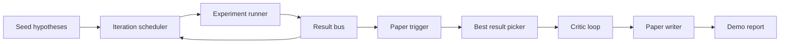
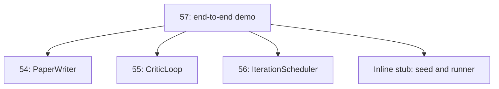
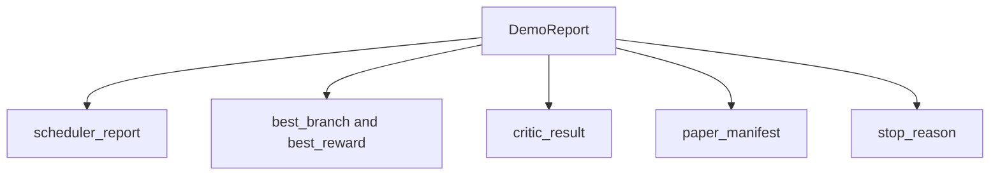

# Bản demo nghiên cứu từ đầu đến cuối

> Bản demo là nơi mà mọi hợp đồng bạn đã viết trước đó phải soạn thảo. Nếu bất kỳ ai trong số họ bị rò rỉ, bản demo là bài học nắm bắt được nó.

**Loại:** Xây dựng
**Ngôn ngữ:** Python
**Kiến thức tiên quyết:** Giai đoạn 19 bài 50-53
**Thời lượng:** ~90 phút

## Mục tiêu học tập

- Kết nối vòng lặp nghiên cứu tự động từ đầu đến cuối: hạt giống giả thuyết, người chạy thử nghiệm, người lập lịch, vòng lặp phê bình, người viết giấy.
- Soạn primitives từ bốn bài học Track D trước đó thông qua Python imports đơn giản, không phải framework.
- Chạy vòng lặp đến đầu tự kết thúc và phát ra một báo cáo demo duy nhất liệt kê đầu ra của mọi giai đoạn.
- Giữ bản demo xác định để bộ thử nghiệm có thể xác định hình dạng cuối cùng.
- Hiển thị chế độ lỗi rõ ràng khi bất kỳ giai đoạn nào của hợp đồng gặp lỗi, vì vậy giai đoạn tiếp theo không chạy với đầu vào bị hỏng.

## Những gì sáng tác ở đây



Năm giai đoạn. Hạt giống là một danh sách ba giả thuyết. Bộ lập lịch chạy sáu thử nghiệm trên chúng với ba khe song song. Xe buýt báo cáo một hoặc nhiều triggers giấy. Người chọn chọn kết quả tốt nhất duy nhất. Vòng lặp phê bình lặp lại trên một bản nháp được xây dựng từ kết quả đó. Người viết giấy phát ra LaTeX, BibTeX và bản kê khai cuối cùng.

## Tại sao import, không sao chép

Mỗi bài học trước đó ships một `main.py` với các lớp dữ liệu và hàm công khai. Bản demo imports chúng bằng cách điều chỉnh `sys.path` cho phù hợp với thư mục mẹ của mỗi bài học. Đây không phải là framework hệ thống dây điện; Nó cũng giống import các tệp kiểm tra trong các bài học trước đó đã sử dụng.



Sơ khai nội tuyến thay thế cho các bài học từ năm mươi đến năm mươi ba: một trình tạo nhỏ các giả thuyết hạt giống và một hàm phần thưởng đồng bộ. Người dùng có thể hoán đổi sơ khai nội tuyến lấy primitives thực từ các bài học đó bằng cách điều chỉnh hai imports.

## Đảm bảo quyết định luận

Bản demo là xác định bằng cách xây dựng. Người chạy thử nghiệm được gieo hạt numpy. Trình sửa đổi của vòng lặp phê bình đi theo các kích thước cố định theo thứ tự cố định. Trình tạo văn xuôi của người viết bài là người bị chế giễu từ bài năm mươi bốn. Bộ chọn UCB của bộ lập lịch trình phá vỡ các mối quan hệ theo thứ tự lặp lại, không phải lựa chọn ngẫu nhiên.

Cho cùng một hạt giống, bản demo phát ra cùng một báo cáo. Thử nghiệm xác nhận thuộc tính này bằng cách chạy bản demo hai lần và so sánh tệp kê khai.

## Hình dạng báo cáo demo



Mỗi trường đến nguyên văn từ giai đoạn thượng nguồn. Bản demo không chuyển đổi bất kỳ đầu ra nào; nó tạo ra chúng. Đó là bài kiểm tra bản demo.

## Xử lý chế độ lỗi

Mỗi giai đoạn thành công hoặc gây ra lỗi đã nhập.

```text
Scheduler ........ returns SchedulerReport with stop_reason
                   in {queue_empty, max_experiments, deadline}
Best-result pick . raises NoTriggerError if no paper trigger fired
Critic loop ...... returns LoopResult with status converged or stopped
Paper writer ..... raises PaperValidationError on contract break
```

Lỗi trong bất kỳ giai đoạn nào sẽ làm ngắn mạch bản demo với một ngoại lệ được nhập. Các bài kiểm tra ghim hợp đồng này: `test_no_triggers_raises_typed_error` và `test_best_picker_raises_when_no_triggers` khẳng định người chọn tăng `NoTriggerError` / `BestResultError` khi không có branch nào bắn trigger và người viết không bao giờ được gọi.

## Công cụ chọn kết quả tốt nhất

Bộ lập lịch phát ra triggers giấy mỗi branch. Người chọn chọn branch có phần thưởng trung bình cao nhất trên tất cả triggers. Các mối quan hệ bị ngắt theo thứ tự bảng chữ cái theo id branch vì vậy bản demo là xác định. Máy hái là một chức năng tinh khiết nhỏ; Thử nghiệm ghim nó vào báo cáo bộ lập lịch cố định.

## Đấu dây vòng lặp phê bình

Vòng lặp phê bình trong bài năm mươi lăm hoạt động trên một `MiniPaper`. Bản demo xây dựng một `MiniPaper` từ branch đã chọn bằng cách điền vào bản tóm tắt với id branch, gieo hai phần (Giới thiệu và Kết quả) và đặt `originality_tag` từ phần thưởng trung bình của branch (cao nếu `>= 0.8`, trung bình nếu `>= 0.6`, thấp nếu không).

Sau đó, người sửa đổi lặp lại bản nháp để hội tụ. Đầu ra đi vào trình ghi giấy.

## Đấu dây máy viết giấy

Người viết bài trong bài năm mươi bốn hoạt động trên hình dạng `Paper` đầy đủ với các số liệu và thư mục. Bản demo nâng cấp `MiniPaper` hội tụ thông qua `mini_to_full_paper`, đính kèm một con số cho branch được chọn và một thư mục tổng hợp nhỏ được xây dựng từ sự kết hợp của các khóa trích dẫn mà nhà phê bình đề xuất. Mỗi trích dẫn mà bản demo thêm vào cũng được thêm vào danh sách thư mục, vì vậy việc xác thực sẽ trôi qua.

## Cách đọc mã

`code/main.py` định nghĩa `BestResultError`, `NoTriggerError`, `DemoReport`, `pick_best_branch`, `build_mini_paper`, `mini_to_full_paper` và `run_demo`. Các imports ở trên cùng điều chỉnh `sys.path` một lần và kéo `PaperWriter`, `CriticLoop` và `IterationScheduler` ra khỏi bài học của họ.

`code/tests/test_e2e.py` bao gồm: bản demo chạy từ đầu đến cuối và phát ra một báo cáo với tất cả năm trường được điền, tính xác định trong hai lần chạy, NoTriggerError khi không có branch nào vượt qua ngưỡng, PaperValidationError khi hợp đồng của người viết gặp lỗi, tệp kê khai giấy chứa số liệu của branch đã chọn và lý do dừng của bộ lập lịch là một trong những giá trị dự kiến.

## Tiến xa hơn

Ba tiện ích mở rộng đáng để nối dây sau khi bản demo có màu xanh lá cây. Đầu tiên, trạng thái liên tục: kết quả của mỗi giai đoạn ghi vào một cửa hàng JSON nhỏ để khởi động lại có thể tiếp tục mà không cần chạy lại các giai đoạn giá rẻ. Thứ hai, bảng điều khiển: các sự kiện trace từ trình lập lịch trình và vòng lặp phê bình hiển thị dưới dạng một dòng thời gian duy nhất. Thứ ba, những lời kêu gọi model thực sự: hoán đổi trình tạo văn xuôi bị chế giễu và nhà phê bình quyết định cho những người theo hướng model; hệ thống dây điện không thay đổi.

Công việc của bản demo là chứng minh rằng bố cục là kiến trúc. Năm bài học, bốn bài imports, một báo cáo. Lần tới khi bạn thêm một giai đoạn, hệ thống dây điện sẽ tăng lên chính xác một dòng.
