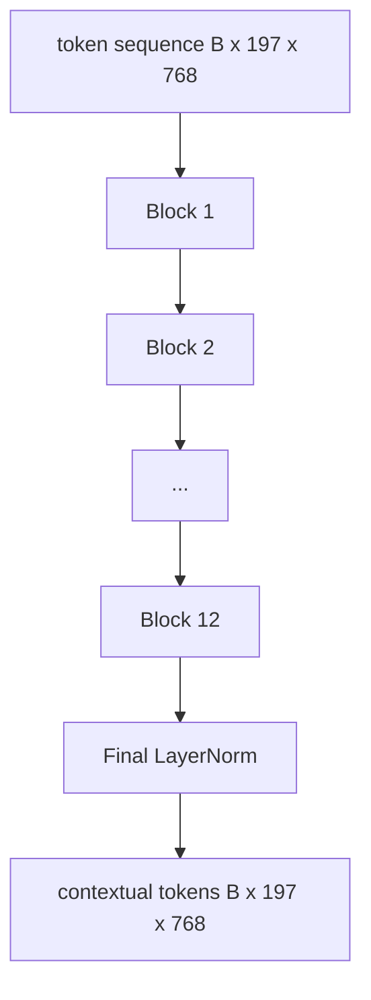

# Tầm nhìn Transformer Encoder

> Chỉ riêng các bản vá không nhìn thấy. Một transformer trước LN 12 lớp với 12 đầu attention biến chuỗi tokens bản vá thành một chuỗi tokens theo ngữ cảnh, với CLS token gộp toàn bộ features hình ảnh ở trạng thái ẩn cuối cùng của nó. Bài học này là phòng máy của mọi model ngôn ngữ thị giác hiện đại.

**Loại:** Xây dựng
**Ngôn ngữ:** Python
**Kiến thức tiên quyết:** Giai đoạn 19 bài 30-37 (Nền tảng theo dõi B)
**Thời lượng:** ~90 phút

## Mục tiêu học tập

- Triển khai khối transformer trước LN với self-attention nhiều đầu và lớp phụ chuyển tiếp.
- Stack 12 khối với 12 đầu để tạo thành một encoder ViT-Base.
- Nối đầu trước của bản vá từ bài 58 vào encoder và chạy một forward pass.
- Xác minh rằng CLS token tổng hợp thông tin từ mọi bản vá.

## Vấn đề

Bản vá embedding tạo ra một chuỗi 197 tokens, mỗi vector mà không nhận thức được bất kỳ bản vá nào khác. Một bức ảnh của một con mèo cần mọi mảng để biết mảng nào có râu, mảng nào chứa nền và mảng nào chứa mắt. transformer là cơ chế xây dựng nhận thức đó, từng lớp attention một. Nếu không có nó, giao diện người dùng của bản vá là một tokenizer thông minh mà không có sự hiểu biết.

Công thức tiêu chuẩn là sâu mười hai khối, rộng mười hai đầu, với vị trí trước khi LayerNorm, kích hoạt GELU và mở rộng chuyển tiếp 4x. Công thức đó là xương sống của CLIP ViT-L, SigLIP, DINOv2, gia đình Qwen-VL, InternVL và mọi encoder tầm nhìn trọng lượng mở khác trong giai đoạn 2025-2026. Công thức đủ ổn định để bạn có thể đọc bất kỳ bài báo nào trong số đó và giả định hình khối này trừ khi họ nói rõ ràng khác.

## Khái niệm




### Trước LN so với sau LN

Transformer ban đầu được đặt LayerNorm sau phần còn lại. Pre-LN (LayerNorm trước mỗi lớp phụ) là phiên bản mà mọi ngôn ngữ thị giác hiện đại model sử dụng, bởi vì nó tập luyện ổn định mà không cần các thủ thuật khởi động tốc độ học. Sự khác biệt là một đường trong forward pass và dòng chảy gradient ở độ sâu 12+ là đêm và ngày.

### self-attention nhiều đầu

Mỗi đầu chiếu token vector thành bộ ba `(query, key, value)` của riêng nó với `head_dim = hidden / num_heads` kích thước. Với `hidden = 768` và `heads = 12`, mỗi cái đầu đều có `dim = 64`. 12 đầu tham dự song song, sau đó đầu ra của chúng kết nối trở lại kích thước 768 và đi qua một phép chiếu đầu ra. Điểm của nhiều đầu là một đầu có thể học "chú ý đến mắt mèo" trong khi người khác học "chú ý đến gradient nền" mà không bị can thiệp.

### Tại sao mở rộng chuyển tiếp nguồn cấp dữ liệu 4x

FFN đi `hidden -> 4 * hidden -> hidden` với GELU ở giữa. Yếu tố 4 là thực nghiệm và đã được duy trì trên transformers ngôn ngữ và tầm nhìn kể từ năm 2017. Đồ lót nhỏ hơn (2x); lớn hơn (8x) quá phù hợp với ngân sách dữ liệu cố định. MLP là nơi model lưu trữ hầu hết các dữ kiện đã học được và phần giữa rộng hơn là nơi họ ngồi.

| Thành phần | Parameters ở thang đo ViT-Base |
|-----------|------------------------------|
| Phép chiếu QKV trên mỗi khối | `3 * 768 * 768 = 1.77M` |
| Dự báo đầu ra trên mỗi khối | `768 * 768 = 590K` |
| FFN trên mỗi khối (mở rộng 4x) | `2 * 768 * 4 * 768 = 4.72M` |
| LayerNorm mỗi khối | `4 * 768 = 3K` |
| Tổng số mỗi khối | khoảng 7,1 triệu |
| 12 khối nhà | khoảng 85M |
| Cộng với giao diện người dùng | tổng cộng khoảng 86 triệu |

ViT-Base là một parameter encoder 86M. Đó là nhỏ theo tiêu chuẩn năm 2026 (SigLIP-So400M là 400M, Qwen-VL ViT là 675M), nhưng kiến trúc giống hệt nhau về chiều rộng và chiều sâu.

### Mặt nạ nhân quả hay không?

Vision Transformers chỉ dành cho encoder và hai chiều: token `i` có thể tham gia token `j` cho bất kỳ cặp nào. Không có mặt nạ. cross-attention phía decoder trong bài 61 sẽ sử dụng mặt nạ nhân quả, nhưng bên trong encoder thị giác, attention được kết nối hoàn toàn.

### CLS token học được gì

CLS token bắt đầu như một parameter đã học, không có nội dung bản vá của riêng nó và tích lũy thông tin thông qua attention trên mọi khối. Đến layer cuối cùng, hàng CLS là một bản tóm tắt vector của toàn bộ hình ảnh; Đầu xuôi dòng chiếu vector đơn này thành các phím class logits, embeddings tương phản hoặc cross-attention cho một decoder văn bản.

## Tự xây dựng

`code/main.py` thực hiện:

- `MultiHeadSelfAttention`, với các phép chiếu `qkv` và đầu ra, tích chấm tỷ lệ attention toán học và xác nhận hình dạng.
- `FeedForward`, bản mở rộng 4x GELU MLP.
- `Block`, một khối tiền LN bao gồm các lớp con attention và chuyển tiếp với phần dư.
- `ViT`, một stack gồm 12 khối với LayerNorm cuối cùng.
- `VisionEncoder`, kết nối `VisionFrontEnd` từ bài 58 đến bài `ViT` stack và hiển thị một `forward()` trả về trình tự ngữ cảnh và vector CLS gộp.
- Một bản demo chạy hình ảnh cố định 224x224 tổng hợp thông qua encoder đầy đủ và in hình dạng đầu vào, hình dạng đầu ra, số lượng parameter và định mức CLS ở mọi lớp khác.

Chạy nó:

```bash
python3 code/main.py
```

Đầu ra: thiết bị cố định được mã hóa thành một `(1, 197, 768)` tensor. Định mức CLS trôi lên khi các lớp tạo thành, sau đó ổn định ở LayerNorm cuối cùng. Tổng parameters báo cáo khoảng 86 triệu.

## Ứng dụng

encoder được xác định ở đây, tùy theo chiều rộng và chiều sâu, là cùng một khối stack ships bên trong mọi VLM trọng lượng mở vào năm 2025-2026. Sự khác biệt sống trong:

- **Chiều rộng và chiều sâu.** ViT-Large là `hidden=1024, depth=24, heads=16`; SigLIP So400M là `hidden=1152, depth=27, heads=16`. Cùng một khối.
- **Gộp đầu.** CLS pooling (bài học này) so với gộp trung bình (SigLIP) so với attention gộp (sau này VLMs).
- **Xử lý vị trí.** Cố định hình sin (bài 58) so với 1D so với ALiBi so với RoPE 2D. Toán học khối không thay đổi.
- **Đăng ký tokens.** DINOv2 thêm 4 tokens học thêm. Một dòng mã.

Khối này stack là chất nền. Các bài học tiếp theo (60-63) đứng trên nó.

## Kiểm tra

`code/test_main.py` bao gồm:

- Một khối duy nhất giữ nguyên hình dạng và bất biến với kích thước batch đầu vào
- attention điểm tổng bằng một dọc theo trục chính (softmax tinh thần)
- đường dẫn dư được nối dây (đầu vào bằng không vẫn tạo ra đầu ra không bằng không thông qua token CLS)
- Một forward pass xếp chồng lên nhau 4 lớp tạo ra hình dạng phù hợp
- gradients luồng đến phép chiếu bản vá từ đầu ra CLS

Chạy chúng:

```bash
python3 -m unittest code/test_main.py
```

## Bài tập

1. Thêm tokens thanh ghi (4 thanh ghi đã học vectors được thêm vào trước sau CLS) và chạy lại. So sánh độ mịn của bản đồ attention thông qua entropy của phân phối softmax trên lớp cuối cùng.

2. Hoán đổi pre-LN cho post-LN và huấn luyện cho một epoch trên bộ phân loại hình dạng tổng hợp. Quan sát xem cái nào tập luyện ổn định mà không cần khởi động LR.

3. Triển khai mặt nạ nhân quả dưới dạng đối số `attn_mask` để có thể sử dụng lại cùng một khối như một khối decoder. Hình dạng mặt nạ `(seq, seq)`, hình tam giác thấp hơn.

4. Cấu hình forward pass ở batch kích thước 1, 8, 64 với `torch.profiler`. Lớp MLP chi phối thời gian tường chứ không phải attention.

5. Thay thế các hình chiếu qkv của một đầu attention bằng bộ chuyển đổi LoRA cấp thấp, đóng băng rest và xác minh gradient chỉ chảy đến nơi bạn mong đợi.

## Thuật ngữ chính

| Thuật ngữ | Nó có nghĩa là gì |
|------|---------------|
| Trước LN | LayerNorm áp dụng trước mỗi lớp con thay vì sau |
| Self-attention | Mỗi token quan tâm đến mọi token khác theo cùng một trình tự |
| Nhiều đầu | Độ mờ ẩn được chia thành `H` đầu attention độc lập |
| Mở rộng FFN | Lớp chuyển tiếp mở rộng đến `4 * hidden` trước khi co lại |
| Gộp CLS | Sử dụng trạng thái ẩn cuối cùng của token đầu tiên làm tóm tắt hình ảnh |

## Đọc thêm

- Một hình ảnh có giá trị 16x16 từ (ViT, 2021) cho công thức encoder.
- DINOv2 (2023) cho đăng ký tokens và mục tiêu pretraining tự giám sát.
- SigLIP (2023) cho biến thể gộp trung bình và loss tương phản sigmoid được sử dụng trong bài 62.
