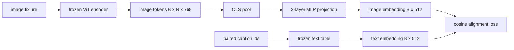

# Lớp chiếu cho phương thức Alignment

> Tầm nhìn encoder tạo ra tokens hình ảnh. Một decoder văn bản tiêu thụ tokens văn bản. Hai người sống trong không gian vector khác nhau. Một MLP hai lớp nhỏ chiếu hình ảnh tokens vào văn bản embedding không gian và một alignment loss cosin đối với một chú thích được ghép nối kéo hai khoảng trống vào sự đồng thuận. Sự phóng chiếu đó là phần nhỏ nhất của một model ngôn ngữ thị giác và là phần quan trọng nhất đối với sự chuyển giao.

**Loại:** Xây dựng
**Ngôn ngữ:** Python
**Kiến thức tiên quyết:** Giai đoạn 19 bài 30-37 (Nền tảng theo dõi B)
**Thời lượng:** ~90 phút

## Mục tiêu học tập

- Xây dựng phép chiếu MLP hai lớp ánh xạ features hình ảnh vào văn bản embedding không gian.
- Xây dựng một văn bản giả embedding bảng (không có pretrained tokenizer, không có kho dữ liệu thực).
- Tính toán alignment loss cosin giữa tokens hình ảnh chiếu và embedding chú thích được ghép nối.
- Huấn luyện phép chiếu một mình với encoder thị giác đóng băng và bảng văn bản đóng băng.

## Vấn đề

Bạn có một encoder tầm nhìn (bài 58-59) tạo ra tokens không gian `vision_hidden = 768`. Bạn có một decoder văn bản mà bạn muốn bắt vít lên trên với `text_hidden = 512` kích thước embedding (bất kỳ số nào khác cũng hợp lý như vậy). The decoder mong đợi tokens hình dạng văn bản. Hình ảnh tokens không có hình dạng văn bản: chúng sống trên cơ sở encoder học được trong pretraining chỉ có thị giác, không có mối liên hệ nào với từ vectors của decoder.

Phép chiếu MLP hai lớp (tuyến tính, GELU, tuyến tính) thu hẹp khoảng cách. Nó đủ nhỏ (khoảng `768 * 1024 + 1024 * 512 = 1.3M` parameters) để luyện tập trong vài phút trên một GPU duy nhất và nó là tác phẩm duy nhất phải học trong giai đoạn alignment. Tầm nhìn encoder vẫn đóng băng. Văn bản embedding bảng vẫn bị đóng băng. Chỉ có phép chiếu di chuyển. Đây là công thức LLaVA shipped vào năm 2023, mà BLIP-2 đã định hình lại thành Q-Former và mọi VLM trọng lượng mở kể từ đó đều được áp dụng dưới một số hình thức.

## Khái niệm



### Gộp trước khi chiếu

Tầm nhìn encoder phát ra 197 tokens. Mặt văn bản có một embedding cấp phụ đề duy nhất. Để căn chỉnh chúng, bạn cần một vector cấp hình ảnh cho mỗi mẫu. CLS pooling là đơn giản nhất: lấy token đầu tiên từ encoder và dự án nó. Gộp trung bình trên tất cả 197 tokens là một lựa chọn khác và là những gì SigLIP sử dụng. Một trong hai nhóm 197 vectors xuống còn một.

### Tại sao hai lớp chứ không phải một lớp

Một phép chiếu tuyến tính duy nhất có thể xoay và chia tỷ lệ lại nhưng không thể sửa cơ sở nếu hai không gian có độ cong không khớp. GELU giữa hai lớp tuyến tính tạo cho phép chiếu một uốn cong phi tuyến tính, đủ kinh nghiệm để căn chỉnh features kiểu CLIP với model embeddings ngôn ngữ. Phép chiếu sâu hơn (LLaVA-NeXT sử dụng GLU; Qwen-VL được sử dụng stack các lớp attention) là phần mở rộng; MLP hai lớp là đường cơ sở chuẩn và là những gì đầu chiếu Q-Former của BLIP-2 ships dưới mui xe.

| Lớp | Hình dạng | Parameters |
|-------|-------|------------|
| FC1 | `(vision_hidden, projection_hidden)` | `768 * 1024 + 1024` |
| Kích hoạt | GELU | 0 |
| FC2 | `(projection_hidden, text_hidden)` | `1024 * 512 + 512` |

Khoảng 1,3 triệu parameters cho một cái đầu `768 -> 1024 -> 512`.

### alignment loss cosin

Căn chỉnh không có nghĩa là `image_emb == text_emb`. Căn chỉnh có nghĩa là `image_emb` điểm cùng hướng với `text_emb` trong không gian khớp. loss cosin là `1 - cos_sim(image, text)`, nằm trong khoảng từ 0 (căn chỉnh hoàn hảo) đến 2 (ngược lại). Training thúc đẩy điều này về không cho mỗi cặp. Bài 62 khái quát hóa một batch tương phản (InfoNCE) trong đó mọi hình ảnh phải gần với chú thích của chính nó hơn bất kỳ chú thích nào khác trong batch; Bài học này sử dụng phiên bản mỗi cặp để hiển thị động lực.

### encoder đông lạnh là mẹo

Tầm nhìn encoder có 86 triệu parameters. Bảng văn bản có thêm vài triệu nữa. Training tất cả chúng từ một kho dữ liệu giả là không bắt đầu. Cả hai đều có nghĩa là parameters 1,3 triệu của phép chiếu là thứ duy nhất thay đổi và vài trăm bước trên các cặp tổng hợp là đủ để đẩy loss xuống. Đây chính xác là hình dạng hoạt động của mọi VLM dựa trên bộ chuyển đổi: các bộ phận nặng vẫn đóng băng, các đoàn tàu cầu nhẹ.

## Tự xây dựng

`code/main.py` thực hiện:

- `MLPProjector(in_dim, hidden_dim, out_dim)`, MLP tuyến tính hai lớp với kích hoạt GELU.
- `MockTextEmbedding(vocab_size, dim)`, một bàn embedding đông lạnh với sự khởi đầu xác định từ một hạt giống.
- `make_pair(seed, vocab_size)`, tổng hợp một mẫu ghép nối (hình ảnh, chú thích). Chú thích là chuỗi id ngắn; embedding chú thích được gộp lại trên token embeddings.
- `cosine_alignment_loss(image_emb, text_emb)`, mục tiêu `1 - cos_sim` mỗi cặp.
- Một vòng lặp training chạy phép chiếu trong 200 bước trên 32 cặp tổng hợp (theo chu kỳ), với encoder thị giác và bảng văn bản bị đóng băng, đồng thời in loss sau mỗi 25 bước.

Chạy nó:

```bash
python3 code/main.py
```

Đầu ra: training báo cáo giảm từ loss ban đầu khoảng 1,07 xuống khoảng 0,80 trong vòng 200 bước, chứng minh rằng chỉ riêng phép chiếu có thể kéo tokens hình ảnh về phía không gian văn bản. Sự tương đồng cosin cuối cùng trên mỗi cặp cũng được in.

## Ứng dụng

Mô hình tương tự xuất hiện trong mọi VLM trọng lượng mở:

- **LLaVA 1.5.** Phép chiếu MLP GELU hai lớp từ CLIP-ViT-L ẩn đến LLaMA embedding độ mờ. Tầm nhìn đóng băng encoder, đóng băng LLM, chỉ huấn luyện hình chiếu (sau đó giải phóng LLM ở giai đoạn hai).
- **BLIP-2.** Q-Former lấy 32 truy vấn đã học tokens qua cross-attention so với tokens hình ảnh, sau đó chiếu vào LLM embedding mờ. Đầu chiếu ở cuối Q-Former là tương tự của MLP của bài học này.
- **MiniGPT-4.** Phép chiếu tuyến tính đơn từ đầu ra BLIP-2 Q-Former đến Vicuna embedding mờ.
- **Qwen-VL.** Cross-attention bộ chuyển đổi có nhiều lớp, nhưng phần cuối cùng lại là hình chiếu vào LM embedding mờ.

Hình dạng khác nhau nhưng vai trò giống hệt nhau: hình ảnh hồ bơi tokens, chiếu vào văn bản embedding mờ, huấn luyện một mình.

## Kiểm tra

`code/test_main.py` bao gồm:

- hình dạng đầu ra của máy chiếu phù hợp với `out_dim` đã định cấu hình
- Bảng embedding văn bản bị đóng băng không có `requires_grad` parameters
- loss cosin bằng không trên vectors giống hệt nhau và là 2 trên vectors chống song song
- máy chiếu gradient chảy sau một backward pass
- Vòng lặp training giảm loss giữa bước 0 và bước 200

Chạy chúng:

```bash
python3 -m unittest code/test_main.py
```

## Bài tập

1. Thay thế gộp CLS bằng gộp trung bình trên tokens bản vá 196 và so sánh loss cuối cùng sau 200 bước. Gộp trung bình thường huấn luyện nhanh hơn trên dữ liệu tổng hợp; CLS hiệu quả hơn trên các hình ảnh tự nhiên.

2. Thêm một temperature vô hướng đã học vào loss cosin (`cos / tau`) và quan sát điều gì xảy ra khi `tau` quá nhỏ (gradient nhiễu) hoặc quá lớn (loss cao nguyên).

3. Hoán đổi MLP hai lớp cho một lớp tuyến tính duy nhất và định lượng khoảng cách loss. Tính phi tuyến tính quan trọng hơn đối với features hình ảnh tự nhiên và ít hơn đối với hình ảnh tổng hợp.

4. Thêm một hình phạt L2 nhỏ trên trọng lượng máy chiếu và xem nó tương tác như thế nào với alignment cosin (cosin là bất biến thang đo, vì vậy hình phạt chủ yếu thu nhỏ các hướng không sử dụng).

5. Duy trì trọng lượng máy chiếu, sau đó tải lại và chạy inference mà không cần encoder backward pass tầm nhìn để xác minh rằng chỉ cần máy chiếu tại thời điểm triển khai.

## Thuật ngữ chính

| Thuật ngữ | Nó có nghĩa là gì |
|------|---------------|
| Phương thức alignment | Hành động làm cho hình ảnh và văn bản embeddings thể so sánh được trong một không gian chung |
| Đầu chiếu | Mô-đun nhỏ ánh xạ không gian này sang không gian khác, thường là MLP 2 lớp |
| Sự tương đồng cosin | Sản phẩm chấm chia cho tích của định mức L2 |
| encoder đông lạnh | Tầm nhìn (hoặc văn bản) model có tất cả parameters với `requires_grad=False` |
| Kho dữ liệu giả | Các cặp tổng hợp được sử dụng để training không có phần phụ thuộc tải xuống dataset |

## Đọc thêm

- Giấy LLaVA cho tàu hai giai đoạn (dự án, sau đó mở băng LM).
- Bài báo BLIP-2 cho Q-Former như một giải pháp thay thế phép chiếu có thể học được.
- Báo cáo kỹ thuật Qwen-VL cho bộ điều hợp cross-attention làm đầu chiếu sâu hơn.
