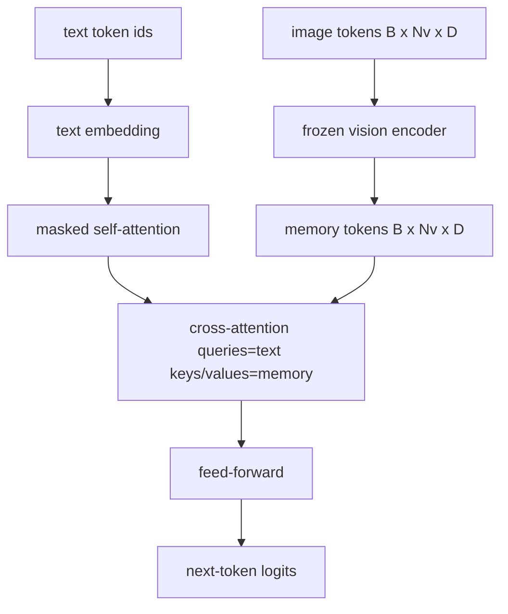
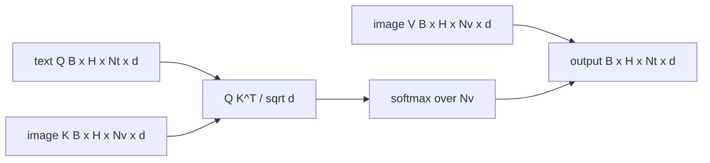

# Cross-Attention Hợp nhất

> Lớp chiếu căn chỉnh một vector hình ảnh với một vector chú thích. Một decoder ngôn ngữ thị giác thực sự cần mọi văn bản token tham gia vào mọi bản vá token, vì vậy model có thể đặt từng từ trong một vùng. Cross-attention là cách grounding đó xảy ra. Các truy vấn văn bản; Chìa khóa và giá trị tầm nhìn trả lời. Bài học này xây dựng khối cross-attention, self-attention văn bản nhân quả và các hình dạng mặt nạ giữ cho cả hai đều hợp pháp.

**Loại:** Xây dựng
**Ngôn ngữ:** Python
**Kiến thức tiên quyết:** Giai đoạn 19 bài 30-37 (Nền tảng theo dõi B)
**Thời lượng:** ~90 phút

## Mục tiêu học tập

- Triển khai cross-attention nhiều đầu trong đó luồng truy vấn là văn bản và luồng key/value là tầm nhìn.
- Soạn một khối decoder: self-attention nhân quả + cross-attention + chuyển tiếp.
- Có được hình dạng mặt nạ phù hợp: mặt nạ nhân quả cho self-attention, không có mặt nạ cho cross-attention.
- Chạy một forward pass với tokens văn bản hàng loạt và một nhóm tokens hình ảnh cố định.

## Vấn đề

Nối tokens hình ảnh và tokens văn bản thành một chuỗi là một tùy chọn hợp nhất (hợp nhất sớm, con đường mà Chameleon và Emu3 thực hiện). Cross-attention là cái kia (hợp nhất muộn, con đường mà Flamingo giới thiệu và mọi decoder hình Flamingo kể từ đó đều sao chép). Trong quá trình hợp nhất muộn, văn bản decoder chạy trên tokens chỉ văn bản và tiếp cận vào luồng hình ảnh thông qua cross-attention ở mọi lớp.

Nhiệt hạch muộn có hai ưu điểm. Đầu tiên, luồng văn bản luôn sạch sẽ và model duy trì khả năng chỉ văn bản. Thứ hai, luồng hình ảnh được tính toán một lần cho mỗi hình ảnh và được sử dụng lại cho mỗi bước giải mã, vì vậy việc tạo ra sẽ rẻ ngay cả đối với chú thích dài. Chi phí là thêm một attention lớp phụ cho mỗi khối.

## Khái niệm





### Hình dạng mặt nạ

Hai sự chú ý bên trong một khối decoder cần những chiếc mặt nạ khác nhau:

| Attention | Độ dài truy vấn | Độ dài phím | Mặt nạ | Tại sao |
|-----------|--------------|------------|------|-----|
| Self-attention | `Nt` (văn bản) | `Nt` (văn bản) | Nhân quả: `(Nt, Nt)` tam giác dưới | tokens văn bản có thể không nhìn về phía trước trong quá trình tự hồi quy |
| Cross-attention | `Nt` (văn bản) | `Nv` (tầm nhìn) | Không đeo khẩu trang | Toàn bộ hình ảnh hiển thị cho mọi vị trí văn bản |

Bài học bao gồm một chức năng xác thực hình dạng, vì vậy sai lầm của việc trộn chúng lên các bề mặt như một `ValueError` thay vì một đường cong loss gặp lỗi một cách âm thầm.

### Tại sao không có mặt nạ trên cross-attention

Hình ảnh được quan sát đầy đủ trước khi bất kỳ văn bản nào được tạo ra. Token `t` chú thích có thể tham gia vào bất kỳ bản vá nào của hình ảnh; Không có thứ tự thời gian trên các bản vá hình ảnh. Một số biến thể Flamingo thêm mẫu mặt nạ cho mỗi mẫu khi xen kẽ nhiều hình ảnh và phân đoạn văn bản, nhưng đối với một hình ảnh cộng với chú thích, cross-attention sẽ nhìn thấy mọi thứ.

### Key/value bộ nhớ đệm

Các khóa và giá trị hình ảnh được tính toán một lần khi bắt đầu giải mã và được giữ trong bộ nhớ đệm. Mỗi văn bản mới token sử dụng bộ nhớ đệm mà không cần tính toán lại. Đây là điều làm cho phụ đề nhanh ở inference: ViT nặng chạy một lần; cross-attention sử dụng lại các khóa và giá trị của nó cho mỗi bước. Bài học hiển thị bộ nhớ cache và kiểm tra đường dẫn truy cập bộ nhớ cache.

### Thành phần khối

Một khối decoder chạy: trước LN -> self-attention -> dư -> trước LN -> cross-attention -> dư -> trước LN -> chuyển tiếp -> dư. Ba lớp phụ, mỗi lớp có LayerNorm riêng. Bài báo Flamingo đã thêm một cổng đã học trên cross-attention để model có thể chọn không tham gia đường dẫn hình ảnh với chi phí ổn định training thời gian; Đường cơ sở chính tắc (được sử dụng ở đây) không có cổng.

```python
class DecoderBlock:
  def forward(self, text_tokens, image_tokens, text_mask, cross_mask):
      text_tokens = text_tokens + self.self_attn(self.ln1(text_tokens),
                                                 mask=text_mask)
      text_tokens = text_tokens + self.cross_attn(self.ln2(text_tokens),
                                                  image_tokens,
                                                  mask=cross_mask)
      text_tokens = text_tokens + self.ffn(self.ln3(text_tokens))
      return text_tokens
```

## Tự xây dựng

`code/main.py` thực hiện:

- `CrossAttention(hidden, heads)`, cross-attention nhiều đầu với các phép chiếu `q` và `kv` riêng biệt.
- `CausalSelfAttention(hidden, heads)`, self-attention mặt nạ từ một decoder tiêu chuẩn.
- `DecoderBlock`, tạo thành ba lớp con với dư trước LN.
- `VisionLanguageDecoder`, decoder bốn lớp được cung cấp bởi một tầm nhìn giả encoder đầu ra và một bảng embedding văn bản nhỏ.
- `causal_mask(length)` trả về một tensor boolean hình tam giác thấp hơn `(length, length)`.
- Một bản demo cung cấp một batch gồm hai chuỗi văn bản có độ dài 10 với bộ nhớ hình ảnh có độ dài 197 và in hình dạng đầu ra, hình dạng mặt nạ self-attention và định mức đầu ra cross-attention cho mỗi vị trí.

Chạy nó:

```bash
python3 code/main.py
```

Đầu ra: decoder tạo ra một `(2, 10, text_vocab)` logits tensor. Hình dạng mặt nạ `(10, 10)`. Kiểm tra việc sử dụng lại bộ nhớ đệm KV xác nhận logits giống hệt nhau giữa các đường dẫn được lưu trong bộ nhớ đệm và không được lưu trong bộ nhớ đệm.

## Ứng dụng

Cross-attention xuất hiện trong hai production họ:

- **Flamingo và IDEFICS.** Chèn một lớp con cross-attention mỗi khối ngôn ngữ K model, với một LM bị đóng băng. Bộ chuyển đổi ngôn ngữ thị giác là khối cross-attention cộng với cổng của nó.
- **BLIP-2.** Q-Former sử dụng cross-attention từ một tập hợp cố định gồm 32 truy vấn tokens vào features hình ảnh, sau đó chiếu các truy vấn vào không gian LM embedding.

Hình dạng của khối trong bài học này ánh xạ trực tiếp lên cả hai. Kỷ luật mặt nạ (nhân quả trên bản thân, không có trên thập giá) là như nhau.

## Kiểm tra

`code/test_main.py` bao gồm:

- Mặt nạ nhân quả có hình tam giác thấp hơn và phù hợp với hình dạng boolean dự kiến
- Hình dạng đầu ra cross-attention `(B, Nt, hidden)` bất kể độ dài phím
- Đường dẫn bộ nhớ đệm KV khớp với đường dẫn không được lưu trong bộ nhớ đệm với dung sai nổi
- Hình dạng không khớp giữa luồng văn bản và hình ảnh làm tăng `ValueError` rõ ràng
- Một decoder forward pass đầy đủ tạo ra hình dạng batch và trình tự phù hợp

Chạy chúng:

```bash
python3 -m unittest code/test_main.py
```

## Bài tập

1. Thêm một cổng tanh đã học vào phần dư cross-attention (thủ thuật Flamingo) và xác minh training hội tụ từ cổng ban đầu gần bằng không. Cổng bắt đầu từ 0; Công model khôi phục hành vi chỉ có văn bản trước khi trộn luồng hình ảnh vào.

2. Triển khai attention xen kẽ trong đó cùng một decoder sử dụng nhiều hình ảnh cộng với nhiều phân đoạn văn bản. Xây dựng mặt nạ cross-attention cho mỗi mẫu để ngăn phân đoạn văn bản 2 tham gia vào hình ảnh 1.

3. Lập hồ sơ lớp cross-attention so với lớp self-attention ở `Nt=64, Nv=576` (lưới 24x24 ở độ phân giải cao hơn). Chi phí cross-attention `Nt * Nv` và chiếm ưu thế ở độ phân giải hình ảnh cao.

4. Thêm dropout phía truy vấn trên bản đồ cross-attention và đo lường sự đa dạng của phụ đề trên bản demo (mẫu phụ đề variance tăng theo dropout trong bản đồ chéo).

5. Hoán đổi lớp cross-attention cho khối attention kiểu Q-Former, trong đó nhóm truy vấn 32 token cố định tham gia vào features hình ảnh một lần cho mỗi lớp.

## Thuật ngữ chính

| Thuật ngữ | Nó có nghĩa là gì |
|------|---------------|
| Nhiệt hạch muộn | Văn bản và hình ảnh nằm trong các luồng riêng biệt; cross-attention kết nối chúng ở mọi khối |
| Cross-attention | Q đến từ một luồng, K và V từ một luồng khác |
| Mặt nạ nhân quả | Mặt nạ boolean hình tam giác thấp hơn giúp ngăn chặn việc nhìn về phía trước trong quá trình tự hồi quy |
| KV cache | Các khóa và giá trị hình ảnh được lưu trữ một lần và được sử dụng lại cho mỗi bước giải mã |
| Bộ nhớ tokens | Hình ảnh đóng băng tokens decoder tiếp cận |

## Đọc thêm

- Flamingo (2022) cho thiết kế nhiệt hạch muộn kinh điển với cross-attention có cổng.
- BLIP-2 (2023) cho Q-Former, là một khối cross-attention được trang phục như một nhóm truy vấn đã học.
- IDEFICS (2023) để tái tạo trọng lượng mở của công thức Flamingo.
