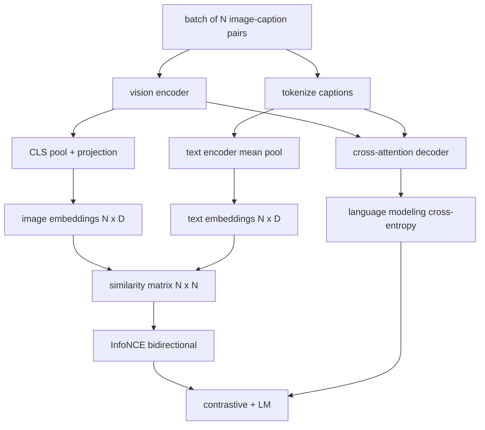

# Tầm nhìn-Ngôn ngữ Pretraining

> Các encoder, hình chiếu và decoder được nối dây. Bây giờ hãy huấn luyện họ cùng nhau. Hai mục tiêu thúc đẩy học tập: một loss hình ảnh-văn bản tương phản (InfoNCE) kéo các cặp phù hợp lại với nhau trong không gian embedding chung và một loss mô hình hóa ngôn ngữ yêu cầu decoder chú thích cho từng hình ảnh. Kết hợp lại, chúng dạy mạng tìm hình ảnh phù hợp cho chú thích và viết chú thích cho hình ảnh.

**Loại:** Xây dựng
**Ngôn ngữ:** Python
**Kiến thức tiên quyết:** Giai đoạn 19 bài 30-37 (Nền tảng theo dõi B)
**Thời lượng:** ~90 phút

## Mục tiêu học tập

- Triển khai loss tương phản InfoNCE trên một batch cặp chú thích hình ảnh.
- Soạn loss tương phản với loss mô hình ngôn ngữ tự hồi quy.
- Tổng hợp kho dữ liệu chú thích hình ảnh giả 200 cặp mà không cần tải xuống dataset thực.
- Chạy vòng lặp training demo 50 bước và quan sát cả hai khoản lỗ đều giảm.

## Vấn đề

Một model ngôn ngữ thị giác cần hai skills. Nó phải xếp hạng: được đưa ra chú thích, hãy tìm hình ảnh phù hợp trong số nhiều hình ảnh. Nó phải tạo ra: cho một hình ảnh, viết một chú thích. Pretraining model trên một skill thôi đã cung cấp cho bạn một nửa hệ thống. CLIP đóng đinh xếp hạng nhưng không thể chú thích. GPT-4V có thể chú thích nhưng sử dụng một đầu truy xuất riêng để xếp hạng. pretraining đa mục tiêu nhận được cả hai trong một lần vượt qua.

InfoNCE xử lý nửa xếp hạng. Đối với một batch của N cặp, model coi N cặp phù hợp là dương và `N^2 - N` cặp không khớp là âm, sau đó chạy một loss entropy chéo trên ma trận tương tự `(N, N)` kết quả. LM loss xử lý nửa thế hệ: dự đoán token tiếp theo tiêu chuẩn có điều kiện trên hình ảnh. Cả hai tổn thất đều có thể phân biệt được và có thể chia sẻ trọng lượng encoder, máy chiếu và decoder.

## Khái niệm



### InfoNCE trong một đoạn văn

Stack hình ảnh N embeddings dưới dạng hàng và N văn bản embeddings dưới dạng hàng. L2-chuẩn hóa cả hai. Tính toán ma trận `N x N` `S = I T^T / tau` trong đó `tau` là một temperature đã học. Các mục chéo là các cặp phù hợp; Các mục không theo đường chéo là âm bản. Áp dụng entropy chéo với `argmax` mục tiêu chạy xuống đường chéo: hàng `i` phải có mục nhập cao nhất trong cột `i`. Làm tương tự đối xứng dọc theo các cột. Tổng số là trung bình của cả hai. Đây là loss CLIP trong tám dòng.

### Temperature vấn đề

temperature `tau` kiểm soát mức độ đỉnh của softmax. Quá nhỏ (ví dụ: `tau = 0.01`) và gradient chỉ đến từ âm bản khó nhất, training ồn ào. Quá lớn và softmax phẳng và gradient biến mất. CLIP học `tau` như một parameter; Bản demo ở đây cũng làm như vậy.

### Mô hình hóa ngôn ngữ loss

decoder tiêu thụ bộ nhớ hình ảnh tokens thông qua cross-attention và dự đoán văn bản tiếp theo token ở mọi vị trí. Loss là entropy chéo tiêu chuẩn với mục tiêu vị trí tiếp theo. Các vị trí đệm được che ngoài loss.

### Kết hợp các khoản lỗ

`total = contrastive + lm_weight * lm` trong đó `lm_weight` là một vô hướng (thường là 1.0). Hai khoản lỗ chia sẻ gradients vào encoder và dự đoán; chỉ decoder nhận được LM-loss gradient. Đây là công thức đa nhiệm mà models kiểu CoCa, BLIP và SigLIP đều sử dụng, với nhiều trọng lượng khác nhau.

| Thành phần | Loss bề mặt | Ảnh hưởng |
|-----------|--------------|---------|
| Thông tin NCE | Xếp hạng cặp trong không gian chung | Encoder + chiếu + tiêu đề văn bản |
| LM | Token dự đoán có điều kiện trên hình ảnh | Encoder + chiếu + decoder |
| Kết hợp | Đa nhiệm | Toàn bộ stack |

### Tại sao 50 bước là đủ cho một bản demo

Kho dữ liệu giả là một tập hợp 200 cặp tổng hợp với các hình ảnh ngẫu nhiên và id chú thích ngẫu nhiên. Sau 50 bước SGD với kích thước batch 16, cả hai tổn thất đều giảm rõ rệt ngay cả khi giá trị tuyệt đối vẫn cao hơn những gì model dữ liệu thực sẽ đạt được. Mục đích của bản demo là xác nhận gradient hệ thống ống nước hoạt động từ đầu đến cuối và việc thêm loss LM không làm mất ổn định mục tiêu tương phản.

## Tự xây dựng

`code/main.py` thực hiện:

- `MultimodalModel`, kết hợp một encoder ViT nhỏ, máy chiếu MLP, một encoder phía văn bản nhỏ (nhóm trung bình trên các id nhúng) và cross-attention decoder từ bài 61.
- `info_nce_loss(image_emb, text_emb, temperature)`, loss tương phản kiểu CLIP hai chiều.
- `lm_loss(logits, target_ids, padding_id)`, che giấu entropy chéo token tiếp theo.
- `make_mock_corpus(seed, n_pairs)`, trả về 200 cặp xác định (hình ảnh, caption_ids).
- Một vòng lặp training chạy 50 bước với batch kích thước 16, Adam optimizer và một temperature parameter nhật ký đã học. Cả hai tổn thất đều được in sau mỗi 5 bước.

Chạy nó:

```bash
python3 code/main.py
```

Đầu ra: loss tương phản giảm từ khoảng `ln(16) = 2.77` xuống 2,4; LM loss giảm từ đường cơ sở đồng nhất ngẫu nhiên là `ln(512) ≈ 6.24` về khoảng 4,7. Cả hai mức giảm đều chứng minh gradient được nối dây chính xác. Thực models luyện tập cho hàng triệu bước; Động lực học là như nhau.

## Ứng dụng

Đây là công thức loss tương tự shipped trong:

- **CLIP (2021).** Chỉ tương phản giữa hình ảnh-văn bản, với đầu dò phụ đề encoder đông lạnh riêng biệt.
- **CoCa (2022).** Hình ảnh-văn bản tương phản cộng với LM phụ đề hình ảnh loss trong một model. Mô hình chính xác mà bài học này xây dựng.
- **BLIP (2022) và BLIP-2.** Tương phản cộng với LM cộng với đầu khớp hình ảnh-văn bản. Ba trận thua kết hợp.
- **SigLIP (2023).** Chuyển đổi InfoNCE cho một cặp sigmoid loss; cùng một vai trò tương phản, hình thức chức năng khác nhau.
- **Họ LLaVA.** Hai giai đoạn training trong đó giai đoạn một là alignment (cosin trên LM đông lạnh) và giai đoạn hai thêm LM loss với LM không đóng băng. Bài 60 ánh xạ đến giai đoạn một; Bài học này liên quan đến giai đoạn hai.

## Kiểm tra

`code/test_main.py` bao gồm:

- InfoNCE loss đối xứng trên image/text hàng
- InfoNCE loss trả về 0 khi ma trận tương tự là một đường chéo hoàn hảo của các số dương lớn
- LM loss che các vị trí đệm một cách chính xác
- model forward pass tạo ra cả hai tổn thất mà không có sai sót
- Vòng lặp training 5 bước làm giảm loss kết hợp

Chạy chúng:

```bash
python3 -m unittest code/test_main.py
```

## Bài tập

1. Thay thế InfoNCE bằng cặp sigmoid kiểu SigLIP loss và so sánh sự hội tụ trên kho dữ liệu giả.

2. Thêm một bước khai thác cứng-âm: cứ batch khác, hãy chọn cặp lệch đường chéo khó nhất từ batch trước đó và thêm nó. Huấn luyện và kiểm tra xem loss tương phản có giảm nhanh hơn hay không.

3. Thêm một đầu nhị phân khớp hình ảnh-văn bản trên đầu embedding chung (true/false: những thứ này có khớp không?) cho loss thứ ba, sao chép thiết lập ba đầu của BLIP.

4. Thay thế kho dữ liệu giả bằng các chuỗi id phụ đề được rút ra từ chuỗi Markov có ma trận chuyển tiếp có điều kiện dựa trên hàm băm hình ảnh. loss phụ đề nên giảm hơn nữa vì có tín hiệu thực tế có thể học được.

5. Huấn luyện cùng một model với `lm_weight = 0` và một lần nữa với `lm_weight = 1`. So sánh loss tương phản; loss LM không được thụt lùi mục tiêu xếp hạng.

## Thuật ngữ chính

| Thuật ngữ | Nó có nghĩa là gì |
|------|---------------|
| Thông tin NCE | Ước tính tương phản nhiễu: entropy chéo trên ma trận tương tự |
| Temperature | Vô hướng kiểm soát mức độ đỉnh của softmax tương phản |
| Tiêu cực cứng | Một cặp lệch đường chéo mà model thấy khó hiểu, hữu ích cho sampling |
| LM loss | Entropy chéo token tiếp theo tiêu chuẩn ở phía phụ đề |
| Không gian embedding chung | Không gian chung nơi hình ảnh và văn bản vectors sống sau khi chiếu |

## Đọc thêm

- Giấy CLIP cho công thức tương phản ban đầu.
- Giấy CoCa để tương phản cộng với chú thích trong một model.
- Giấy SigLIP cho biến thể loss cặp sigmoid và lý do tại sao nó mở rộng tốt hơn.
