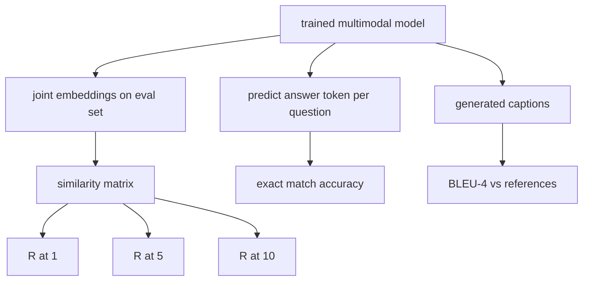

# Đánh giá đa phương thức

> Training là một nửa vòng lặp. Nửa còn lại là đo lường. Bài học này xây dựng ba bề mặt đánh giá từ primitives: truy xuất chú thích hình ảnh được báo cáo là R@1, R@5, R@10; trả lời câu hỏi trực quan được báo cáo là accuracy khớp chính xác; và chú thích hình ảnh được báo cáo là BLEU-4. Mỗi chỉ số là một hàm trên đầu ra của model và một bộ đánh giá tổng hợp chạy trong vài giây.

**Loại:** Xây dựng
**Ngôn ngữ:** Python
**Kiến thức tiên quyết:** Giai đoạn 19 bài 58-62 (Nền tảng Track E: encoder, transformer, chiếu, cross-attention fusion, pretraining)
**Thời lượng:** ~90 phút

## Mục tiêu học tập

- Tính toán Recall@K từ ma trận tương tự giữa embeddings hình ảnh và chú thích.
- Tính toán accuracy VQA khớp chính xác từ một model ánh xạ các cặp (hình ảnh, câu hỏi) với một từ vựng câu trả lời cố định.
- Tính toán BLEU-4 từ các chuỗi token được tạo và tham chiếu mà không cần bất kỳ thư viện bên ngoài nào.
- Chạy cả ba vòng đánh giá với một bộ tổng hợp được xây dựng trên model đã được huấn luyện từ bài 62.

## Vấn đề

Sự cám dỗ là tuyên bố một model đa phương thức đã hoàn thành khi training loss ổn định. Training loss biện pháp phù hợp với phân phối training; Nó không đo lường liệu model có thể xếp hạng các cặp trong một batch được tổ chức, trả lời một câu hỏi hoặc viết chú thích mà con người sẽ chấp nhận hay không. Ba bề mặt đánh giá là tiêu chuẩn:

- **Truy xuất (R@1, R@5, R@10).** Xây dựng embedding chung cho chú thích truy vấn; xếp hạng mọi hình ảnh trong nhóm đánh giá theo cosine; Báo cáo xem hình ảnh phù hợp có nằm trong top 1, top 5, top 10 hay không. Biểu mẫu đối xứng (hình ảnh thành văn bản) chạy theo cách tương tự.
- **Trả lời câu hỏi trực quan (đối sánh chính xác).** Cho (hình ảnh, câu hỏi), model xuất ra câu trả lời token. Đối sánh chính xác là một bit cho mỗi mẫu: câu trả lời dự đoán có bằng câu trả lời tham chiếu không? Trung bình trên bộ đánh giá.
- **Phụ đề (BLEU-4).** Tạo phụ đề. Tính giá trị trung bình hình học của độ chính xác từ 1 gam đến 4 gam so với phụ đề tham chiếu, với hình phạt ngắn gọn. Đa tham chiếu là hình thức tiêu chuẩn (một hình ảnh, một số chú thích tham khảo).

Mỗi chỉ số là một hàm mỏng. Bài học xây dựng tất cả chúng trong mã để toán học cụ thể và bề mặt nằm trong tầm kiểm soát của bạn. Các bộ benchmark thực (MS-COCO, VQA v2, GQA, OK-VQA) cắm vào cùng một hình dạng chức năng.

## Khái niệm



### Recall@K từ ma trận tương tự

Xây dựng ma trận tương tự cosin `(N, N)` giữa embeddings hình ảnh và chú thích. Đối với mỗi hàng, sắp xếp các cột theo độ tương tự giảm dần. Recall@K là phần của các hàng mà chỉ số cột chéo nằm trong các vị trí K hàng đầu. Recall@K đối xứng (chú thích thành hình ảnh) được tính toán trên ma trận chuyển vị. Cả hai con số đều được báo cáo. Đối với đánh giá N=100, R@1 = 0,6 có nghĩa là 60 trong số 100 chú thích đã truy xuất hình ảnh chính xác của chúng làm kết quả khớp trên cùng.

### VQA khớp chính xác

Đối với mỗi (hình ảnh, câu hỏi, câu trả lời), mã hóa hình ảnh, nhúng câu hỏi, hợp nhất qua decoder và đọc token tiếp theo. Id token dự đoán được so sánh với id tham chiếu; đúng nếu bằng. Trung bình trên bộ đánh giá. VQA thực datasets ship với nhiều câu trả lời được chú thích của con người cho mỗi câu hỏi và sử dụng công thức accuracy mềm (1.0 nếu ít nhất 3 trong số 10 người chú thích đồng ý, được chia tỷ lệ bên dưới); Bài học sử dụng kết quả khớp chính xác một câu trả lời để rõ ràng.

### BLEU-4 ·

```text
BLEU-4 = BP * exp(mean(log p1, log p2, log p3, log p4))
```

Trong đó `p_n` là precision n-gram đã sửa đổi (số lượng n-gam được tạo ra xuất hiện trong bất kỳ tham chiếu nào, chia cho tổng số n-gam được tạo ra) và `BP` là hình phạt ngắn gọn:

```text
BP = 1                if generated length > reference length
   = exp(1 - r/g)     otherwise, where r is reference length and g is generated
```

Làm mịn là cần thiết đối với các mẫu nhỏ trong đó một số `p_n` bằng không. Việc triển khai sử dụng "phương pháp 1" của Chen và Cherry (thêm 1 vào tử số và mẫu số cho bất kỳ số không nào), đây là mặc định an toàn nhất cho các chế độ đếm thấp.

### Bộ đánh giá tổng hợp

Một bộ đánh giá 50 mẫu được xây dựng trong bộ nhớ từ cùng một mẫu kho dữ liệu giả được sử dụng trong bài 62, với một hạt giống được giữ ra. Ba danh sách tạo nên bộ sản phẩm:

- `pairs`: 50 cặp (hình ảnh, caption_ids) để truy xuất.
- `vqa`: 50 (hình ảnh, question_ids, answer_id) gấp ba.
- `caps`: 50 mục (hình ảnh, [reference_caption_ids, ...]) với tối đa 3 tham chiếu cho mỗi hình ảnh.

Bộ này là xác định từ hạt giống và được đưa ra từ kho dữ liệu training, vì vậy các số liệu được tính toán trên dữ liệu mà model chưa bao giờ nhìn thấy. Duy trì bộ để JSON được để lại như một bài tập (xem bên dưới).

| Số liệu | Phạm vi | Đường cơ sở ngẫu nhiên (N = 50) |
|--------|-------|------------------------|
| R@1 | 0 ăn 1 | 0,02 (1 / N) |
| R@5 | 0 ăn 1 | 0.10 |
| R@10 | 0 ăn 1 | 0.20 |
| VQA EM | 0 ăn 1 | 1 / Từ vựng |
| BLEU-4 · | 0 ăn 1 | nhỏ nhưng không phải bằng không |

Đối với training 50 bước chạy trên dữ liệu tổng hợp, các chỉ số dự kiến sẽ không cao; Chúng dự kiến sẽ ở trên đường cơ sở ngẫu nhiên, đó là những gì bản demo kiểm tra.

## Tự xây dựng

`code/main.py` thực hiện:

- `recall_at_k(sim_matrix, k)`, trả về một phao trong `[0, 1]` cho cả hai hướng.
- `vqa_exact_match(predictions, references)`, trả về giá trị trung bình trên `int` bình đẳng.
- `bleu4(generated, references, smoothing=True)`, với hỗ trợ đa tham chiếu.
- `build_eval_suite(seed, n_samples, vocab_size, max_len)`, trả về ba danh sách đánh giá xác định.
- `evaluate(model, suite)`, chạy cả ba chỉ số và trả về một `dict` số.
- Một bản demo tải một model đa phương thức mới khởi tạo từ bài 62, đánh giá nó, sau đó huấn luyện nó trong 50 bước và đánh giá lại, in các chỉ số before/after.

Chạy nó:

```bash
python3 code/main.py
```

Đầu ra: bảng số liệu before/after cho thấy khả năng truy xuất được cải thiện từ gần như ngẫu nhiên đối với tín hiệu đã học của model, VQA cải thiện trên ngẫu nhiên và BLEU-4 cải thiện (cấu trúc tổng hợp đủ để nâng precision 4 gram).

## Ứng dụng

Mỗi chỉ số ánh xạ trực tiếp vào một production benchmark:

- **Truy xuất.** MS-COCO 5K val, Flickr30K, ImageNet zero-shot tất cả đều R@K vấn đề trên cùng một ma trận tương tự. Thay thế đánh giá tổng hợp bằng các tệp thực và chữ ký hàm không thay đổi.
- **VQA.** VQA v2, GQA, OK-VQA sử dụng cùng một hình dạng khớp chính xác (với soft-acc thay vì EM một câu trả lời cho VQA v2).
- **BLEU-4.** Phụ đề MS-COCO, NoCaps, phụ đề Flickr30K đều sử dụng BLEU-4 cộng với CIDEr và METEOR. Thêm CIDEr là một chức năng nữa.

Đối với benchmarks thực, hãy hoán đổi `build_eval_suite` cho một bộ nạp thực và giữ lại các phần thân hàm. Toán học là benchmark bất khả tri.

## Kiểm tra

`code/test_main.py` bao gồm:

- recall@k trả về 1.0 trên ma trận tương tự nhận dạng hoàn hảo và 0.0 trên ma trận lật ngược cho k < N
- recall@k tôn trọng giới hạn trên `k <= N`
- bleu4 trả về 1.0 khi được tạo bằng một trong các tham chiếu chính xác
- bleu4 trả về 0.0 cho từ vựng rời rạc
- Đối sánh chính xác VQA bằng phần của các cặp bằng nhau
- build_eval_suite trả về số lượng cặp, mục vqa và mục chú thích dự kiến

Chạy chúng:

```bash
python3 -m unittest code/test_main.py
```

## Bài tập

1. Thêm CIDEr vào chỉ số phụ đề. CIDEr sử dụng trọng số TF-IDF trên n-gram, thưởng cho tokens thông tin.

2. Triển khai VQA accuracy mềm: nhiều câu trả lời của con người cho mỗi câu hỏi accuracy `min(human_count / 3, 1)` nếu có câu trả lời phù hợp. Sao chép VQA v2.

3. Thêm biến thể `bleu4` an toàn NaN để xử lý các trình tự được tạo trống mà không gặp sự cố.

4. Tính toán xếp hạng đối ứng trung bình (MRR) cùng với R@K. MRR nhạy cảm với vị trí mục chính xác nằm ngoài K trên cùng; R@K nhạy cảm với việc liệu nó có nằm trong top K hay không.

5. Chạy đánh giá trên model ở năm checkpoints trong training (bước 0, 10, 20, 30, 40, 50) và vẽ đường cong học tập. Xác nhận quỹ đạo hệ mét theo dõi quỹ đạo loss.

## Thuật ngữ chính

| Thuật ngữ | Nó có nghĩa là gì |
|------|---------------|
| R@K | Phần truy vấn trong đó kết quả khớp chính xác nằm trong kết quả K hàng đầu |
| Đối sánh chính xác | Chấm điểm VQA đơn giản nhất: câu trả lời dự đoán bằng tham chiếu |
| BLEU-4 · | Trung bình hình học có độ chính xác từ 1 đến 4 gam, với hình phạt ngắn gọn |
| Đa tài liệu tham khảo | Chỉ số phụ đề chấp nhận một số phụ đề tham chiếu cho mỗi hình ảnh |
| Giữ lại | Bộ đánh giá được lấy mẫu từ một hạt giống rời khỏi kho dữ liệu training |

## Đọc thêm

- Giấy VQA v2 cho công thức accuracy mềm và thống kê dataset.
- Giấy CIDEr để chú thích n-gram có trọng số TF-IDF.
- BLEU ban đầu (Papineni et al., 2002) cho các biến thể làm mịn.
- scripts đánh giá phụ đề MS-COCO để triển khai tham chiếu chính tắc.
