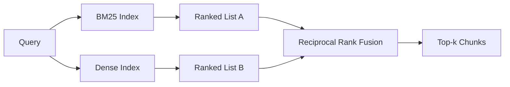

# Hybrid Retrieval với BM25 và Dense Embeddings

> Truy xuất từ vựng và ngữ nghĩa không thành công trên các phân phối truy vấn ngược lại. Truy xuất kết hợp với sự kết hợp xếp hạng đối ứng không nội suy, nó bỏ phiếu - và phiếu bầu giành chiến thắng trên mọi truy vấn class.

**Loại:** Xây dựng
**Ngôn ngữ:** Python
**Kiến thức tiên quyết:** Giai đoạn 11 bài 04 (embeddings), 06 (RAG); Nền tảng Giai đoạn 19 Track B (bài 20-29); Giai đoạn 19 bài 64 (chiến lược phân đoạn)
**Thời lượng:** ~90 phút

## Mục tiêu học tập
- Triển khai BM25 từ đầu từ công thức Robertson và Sparck Jones, với trọng số trường, chuẩn hóa độ dài tài liệu và k1 và b có thể điều chỉnh.
- Xây dựng một săn mồi dày đặc trên một embedding mô phỏng xác định để vòng lặp chạy ngoại tuyến.
- Thực hiện hợp nhất xếp hạng đối ứng chính xác như Cormack, Clarke và Buettcher đã xuất bản nó vào năm 2009 và giải thích lý do tại sao nó thống trị nội suy trọng số điểm.
- Điều chỉnh hằng số RRF k và trọng số cho mỗi phương thức và đọc sự đánh đổi trên một kho dữ liệu cố định nhỏ.

## Vấn đề

Tìm kiếm từ vựng sẽ thắng khi truy vấn mang mã định danh theo nghĩa đen mà kho dữ liệu chứa nguyên văn. Một truy vấn cho `AbortMultipartOnFail` trả về hàm Go bên phải thông qua BM25 tính bằng micro giây. Cùng một truy vấn, được nhúng, nằm ở ranh giới của ba cụm tương tự và một săn mồi dày đặc xếp hạng sai tệp đầu tiên.

Tìm kiếm dày đặc chiến thắng khi truy vấn được diễn giải ra khỏi tokens nghĩa đen của kho dữ liệu. Một người dùng hỏi "làm thế nào để chúng tôi xử lý các tải lên bị hủy" không bao giờ gõ từ hủy bỏ hoặc nhiều phần. BM25 trả về đoạn tài liệu về "tải lên các tệp lớn" vì trang đó chứa từ tải lên. Truy xuất dày đặc tìm hàm hủy bỏ có tóm tắt đề cập đến việc hủy.

Sự lựa chọn giữa hai không phải là một sự lựa chọn tĩnh. Phân phối truy vấn là biến. Một hệ thống production RAG xử lý cả hai classes từ cùng một endpoint, vì vậy việc truy xuất phải xử lý cả hai cùng một lúc. Đó là truy xuất lai. Bước merge là phần phải đúng.

## Khái niệm



### BM25 trong một đoạn văn

BM25 chấm điểm một cặp tài liệu truy vấn bằng cách tổng, trên các thuật ngữ truy vấn, một hệ số tần số tài liệu nghịch đảo nhân với hệ số tần số thuật ngữ bão hòa bao gồm hiệu chỉnh chuẩn hóa độ dài. Hai núm. `k1` kiểm soát độ bão hòa tần số hạn; 1.5 mặc định là đề xuất đã xuất bản và bạn không nên di chuyển nó mà không có benchmark. `b` kiểm soát độ dài tài liệu quan trọng; 0,75 mặc định cho biết các tài liệu dài hơn bị phạt, nhưng không tuyến tính.

Công thức IDF sử dụng định nghĩa Robertson và Sparck Jones được làm mịn, `log((N - df + 0.5) / (df + 0.5) + 1)`. Dấu cộng một bên trong nhật ký giữ cho IDF dương khi một thuật ngữ xuất hiện trong hơn một nửa kho dữ liệu. Điều này quan trọng trong kho dữ liệu nhỏ, nơi các từ dừng rất hiếm về mặt kỹ thuật.

Trọng số trường cho phép bạn cho BM25 biết rằng một kết quả khớp trên tên biểu tượng có giá trị nhiều hơn một kết quả trùng khớp trong nội dung. Việc triển khai là hệ số nhân về số lượng thời hạn trong quá trình lập chỉ mục, không phải tại thời điểm chấm điểm. Điều đó giữ cho phép toán giống hệt nhau và tránh một điểm số riêng biệt cho mỗi trường.

### Truy xuất dày đặc trong một đoạn văn

Nhúng từng đoạn vào một vector có kích thước cố định bằng embedding model. Tại thời điểm truy vấn, nhúng truy vấn, xếp hạng cosin mọi phân đoạn theo sự tương đồng và trả về top-k. model là biến quyết định chất lượng. Bản thân thuật toán truy xuất có hai dòng: chấm sản phẩm và sắp xếp.

Bài học này sử dụng embedding dựa trên hàm băm xác định để bạn có thể đọc toán học hợp nhất mà không cần gọi mạng. Hàm băm tổng các phần bù khóa token thành một vector 96 chiều và chuẩn hóa. Xếp hạng cosin là xác định qua các lần chạy, đó là những gì bộ thử nghiệm yêu cầu.

### Hợp nhất xếp hạng đối ứng, công thức đã xuất bản

Hai danh sách được xếp hạng. Đối với mỗi ứng cử viên xuất hiện trong một trong hai danh sách, hãy tính tổng các đóng góp có thứ hạng đối ứng của nó. Bài báo năm 2009 sử dụng `1 / (k + rank)` với k bằng 60 làm mặc định. Sắp xếp theo tổng điểm. Đó là toàn bộ thuật toán.

Hằng số được công bố k = 60 không phải là tùy ý. Với k = 60, đóng góp hạng 1 là 1 / 61 và đóng góp hạng 10 là 1 / 70. Khoản đóng góp giảm dần nên các ứng cử viên sâu sắc vẫn bỏ phiếu. K nhỏ hơn làm cho kết quả hàng đầu chiếm ưu thế. K lớn hơn làm phẳng đường cong đóng góp.

Hai núm có thể điều chỉnh trong quá trình triển khai của chúng tôi. Hằng số `k`. Một cặp trọng lượng cho mỗi phương thức để bạn có thể tăng BM25 hoặc đậm đặc khi bạn có prior bằng chứng cho thấy trọng lượng tốt hơn trên kho dữ liệu của bạn. Nhân đóng góp xếp hạng với trọng số là cách thực hiện có nguyên tắc đơn giản nhất; Nó giữ nguyên hình dạng phân rã cấp bậc và không có quy mô.

### Tại sao hợp nhất đánh bại nội suy trọng số điểm số

Điểm BM25 là không giới hạn và phụ thuộc vào kho dữ liệu. Sự tương đồng cosin được giới hạn trong -1 đến 1. Một `alpha * bm25 + (1 - alpha) * cosine` kết hợp tuyến tính yêu cầu điều chỉnh alpha cho mỗi kho dữ liệu và ngắt mỗi khi bạn lập chỉ mục lại. Sự hợp nhất dựa trên cấp bậc thì không. Hai cấp bậc có thể so sánh giữa các phương thức. Đường cơ sở RRF được công bố đánh bại nội suy điểm số trong mọi đường đua TREC công khai kể từ năm 2010.

Đây là lập luận tương tự mà bạn nghe về RankFusion vs RRF trong tài liệu Vespa và Weaviate. Họ đi đến cùng một kết luận: duy trì dựa trên thứ hạng trừ khi bạn có bằng chứng rất mạnh mẽ để nội suy điểm số.

## Tự xây dựng

`code/main.py` thực hiện:

- `tokenize(text)` - một tokenizer biểu thức chính quy nhanh.
- `BM25Index` - trọng số trường, với `add` và `search` và có thể điều chỉnh k1, b.
- `mock_embed`, `DenseIndex` - embedding xác định tương tự như bài 64 nên các khối có thể so sánh được.
- `rrf(rankings, k, weights)` - sự kết hợp được công bố với trọng số đa phương thức.
- `HybridRetriever` - kết hợp BM25 và đậm đặc.
- Một `main()` demo tải một kho dữ liệu cố định nhỏ, chạy ba truy vấn nhắm mục tiêu vào điểm mạnh và điểm yếu của mỗi săn mồi, đồng thời in thứ hạng của mỗi phương thức được tạo ra cộng với danh sách hợp nhất.

Chạy nó:

```bash
python3 code/main.py
```

Đọc đầu ra demo song song. Truy vấn định danh theo nghĩa đen hạ cánh ở BM25 hạng 1, hạng mật độ 4, RRF hạng 1. Truy vấn được diễn giải hạ cánh ở BM25 hạng 6, hạng 1 dày đặc, hạng RRF 1. Truy vấn mơ hồ nằm ở BM25 hạng 3, hạng 3 dày đặc, RRF hạng 1. Sự hợp nhất không phải là một sự phá vỡ hòa; Đó là hệ thống chiến thắng trên mọi truy vấn class.

## Điều chỉnh các núm

| Núm vặn | Mặc định | Di chuyển nó lên khi | Di chuyển nó xuống khi |
|------|---------|----------------|------------------|
| BM25 k1 | 1.5 | Các thuật ngữ lặp lại trong tài liệu và bạn muốn tần suất quan trọng hơn | Tài liệu ngắn và lặp lại thời hạn là nhiễu |
| BM25 b | 0.75 | Tài liệu dài thực sự nói ít hơn trên mỗi từ | Độ dài tài liệu không tương quan với chủ đề |
| RRF k | 60 | Các ứng cử viên sâu nên tiếp tục bỏ phiếu | Top 1 nên thống trị |
| Trọng lượng BM25 | 1.0 | Kho dữ liệu của bạn chứa các mã định danh theo nghĩa đen và các truy vấn khớp với chúng | Các truy vấn của bạn được diễn giải bởi người dùng |
| Trọng lượng dày đặc | 1.0 | Các truy vấn được diễn giải | Truy vấn theo nghĩa đen |

Điều chỉnh bằng cách chạy lại harness đánh giá của bài học 68 trên bộ truy vấn của bạn, không phải bằng trực giác.

## Chế độ thất bại mà bản demo sẽ ẩn

**Out-of-vocabulary tokens.** IDF của BM25 được tính toán từ kho dữ liệu, vì vậy các thuật ngữ chỉ trong truy vấn đóng góp bằng không. Dày đặc embeddings ảo giác một vector trong cùng một thời hạn. Trên các định danh ngoài kho dữ liệu, phương thức dày đặc trả về những hàng xóm trông hợp lý nhưng sai. Sự hợp nhất hấp thụ điều này vì BM25 không trả về gì và đóng góp thứ hạng sẽ bị loại bỏ, nhưng chỉ khi bạn loại bỏ trùng lặp theo tài liệu, không phải theo từng khối.

**Sự thống trị token dừng lại.** BM25 so với từ "the" tạo ra một thứ hạng đồng nhất trên kho dữ liệu. Lọc dừng tokens trong trình lập chỉ mục hoặc chấp nhận rằng các thuật ngữ IDF cao chiếm ưu thế một cách tự nhiên.

**Nội dung giống hệt nhau trên các phương thức.** Nếu kho dữ liệu của bạn đủ nhỏ để top-1 của BM25 cũng là top-1 của mật độ, RRF cung cấp cho bạn cùng top-1 với cùng một hàng xóm. Đó là hành vi đúng đắn, không phải là thất bại, nhưng nó làm cho sự hợp nhất trông vô hình. Thêm một cặp truy vấn đối nghịch trong đánh giá của bạn để xác minh sự hợp nhất đang thực sự hoạt động.

## Ứng dụng

Production mẫu:

- Chỉ số BM25 tính bằng process; nút cổ chai là từ điển thuật ngữ-tần số, không phải vectors.
- Index dày đặc vectors trong một cửa hàng riêng biệt (trong bài học này chúng ta sử dụng một danh sách phẳng; trong production bạn sẽ sử dụng HNSW).
- Chạy song song cả hai truy vấn; Sự hợp nhất là một merge liên tục theo thời gian đối với liên minh.
- Duy trì phương thức của mỗi lần truy xuất để người xếp hạng lại hạ lưu có thể xem phương thức nào đã bỏ phiếu cho nó.

## Sản phẩm bàn giao

Bài 66 lấy top-k hợp nhất từ bài học này và xếp hạng lại bằng một encoder chéo. Bài 68 đánh giá toàn bộ pipeline bằng precision, recall, MRR và nDCG. Chó săn mồi lai trong bài học này là giai đoạn đầu tiên của hệ thống end-to-end trong bài 69.

## Bài tập

1. Thay thế `mock_embed` bằng một model thực sự từ nhà cung cấp của bạn. Chạy lại bản demo và báo cáo cách xếp hạng chỉ dày đặc thay đổi trên truy vấn được diễn giải.
2. Thêm phương thức thứ ba: tóm tắt chunk được lập chỉ mục riêng biệt và hợp nhất thành danh sách xếp hạng thứ ba. Đo lường lợi nhuận.
3. Quét RRF k trên 10, 30, 60, 100, 200. Vẽ đường cong recall@k từ bài 68. Báo cáo giá trị của k nơi đường cong đạt đỉnh trên kho dữ liệu của bạn.
4. Thực hiện BM25F đúng cách (chuẩn hóa độ dài trên mỗi trường thay vì thủ thuật hệ số nhân) và so sánh trên một kho dữ liệu mà ký hiệu khớp với vấn đề quan trọng nhất.

## Thuật ngữ chính

| Thuật ngữ | Những gì mọi người nói | Ý nghĩa thực sự của nó |
|------|-----------------|------------------------|
| BM25 | "Tìm kiếm từ vựng" | Xếp hạng xác suất với idf x bão hòa tf x chuẩn hóa chiều dài |
| RRF | "Hợp nhất cấp bậc" | Tổng 1 / (k + xếp hạng) trên các danh sách được xếp hạng; k = 60 mặc định |
| k1 | "Độ bão hòa TF" | Kiểm soát tốc độ một thuật ngữ lặp lại ngừng thêm điểm |
| b | "Hình phạt chiều dài" | 0 có nghĩa là bỏ qua độ dài tài liệu, 1 có nghĩa là chuẩn hóa hoàn toàn |
| Trọng số trường | "Tăng biểu tượng" | Lặp lại tokens trong quá trình lập chỉ mục để tăng số lượng trùng khớp trong trường đó |
| Hợp nhất dựa trên xếp hạng và dựa trên điểm số | "Tại sao RRF đánh bại tuyến tính" | Cấp bậc có thể so sánh giữa các phương thức; điểm số không |

## Đọc thêm

- Cormack, Clarke, Buettcher, "Reciprocal Rank Fusion vượt trội hơn Condorcet và phương pháp học xếp hạng cá nhân", SIGIR 2009
- Robertson, Walker, Beaulieu, Gatford, Payne, "Okapi tại TREC-3" (bài báo BM25 gốc)
- [Vespa: Hybrid Retrieval with BM25 and Embeddings](https://docs.vespa.ai/en/tutorials/hybrid-search.html)
- [Weaviate: Hybrid Search](https://weaviate.io/developers/weaviate/search/hybrid)
- Giai đoạn 11 bài 06 - RAG nguyên tắc cơ bản
- Giai đoạn 19 bài 64 - các chunker có đầu ra được lập chỉ mục ở đây
- Giai đoạn 19 bài 66 - trình xếp lại encoder chéo tiêu thụ top-k hợp nhất
