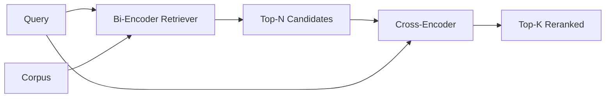

# Cross-Encoder Reranker

> Bi-encoder nhúng truy vấn và tài liệu một cách độc lập. Một encoder chéo nối chúng và đọc cả hai cùng một lúc. Chữ encoder chéo là người đọc thông minh nhất và chậm nhất. Được sử dụng như một giai đoạn thứ hai trong top-k của hai encoder, nó tự trả tiền.

**Loại:** Xây dựng
**Ngôn ngữ:** Python
**Kiến thức tiên quyết:** Giai đoạn 11 bài 06 (RAG), Giai đoạn 11 bài 07 (RAG nâng cao); Nền tảng Giai đoạn 19 Track B (bài 20-29); Giai đoạn 19 bài 65 (cho ăn thu hồi lai giai đoạn này)
**Thời lượng:** ~90 phút

## Mục tiêu học tập
- Phân biệt trình truy xuất hai encoder với trình xếp lại encoder chéo theo hình dạng đầu vào, số lượng parameter và chi phí cho mỗi truy vấn.
- Triển khai một encoder chéo nhỏ từ đầu dưới dạng một khối transformer tiêu thụ một chuỗi đóng gói (truy vấn, tài liệu) và phát ra một vô hướng liên quan duy nhất.
- Nối một pipeline truy xuất hai giai đoạn sau đó xếp hạng lại: lấy lại top N bằng một săn giá rẻ, xếp hạng lại N thành top-K với encoder chéo, trả lại K.
- Đo lường sự đánh đổi giữa độ trễ và chất lượng trên một kho dữ liệu cố định nhỏ và chọn N phù hợp cho ngân sách độ trễ nhất định.

## Vấn đề

Một bi-encoder ánh xạ truy vấn và tài liệu vào cùng một không gian vector và xếp hạng theo cosin. Hai mã hóa không bao giờ nhìn thấy nhau. model phải nén mọi thứ hữu ích về một tài liệu vào một vector duy nhất, mù quáng với truy vấn. Điều này nhanh chóng - một embedding cho mỗi tài liệu tại thời điểm lập chỉ mục và một cho mỗi truy vấn tại thời điểm truy vấn - và đó là cách duy nhất để xếp hạng ở quy mô kho dữ liệu.

Chi phí là precision. Hai tài liệu có cùng chủ đề tổng thể có thể có embeddings gần giống hệt nhau ngay cả khi một trong số chúng trả lời truy vấn và tài liệu kia thì không. Hai encoder không thể phân biệt chúng.

Một encoder chéo giải quyết vấn đề này bằng cách đọc truy vấn và tài liệu cùng nhau. model nhận `[query] [SEP] [document]` dưới dạng một chuỗi duy nhất, chạy đầy đủ attention trên liên kết và tạo ra một vô hướng liên quan. Mọi token của tài liệu đều có thể tham gia vào mọi token của truy vấn. model quyết định điểm số với đầy đủ bối cảnh.

Chi phí là thông lượng. Trong trường hợp bi-encoder nhúng một lần và truy vấn mãi mãi, encoder chéo chạy một lần cho mỗi cặp (truy vấn, tài liệu). Đối với kho dữ liệu 10 triệu tài liệu, tức là 10 triệu chuyển tiếp cho mỗi truy vấn. Không thể chạy trong ngân sách yêu cầu.

Giải pháp là dàn dựng. Sử dụng bi-encoder để truy xuất top-N. Sử dụng encoder chéo để xếp hạng lại N thành top-K. N nhỏ (50 đến 200) và chất lượng nâng của encoder chéo tập trung ở những nơi quan trọng. Tổng độ trễ vẫn nằm trong ngân sách yêu cầu. Chất lượng tổng thể là chất lượng của cross-encoder, được giới hạn bởi recall của bi-encoder ở N.

## Khái niệm



### Hình dạng đầu vào của encoder chéo

Bao bì tiêu chuẩn là `[CLS] query_tokens [SEP] document_tokens [SEP]`. Đầu ra vị trí CLS được đưa vào một đầu tuyến tính duy nhất xuất ra vô hướng liên quan. Một số triển khai sử dụng gộp trung bình thay vì CLS; Sự khác biệt là nhỏ. Vấn đề là model tạo ra một số cho mỗi cặp.

Một encoder chéo 22M-parameter (class trọng lượng `ms-marco-MiniLM-L-6-v2` được công bố) là điểm production điển hình. Các models nhỏ hơn giảm chất lượng nhanh hơn là tiết kiệm độ trễ. models lớn hơn (ví dụ: `bge-reranker-v2-m3` ở mức 568 triệu parameters) được dành riêng cho xếp hạng lại ngoại tuyến hoặc xếp hạng lại trang đầu tiên khi K nhỏ.

### Tại sao bài học này huấn luyện một đứa trẻ nhỏ

Một encoder chéo thực sự là một encoder transformer tinh chỉnh. Trong production bạn tải một checkpoint và chạy nó. Trong bài học này, mục tiêu là cho bạn thấy hình dạng của model và hình dạng của đường cong chất lượng độ trễ, không phải để huấn luyện một người xếp hạng hiện đại. Vì vậy, chúng ta xây dựng một `nn.Module` nhỏ với một khối transformer, multi-head attention (4 đầu theo mặc định) và một đầu hồi quy. Nó được khởi tạo xác định từ một hạt giống để bản demo có thể tái tạo mà không cần trọng số trên đĩa.

Đồ chơi model học hình dạng phù hợp từ kho dữ liệu cố định: các cặp tài liệu truy vấn có liên quan có điểm dự đoán cao hơn các cặp không liên quan. pipeline từ đầu đến cuối xếp hạng lại đầu ra của hai encoder và top-k của xếp hạng lại tương quan với nhãn vàng.

### Độ trễ so với chất lượng

pipeline hai giai đoạn có một điều chỉnh được: N. Quét N từ 5 đến 100 trên một tập truy vấn được giữ lại và bạn sẽ nhận được đường cong.

| N | Recall@1 của giai đoạn 2 | Chuyển tiếp chéo encoder cho mỗi truy vấn | Độ trễ |
|---|--------------------|---------------------------------------|---------|
| 5 | 0.62 | 5 | thấp |
| 20 | 0.81 | 20 | trung bình |
| 50 | 0.86 | 50 | cao |
| 100 | 0.86 | 100 | rất cao |

Các con số trên là minh họa cho hình dạng, không phải số đo từ thiết bị cố định này. Hình dạng là thật. Luôn có một đầu gối khoảng 20 đến 50 ứng cử viên mà thang máy xếp hạng lại bão hòa. Qua đầu gối, bạn không phải trả tiền gì.

Chọn N từ đường cong đánh giá cộng với ngân sách độ trễ. Cross-encoder không thể nâng recall lên trên recall của bi-encoder ở N, vì vậy chất lượng giới hạn N thấp, không chỉ độ trễ.

## Tự xây dựng

`code/main.py` thực hiện:

- `CrossEncoder` - một `torch.nn.Module` nhỏ: token embedding, một khối transformer với multi-head attention và feedforward, đầu gộp trung bình tạo ra một vô hướng.
- `tokenize_pair(query, document)` - đóng gói hai chuỗi thành một chuỗi id duy nhất với các id kiểu đánh dấu ranh giới, xác định và stdlib.
- `train_tiny(pairs)` - một lần chuyển training được giám sát trên danh sách ba được gắn nhãn thủ công (truy vấn, tài liệu, mức độ liên quan), vì vậy model tạo ra điểm số hợp lý trên thiết bị cố định.
- `rerank(query, candidates, top_k)` - giao diện production.
- `pipeline(query, retriever, top_n, top_k)` - dòng chảy hai giai đoạn.
- Một `main()` demo tải kho dữ liệu từ mẫu của bài 65, truy xuất top-N, xếp hạng lại top-K, in cả hai danh sách cạnh nhau và báo cáo độ trễ của từng giai đoạn.

Chạy nó:

```bash
python3 code/main.py
```

Kết quả hiển thị N hàng đầu của bi-encoder, top-K của encoder chéo và tóm tắt thời gian. Cross-encoder mất nhiều thời gian hơn cho mỗi cuộc gọi nhưng không chạy trên toàn bộ kho dữ liệu. Tổng số hai giai đoạn nằm trong ngân sách yêu cầu trong khi chọn câu trả lời mà hai encoder xếp thứ hai hoặc thứ ba.

## Chế độ thất bại mà bản demo sẽ ẩn

**Cross-encoder không đối xứng.** `rerank(q, d)` và `rerank(d, q)` là điểm số khác nhau. Luôn cung cấp truy vấn trước. Nếu bạn vô tình hoán đổi, recall sẽ sụp đổ.

**N quá thấp để lộ lỗi.** Nếu bạn đặt N = K, encoder chéo không thể sắp xếp lại; nó chỉ có thể cân lại. Thang máy trông bằng không. Chọn N ít nhất ba lần K.

**Training dữ liệu bị rò rỉ vào quá trình đánh giá.** Nếu các cặp training được gắn nhãn thủ công bao gồm các truy vấn đánh giá, thì việc xếp hạng lại trông thật kỳ diệu. Tách biệt nghiêm ngặt tàu và đánh giá, ngay cả trên một vật cố định.

**Production trọng lượng dày đặc.** encoder chéo 22M-parameter là 88MB ở float32. Lập kế hoạch cho bộ nhớ của model server trước khi hứa hẹn dưới 100ms p95.

**Vấn đề hàng loạt.** Một encoder chéo thực sự chạy N ứng cử viên trong một batch. Bài học này thực hiện điều đó trong `_batch_encode`, xây dựng id hàng loạt và type-id tensors với `torch.tensor(...)` và chạy một forward pass. Bỏ qua hàng loạt và độ trễ nhân với N.

## Ứng dụng

Production mẫu:

- Ghim hai encoder, encoder chéo và N lại với nhau. Thay đổi bất kỳ cái nào sẽ làm mất hiệu lực của đánh giá.
- Bộ nhớ đệm đầu ra của trình xếp hạng lại bằng hàm băm (truy vấn, document_id). Cùng một truy vấn đối với một kho dữ liệu ổn định được xếp hạng lại theo cùng một thứ tự; Lần truy cập bộ nhớ cache giúp bạn giảm độ trễ miễn phí.
- Ghi lại điểm chéo encoder xếp hạng 1. Truy vấn có điểm top 1 thấp hơn ngưỡng cụ thể của kho dữ liệu là lần truy cập ngoài miền; hiển thị nó lên LLM là "Tôi không tự tin".

## Sản phẩm bàn giao

Bài 68 đánh giá hai giai đoạn này pipeline từ đầu đến cuối. Bài 69 nối dây người xếp hạng lại này phía sau săn lai từ bài 65 và phía trước trình tạo câu trả lời. Trình xếp hạng lại là giai đoạn thứ hai của hệ thống end-to-end.

## Bài tập

1. Quét N từ 5 đến 50 và vẽ recall@1 của đầu ra được xếp hạng lại. Tìm đầu gối trên vật cố định này.
2. Huấn luyện encoder chéo trong mười epochs thay vì một. Đo lường biên độ điểm giữa các cặp dương và tiêu cực ở mỗi epoch.
3. Thay thế gộp trung bình bằng đầu CLS-token. So sánh sự hội tụ của trận đấu này.
4. Thêm đầu encoder chéo thứ hai dự đoán nhãn nhị phân "có phải câu trả lời này trong tài liệu không". Sử dụng cả hai đầu ở inference; một để xếp hạng, một đến ngưỡng.
5. Thay thế bi-encoder giả xác định bằng hai giai đoạn từ bài 65 và xâu chuỗi hai giai đoạn. Đo lường sự thay đổi về top-K so với chỉ encoder kép.

## Thuật ngữ chính

| Thuật ngữ | Những gì mọi người nói | Ý nghĩa thực sự của nó |
|------|-----------------|------------------------|
| Bi-encoder | "Vector chó tha mồi" | Mã hóa truy vấn và tài liệu độc lập; Cosine xếp hạng chúng |
| encoder chéo | "Xếp hạng lại" | Mã hóa (truy vấn, tài liệu) chung; xuất ra một vô hướng liên quan |
| Hai giai đoạn pipeline | "Truy xuất và xếp hạng lại" | Chó săn giá rẻ trả về N, người xếp hạng lại đắt tiền giữ K |
| N (ngân sách ứng viên) | "Xếp hạng lại nhóm" | Số lượng ứng viên điểm encoder chéo cho mỗi truy vấn |
| Đầu gộp trung bình | "Ý nghĩa của lần ẩn cuối cùng" | Tính trung bình các đầu ra lớp cuối cùng của encoder thành một vector |

## Đọc thêm

- Nogueira, Cho, "Xếp hạng lại đoạn văn với BERT", 2019 - bài báo xếp hạng chéo encoder kinh điển
- Reimers, Gurevych, "Sentence-BERT: Sentence Embeddings using Xiamese BERT-Networks", 2019 - về bi-encoders vs cross-encoders
- [SentenceTransformers Cross-Encoders documentation](https://www.sbert.net/examples/applications/cross-encoder/README.html)
- [BGE Reranker v2 model card](https://huggingface.co/BAAI/bge-reranker-v2-m3)
- Giai đoạn 19 bài 65 - chó săn mồi lai cho ăn giai đoạn xếp hạng lại này
- Giai đoạn 19 bài 68 - đánh giá đo lường mức nâng mà xếp hạng lại này mang lại
