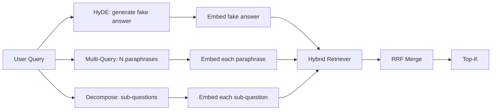

# Viết lại truy vấn: HyDE, đa truy vấn và phân tách

> Truy vấn mà người dùng nhập không phải là truy vấn mà người truy xuất của bạn muốn. Viết lại thu hẹp khoảng cách trước khi truy xuất, vì vậy chỉ mục nhìn thấy một cái gì đó gần với câu trả lời trông như thế nào.

**Loại:** Xây dựng
**Ngôn ngữ:** Python
**Kiến thức tiên quyết:** Giai đoạn 11 bài 04 (embeddings), 06 (RAG); Nền tảng Giai đoạn 19 Track B (bài 20-29); Giai đoạn 19 bài 64 và 65
**Thời lượng:** ~90 phút

## Mục tiêu học tập
- Triển khai Embeddings tài liệu giả định (HyDE): tạo câu trả lời giả, nhúng nó, truy xuất dựa trên vector đó thay vì vector truy vấn.
- Thực hiện mở rộng nhiều truy vấn: viết lại một truy vấn thành N diễn giải, truy xuất với mỗi truy vấn merge liên kết bằng cách hợp nhất xếp hạng đối ứng.
- Thực hiện phân tách truy vấn: chia một câu hỏi phức tạp thành các câu hỏi phụ, truy xuất từng câu hỏi phụ, merge.
- So sánh ba người viết lại đối đầu trong một trận đấu và giải thích khi nào mỗi chiến lược thắng.
- Nối dây một LLM giả tạo ra các đầu ra xác định, trên cố định để vòng lặp ghi lại chạy ngoại tuyến.

## Vấn đề

Người dùng gõ "nhóm của chúng tôi làm gì khi tải lên không thành công và ngân sách không còn?". Kho dữ liệu chứa một tài liệu cho biết "AbortMultipartOnFail hủy bỏ tải lên nhiều phần S3 đang diễn ra và giảm ngân sách thử lại cho mỗi vùng lưu trữ khi tải lên không thành công". Truy vấn và tài liệu không dùng chung một cụm danh từ. BM25 bỏ lỡ. Bi-encoder xếp tài liệu thứ ba hoặc thứ tư vì truy vấn vector đến một khu vực của không gian embedding thích tài liệu về các công việc bị hủy chứ không phải tài liệu về các công việc bị hủy bỏ. Xếp hạng lại hai giai đoạn từ bài 66 có thể cứu vãn câu trả lời nếu nó nằm trong top N, nhưng nếu nó thậm chí không đạt được top-N, người xếp hạng lại sẽ không bao giờ nhìn thấy nó.

Cách khắc phục là viết lại truy vấn trước khi nó chạm vào truy xuất. Bài báo năm 2023 "Truy xuất chính xác Zero-Shot dày đặc mà không có nhãn liên quan" (Gao và cộng sự) đã giới thiệu HyDE: yêu cầu một LLM viết tài liệu sẽ trả lời truy vấn, nhúng tài liệu giả định đó và sử dụng embedding của nó làm vector truy xuất. Tài liệu giả định nằm ở đúng vùng của không gian embedding vì nó được viết bằng giọng nói của kho dữ liệu. Truy vấn vector không.

Hai kỹ thuật anh em họ kết hợp với HyDE. Mở rộng nhiều truy vấn (thuật ngữ GraphRAG của Microsoft được sử dụng) tạo ra N đoạn diễn giải của truy vấn và truy xuất với mỗi cụm từ, sau đó merges. Phân tách (phổ biến là "phân tách truy vấn con" trong công việc DSPy năm 2024 của Stanford) chia "nhóm của chúng tôi làm gì khi tải lên không thành công và ngân sách không còn" thành hai câu hỏi: "điều gì xảy ra khi tải lên không thành công" và "điều gì xảy ra khi ngân sách thử lại không còn". Hai lần truy xuất, một merged kết quả, cả hai phần của câu trả lời đều có thể đạt được.

Bài học này thực hiện cả ba và chạy chúng trên cùng một kho dữ liệu cố định.

## Khái niệm



### HyDE chi tiết

HyDE thay thế vector truy vấn của người dùng bằng một vector tài liệu giả định được viết LLM. prompt ngắn:

```
You are a domain expert. Write a one-paragraph passage that answers the question
below. Use the same vocabulary and phrasing the documentation in this domain would
use. Do not refuse. Do not say you do not know.

Question: {user_query}

Passage:
```

Câu trả lời của LLM là sai như một câu trả lời thực tế vì LLM không biết kho dữ liệu của bạn. Điều đó không sao. Chó săn mồi không quan tâm đến tính đúng đắn thực tế, chỉ quan tâm đến sự phân phối token. Đoạn giả định chứa các từ "hủy bỏ", "nhiều phần", "xô", "ngân sách", bởi vì đó là những gì một đoạn văn tài liệu về chủ đề này sẽ nói. Nhúng đoạn văn đó. vector hạ cánh gần lối đi thực.

Trong production bạn giới hạn tài liệu giả định thành hai hoặc ba câu. Các giả thuyết dài hơn thu thập nhiều nhiễu hơn. Những cái ngắn hơn mất tín hiệu từ vựng HyDE cần.

### Chi tiết mở rộng nhiều truy vấn

Tạo N diễn giải truy vấn của người dùng. Cách prompt đơn giản nhất:

```
Rewrite the following question in {N} different ways. Each rewrite must preserve
the original intent. Number them 1 to {N}. Do not add explanations.
```

Truy xuất top-k cho mỗi diễn giải. Merge danh sách xếp hạng N có RRF (thuật toán tương tự từ bài 65). Rẻ, song song, quyết định.

Multi-query chiến thắng khi cụm từ của người dùng là một trong nhiều cách hợp lệ như nhau để đặt câu hỏi và bất kỳ lần viết lại nào cũng sẽ hỏi nó tốt hơn. Thua khi tất cả các bản viết lại đều tệ như nhau vì bản gốc cũng tệ theo cùng một cách.

### Phân hủy chi tiết

Một truy xuất duy nhất không thể thỏa mãn một câu hỏi nhiều mặt. Phân hủy yêu cầu LLM chia câu hỏi thành các câu hỏi phụ và hệ thống truy xuất từng câu hỏi phụ. Các prompt:

```
The following question may require information from multiple distinct topics.
Decompose it into a list of sub-questions. Each sub-question must be answerable
independently. If the question is already atomic, return it unchanged.

Question: {user_query}
```

Truy xuất cho mỗi câu hỏi phụ. Merge. Phân tách là công cụ phù hợp cho các câu hỏi có liên từ, so sánh nhiều mệnh đề hoặc hai chủ đề không liên quan. Công cụ sai cho các câu hỏi nguyên tử; Công việc của người phân hủy ở đó là trả về một câu hỏi duy nhất và không phát minh ra các câu hỏi phụ giả mạo.

### Tại sao cả ba đều tồn tại

Ba điều này bổ sung cho nhau. HyDE kết nối khoảng cách kho dữ liệu truy vấn token. Đa truy vấn bao gồm variance diễn giải. Phân tách bao gồm các truy vấn nhiều chủ đề. Một hệ thống production chạy cả ba và chọn chiến lược cho mỗi truy vấn (hệ thống đầu cuối của bài 69 hiển thị bộ chọn).

## Giả LLM

Bài học chạy ngoại tuyến. LLM giả là một bảng tra cứu nhỏ được khóa trên truy vấn của người dùng, cộng với một dự phòng cho các truy vấn mà nó chưa thấy. Bảng tra cứu chứa:

- Đối với mỗi truy vấn cố định: một đoạn giả định bằng văn bản, ba diễn giải và một phân tách.
- Đối với truy vấn không xác định: chuyển đổi xác định: lấy các từ nội dung của truy vấn, mở rộng chúng thông qua bản đồ từ đồng nghĩa và trả về kết quả.

Hình dạng của mô phỏng là điều quan trọng, không phải dữ liệu. Trong production, bạn hoán đổi mô phỏng cho một cuộc gọi model thực sự. Chó săn mồi không thay đổi.

## Tự xây dựng

`code/main.py` thực hiện:

- `MockLLM` - thay thế xác định được mô tả ở trên.
- `HyDERewriter` - gọi LLM để viết tài liệu giả định, trả về đầu ra của trình viết lại là `RewriteResult` với văn bản giả định và truy vấn mà người truy xuất nên sử dụng.
- `MultiQueryRewriter` - gọi LLM cho N diễn giải, trả về danh sách các truy vấn.
- `DecomposeRewriter` - gọi LLM để phân tách, trả về các câu hỏi phụ.
- `retrieve_with_rewriter` - lấy một người viết lại và một người săn mồi, chạy các lần viết lại, hợp nhất kết quả.
- Một bản demo chạy ba người viết lại trên một vật cố định và in chiến lược nào trả về tài liệu trả lời vàng trước.

Hình dáng chó tha mồi được sử dụng lại từ bài 65 (lai BM25 + dày đặc). Sự hợp nhất là cùng một RRF. Hình dạng mới duy nhất là giao diện rewriter, nhỏ.

Chạy nó:

```bash
python3 code/main.py
```

Kết quả là xếp hạng cho mỗi chiến lược và tóm tắt cuối cùng. HyDE thắng trong truy vấn cụm từ không khớp. Nhiều truy vấn chiến thắng trong truy vấn variance diễn giải. Phân tách chiến thắng trong truy vấn nhiều chủ đề. Dự phòng (không viết lại) thua ít nhất một trong ba.

## Chế độ thất bại mà bản demo sẽ ẩn

**HyDE ảo giác sai các định danh cụ thể của kho dữ liệu.** model phát minh ra một tên hàm. Điểm BM25 của giả thuyết trên tài liệu bên phải sụp đổ vì tên được phát minh hiện là một token có trọng lượng cao không xuất hiện trong chỉ mục. Giới hạn chiều dài và trọng lượng của giả thuyết BM25 thấp hơn trong nhiệt hạch.

**Viết lại nhiều truy vấn hội tụ.** Một model yếu tạo ra ba diễn giải gần giống hệt nhau. N truy xuất trả về cùng một top-k. RRF merge không tốt hơn một lần truy xuất duy nhất. Thêm một hướng dẫn đa dạng rõ ràng vào prompt viết lại và phát hiện các bản sao của Jaccard.

**Phân hủy quá tách.** Người phân hủy biến một câu hỏi nguyên tử thành một danh sách. Tất cả các truy xuất đều trả về cùng một tài liệu nhưng với thứ hạng giảm. merge tệ hơn bản gốc. Phát hiện điều này bằng cách vượt qua "những câu hỏi phụ này có đủ khác biệt không" trước khi phân tán.

**Độ trễ nhân lên.** HyDE mất một LLM cuộc gọi. Đa truy vấn tốn một LLM cuộc gọi để tạo ra N lần ghi lại, sau đó là N lần truy xuất. Phân hủy tốn một LLM cuộc gọi để phân hủy, sau đó truy xuất M. Việc truy xuất chạy song song; Cuộc gọi LLM là sàn nhà.

## Ứng dụng

Production mẫu:

- Lựa chọn chiến lược cho mỗi truy vấn theo độ dài truy vấn: truy vấn ngắn nguyên tử nhận được nhiều truy vấn, truy vấn nhiều mệnh đề phức tạp được phân tách, các truy vấn nặng biệt ngữ được HyDE.
- Bộ nhớ đệm đầu ra của trình viết lại bằng hàm băm truy vấn. Nhiều truy vấn lặp lại.
- Chạy song song cả ba và hợp nhất ba bộ kết quả thành một với RRF. Chi phí là ba cuộc gọi LLM và một lần hợp nhất; Chất lượng là sự kết hợp của cả ba chiến lược.

## Sản phẩm bàn giao

Bài 69 kết nối giai đoạn viết lại này trước người truy xuất từ bài 65 và người xếp hạng lại từ bài 66. Bài 68 đánh giá mức nâng mà người viết lại thêm vào recall truy xuất.

## Bài tập

1. Triển khai RAG-Fusion (một biến thể năm 2024 của multi-query) trong đó các diễn giải của người viết lại có chủ ý đa dạng, sau đó bước xếp hạng lại (bài 66) sẽ chọn danh sách cuối cùng.
2. Thêm chiến lược thứ tư: lùi lại prompting (hỏi LLM cho câu hỏi tổng quát hơn, truy xuất câu hỏi đó, sau đó thu hẹp). So sánh trên vật cố định.
3. Huấn luyện bộ phân hủy nhận dạng các truy vấn nguyên tử bằng cách thêm đầu "là câu hỏi nguyên tử". Đo tỷ lệ phân chia quá mức trước và sau.
4. Thay thế LLM giả bằng một cuộc gọi model thực sự. Đo lường độ trễ trên mỗi chiến lược trên stack của bạn.
5. Thêm điểm tin cậy cho mỗi lần viết lại. Bỏ viết lại dưới ngưỡng. Đo lường tác động đến recall.

## Thuật ngữ chính

| Thuật ngữ | Những gì mọi người nói | Ý nghĩa thực sự của nó |
|------|-----------------|------------------------|
| HyDE | "Truy xuất tài liệu giả" | LLM viết câu trả lời; nhúng và truy xuất vào đó thay vì truy vấn |
| Đa truy vấn | "Mở rộng diễn giải" | N viết lại truy vấn; truy xuất N lần, merge bằng RRF |
| Phân hủy | "Phân tách truy vấn con" | Các truy vấn nhiều chủ đề được chia thành các câu hỏi phụ, được truy xuất riêng |
| Truy vấn nguyên tử | "Chủ đề đơn" | Không thể phân hủy mà không phát minh ra các câu hỏi phụ giả mạo |
| Lùi lại | "Tóm tắt truy vấn" | Đặt câu hỏi tổng quát hơn, truy xuất, sau đó thu hẹp |

## Đọc thêm

- Gao, Ma, Lin, Callan, "Truy xuất chính xác Zero-Shot dày đặc mà không có nhãn liên quan" (HyDE), 2023
- Nghiên cứu của Microsoft, "Mở rộng nhiều truy vấn để truy xuất"
- Stanford DSPy, "Phân tách truy vấn con cho QA nhiều chảy"
- [LlamaIndex query transformations documentation](https://docs.llamaindex.ai/en/stable/optimizing/advanced_retrieval/query_transformations/)
- Giai đoạn 11 bài 07 - các mô hình RAG nâng cao
- Giai đoạn 19 bài 65 - săn mồi mà người viết lại này cung cấp
- Giai đoạn 19 bài 68 - đánh giá đo lường mức nâng của người viết lại
