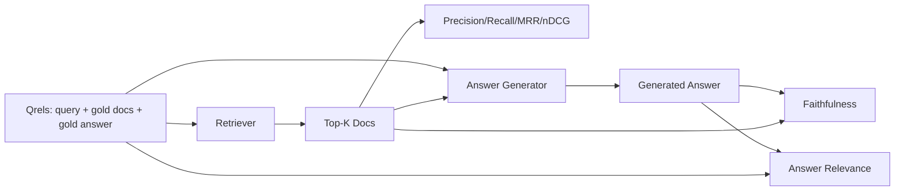

# Đánh giá RAG: Precision, Recall, MRR, nDCG, Trung thực, Mức độ liên quan của câu trả lời

> Nếu bạn không thể chấm điểm truy xuất và câu trả lời của mình cùng một lúc, bạn không thể ship hệ thống. Cả hai không phải là cùng một số liệu và cùng một prompt thất bại trên các trục khác nhau.

**Loại:** Xây dựng
**Ngôn ngữ:** Python
**Kiến thức tiên quyết:** Giai đoạn 11 bài 06 (RAG), 10 (đánh giá); Nền tảng Giai đoạn 19 Track B (bài 20-29); Giai đoạn 19 bài 64, 65, 66, 67
**Thời lượng:** ~90 phút

## Mục tiêu học tập
- Tính toán bốn chỉ số truy xuất từ các qrel vàng: precision@k, recall@k, MRR (xếp hạng đối ứng trung bình) và nDCG@k.
- Tính toán hai chỉ số cấp câu trả lời: độ trung thực (mọi tuyên bố dựa trên ngữ cảnh được truy xuất) và mức độ liên quan của câu trả lời (câu trả lời giải quyết câu hỏi).
- Xây dựng tệp qrels cố định (truy vấn, id tài liệu vàng, văn bản câu trả lời vàng) mà đánh giá đọc từ đầu đến cuối.
- Đọc các giá trị chỉ số để chẩn đoán vị trí pipeline bị lỗi: truy xuất, xếp hạng, tạo hoặc grounding.

## Vấn đề

Một hệ thống RAG có ít nhất bốn bộ phận chuyển động: chunker, retriever, reranker, generator. Bất kỳ ai trong số họ đều có thể là nguyên nhân của một câu trả lời sai. Nếu không có số liệu trên mỗi giai đoạn, bạn đang bay mù.

Người dùng báo cáo câu trả lời sai. Có phải vì chunker đã cắt câu trả lời span? Có phải vì chó săn không bao gồm phần trong top-k? Có phải vì người xếp hạng lại đã đẩy phần bên phải qua vị trí một? Có phải vì máy phát điện đã bỏ qua khối và bịa đặt một cái gì đó? Bạn không thể biết chỉ từ câu trả lời. Bạn cần:

- Các chỉ số truy xuất để chấm điểm những gì xuất hiện từ chó tha mồi.
- Xếp hạng các chỉ số để xếp hạng vị trí của phần phù hợp theo thứ tự.
- Trung thực để phân loại xem trình tạo có ở trong ngữ cảnh được truy xuất hay không.
- Trả lời mức độ liên quan đến việc chấm điểm liệu câu trả lời có giải quyết được câu hỏi hay không.

Bài học này xây dựng tất cả sáu trên một tệp qrels cố định. Đánh giá là ngoại tuyến và xác định; trong production bạn hoán đổi LLM giả làm thẩm phán cho một người thật.

## Khái niệm



### Precision@k

Trong số top-k tài liệu mà tha mồi trả lại, có bao nhiêu phần trong bộ vàng? Nếu vàng có ba tài liệu và top 3 trả về hai trong số đó và một sai thì precision@3 là 2/3. Sử dụng precision khi chi phí của một đoạn được truy xuất không liên quan cao (máy phát điện lãng phí tokens vào đó hoặc đoạn đầu độc câu trả lời).

### Recall@k

Trong số các tài liệu vàng, có bao nhiêu phần trong top-k? Nếu vàng có ba tài liệu và top 5 chứa cả ba, recall@5 là 1,0. Sử dụng recall khi chi phí của một câu trả lời bị bỏ lỡ cao (bạn thà thấy thêm một đoạn sai còn hơn là bỏ lỡ hoàn toàn đoạn câu trả lời).

Trong production RAG số liệu mà mọi người thường trích dẫn là recall@k. Thế hệ có thể loại bỏ các phần không liên quan một cách dễ dàng; nó không thể phát minh ra câu trả lời từ một phần mà nó chưa bao giờ nhìn thấy.

### MRR (Xếp hạng đối ứng trung bình)

Đối với mỗi truy vấn, hãy tìm vị trí của tài liệu có liên quan đầu tiên trong danh sách được xếp hạng. Thứ hạng đối ứng là 1 / vị trí. Ý nghĩa trên bộ truy vấn. MRR là một bản tóm tắt một số về mức độ chó săn đặt câu trả lời tốt nhất ở trên cùng.

MRR nặng nề ở vị trí-1. Một truy vấn trong đó tài liệu vàng ở hạng 1 đóng góp 1.0. Hạng 2 đóng góp 0.5. Xếp hạng 10 đóng góp 0.1. Chỉ số này bị chi phối bởi đầu danh sách.

### nDCG@k

Lợi nhuận tích lũy chiết khấu được chuẩn hóa. Công thức đầy đủ chỉ định lợi nhuận cho mỗi tài liệu được truy xuất (thường là 1 cho có liên quan, 0 cho không), chiết khấu theo nhật ký của vị thế, tổng và chia cho DCG lý tưởng (DCG bạn sẽ có nếu bạn xếp hạng hoàn hảo). Phạm vi 0 đến 1.

nDCG phù hợp với mức độ liên quan được phân loại: vàng có thể nói "tài liệu A là 3, tài liệu B là 2, tài liệu C là 1". MRR và recall@k làm phẳng mọi thứ thành nhị phân. Sử dụng nDCG khi kho dữ liệu có nhiều tài liệu có liên quan một phần cho mỗi truy vấn.

### Trung thành

Đối với mỗi thông báo xác nhận quyền sở hữu trong câu trả lời được tạo, hãy kiểm tra xem ngữ cảnh đã truy xuất có hỗ trợ xác nhận quyền sở hữu hay không. Việc triển khai tiêu chuẩn sử dụng một prompt LLM như đánh giá nhận (yêu cầu, ngữ cảnh) và trả về có hoặc không. Số liệu là phần nhỏ của các yêu cầu vượt qua.

Sự trung thực bắt chế độ lỗi máy phát điện nơi model phát minh ra nội dung. Ngay cả khi săn trả lại đúng mảnh, một máy phát điện gây ảo giác sẽ bị hỏng. Trung thành còn được gọi là căn cứ, hỗ trợ, ghi công.

Bài học này thực hiện tính trung thực với một thẩm phán giả xác định để kiểm tra xem liệu tokens của mỗi tuyên bố có trùng lặp với ngữ cảnh được truy xuất theo một ngưỡng hay không. Trong production bạn hoán đổi sang một cuộc gọi model thực. Hình dạng của số liệu là như nhau.

### Mức độ liên quan của câu trả lời

Câu trả lời có thực sự giải quyết câu hỏi không? Sự trung thành đặt câu hỏi "câu trả lời có dựa trên bối cảnh không?". Mức độ liên quan của câu trả lời hỏi "câu trả lời có dựa trên câu hỏi không?". Một câu trả lời trung thực nhưng lạc đề đạt điểm cao về độ trung thực và mức độ liên quan thấp. Một câu trả lời ngắn, đúng chủ đề bỏ qua ngữ cảnh đạt điểm cao về mức độ liên quan và mức độ trung thực thấp.

Việc thực hiện tiêu chuẩn cũng sử dụng LLM-as-judge: lấy (câu hỏi, câu trả lời) và hỏi liệu câu trả lời có giải quyết được câu hỏi hay không. Bài học này thực hiện một token chồng chéo cộng với giám khảo thay thế.

## Các qrels cố định

```python
{
  "qid": "q1",
  "query": "what is the abort threshold for multipart uploads",
  "gold_doc_ids": ["d1", "d3"],
  "gold_answer_substring": "three failed parts",
  "graded_relevance": {"d1": 3, "d3": 2},
}
```

Mỗi truy vấn mang theo:
- chuỗi truy vấn,
- một bộ id tài liệu vàng (cho precision / recall / MRR),
- một dict liên quan được phân loại (đối với nDCG),
- Chuỗi con câu trả lời vàng (được giữ dưới dạng siêu dữ liệu tham chiếu trên mỗi qrel; độ trung thực trong bài học này được tính bằng cách đánh giá các tuyên bố được trích xuất dựa trên ngữ cảnh được truy xuất, không dựa trên chuỗi con này).

Trong production bạn dán nhãn những thứ này. Bài học này ships một thiết bị cố định được chế tạo bằng tay để đánh giá hết hộp.

## Tự xây dựng

`code/main.py` thực hiện:

- `precision_at_k(retrieved, gold, k)` - định nghĩa theo nghĩa đen.
- `recall_at_k(retrieved, gold, k)` - định nghĩa theo nghĩa đen.
- `mean_reciprocal_rank(retrieved_list_of_lists, gold_list)` - giá trị trung bình trên các truy vấn.
- `ndcg_at_k(retrieved, graded_relevance, k)` - DCG / IDCG với mức tăng nhị phân hoặc phân loại.
- `extract_claims(answer)` - chia câu trả lời thành các tuyên bố hình câu.
- `faithfulness(claims, context_texts, judge)` - một phần các yêu cầu được đánh giá là được hỗ trợ.
- `answer_relevance(question, answer, judge)` - đánh giá xem câu trả lời có giải quyết được câu hỏi hay không.
- `MockJudge` - đánh giá token trùng lặp xác định để đánh giá chạy ngoại tuyến.
- `evaluate_pipeline(pipeline_fn, qrels, ks)` - trình điều phối chạy mọi chỉ số.
- Một bản demo chạy ba biến thể pipeline (đường cơ sở chunker, truy xuất kết hợp, lai + xếp hạng lại) dựa trên các qrel và in bảng chỉ số.

Chạy nó:

```bash
python3 code/main.py
```

Kết quả hiển thị mức độ liên quan của precision@k, recall@k, MRR, nDCG@k, độ trung thực và mức độ liên quan của câu trả lời cho từng biến thể trong một bảng chỉ số duy nhất. Hàng truy xuất lai đánh bại đường cơ sở của chunker trên recall; hàng xếp hạng lại đánh bại hybrid trên MRR.

## Đọc các số liệu để chẩn đoán lỗi

| Triệu chứng | Nguyên nhân có thể | Những gì cần khắc phục |
|---------|-------------|-------------|
| recall@k thấp, precision@k thấp | Chunker cắt câu trả lời hoặc retriever không thể tìm thấy nó | Ranh giới Chunker (bài 64) hoặc phương thức chó săn mồi (bài 65) |
| recall@k khá, MRR thấp | Đoạn bên phải nằm trong top-k nhưng không ở vị trí 1 | Xếp hạng lại (bài 66) |
| MRR cao, độ trung thực thấp | Trình tạo phát minh ra nội dung bất chấp ngữ cảnh phù hợp | Thế hệ prompt; buộc trích dẫn hoặc từ chối |
| Độ trung thực cao, mức độ liên quan thấp | Câu trả lời có cơ sở nhưng lạc đề | Trình viết lại truy vấn (bài 67) hoặc thế hệ prompt |
| Cả bốn cao, người dùng vẫn phàn nàn | Bộ đánh giá không đại diện | Mở rộng qrel với các truy vấn của người dùng thực |

## Chế độ thất bại mà bản demo sẽ ẩn

**LLM với tư cách là thẩm phán bias.** Một model đánh giá kết quả của chính mình là trung thực hơn so với thực tế. Sử dụng một họ model khác cho giám khảo so với máy phát điện hoặc chấm điểm bằng tay một mẫu.

**Qrels thối rữa.** Câu trả lời vàng trôi dạt khi kho dữ liệu thay đổi. Một tài liệu là vàng cho quý 1 vào tháng 1 năm 2024 không còn là câu trả lời đúng vào tháng 10 năm 2024 vì nhóm đã đổi tên chức năng. Lên lịch đánh giá qrels hàng quý.

**Kiểm tra vi mô về độ trung thực bỏ lỡ các tuyên bố vĩ mô.** Độ trung thực của mỗi câu có thể vượt qua trong khi cấu trúc của câu trả lời tổng thể gây hiểu lầm. Thêm đánh giá định tính cấp mẫu lên trên chỉ số tự động.

**Recall@k che giấu lỗi cho mỗi truy vấn.** Một recall trung bình 90% có thể ẩn một truy vấn mà class luôn bỏ sót. Cắt các qrel theo class truy vấn (nghĩa đen, diễn giải, nhiều chủ đề) và báo cáo trên mỗi lát cắt.

## Ứng dụng

Production mẫu:

- Chạy đánh giá trên mỗi lần thay đổi máy phát điện. Coi hồi quy recall@k như thất bại trong thử nghiệm.
- Duy trì trace chỉ số cho mỗi truy vấn. Khi người dùng phàn nàn, hãy tra cứu mục qrels khớp và xem liệu nó có bị bắt hay không.
- Phân cấp qrels: một tập hợp khói gồm 20 truy vấn chạy trong CI; một tập hồi quy gồm 200 chạy hàng đêm; một bộ sâu gồm 2000 chạy hàng tuần.

## Sản phẩm bàn giao

Bài 69 kết nối toàn bộ pipeline (chunker, retriever, reranker, generator) và chạy đánh giá này dựa trên hệ thống end-to-end.

## Bài tập

1. Thêm chỉ số truy xuất thứ năm: hit-rate@k. So sánh nó với recall@k. Giải thích khi chúng khác nhau.
2. Thực hiện mức độ trung thực theo phân loại: 0 (không được hỗ trợ), 1 (được hỗ trợ một phần), 2 (được hỗ trợ đầy đủ). Cập nhật chỉ số cho phù hợp.
3. Thay thế thẩm phán giả bằng một cuộc gọi model thực sự. Đo lường sự bất đồng giữa người giả và thẩm phán thực sự về lịch thi đấu.
4. Thêm lát cắt class truy vấn ("nghĩa đen", "diễn giải", "đa chủ đề"). Báo cáo chỉ số trên mỗi lát cắt.
5. Thêm số liệu "độ dài câu trả lời" và tương quan với mức độ trung thực. Vẽ đường cong.

## Thuật ngữ chính

| Thuật ngữ | Những gì mọi người nói | Ý nghĩa thực sự của nó |
|------|-----------------|------------------------|
| Precision@k | "Tỷ lệ truy cập quá mức được truy xuất" | Phần top-k là vàng |
| Recall@k | "Tỷ lệ trúng thưởng so với vàng" | Phần vàng tính bằng top-k |
| MRR | "Vị trí đánh đầu tiên" | Trung bình 1/hạng văn bản liên quan đầu tiên |
| nDCG@k | "Chất lượng xếp hạng được phân loại" | DCG trên top-k chia cho DCG lý tưởng |
| Trung thành | "Căn cứ" | Phần yêu cầu câu trả lời được hỗ trợ bởi ngữ cảnh được truy xuất |
| Mức độ liên quan của câu trả lời | "Nó đã giải quyết được câu hỏi chưa?" | Câu trả lời có khớp với ý định của câu hỏi hay không |
| Qrels | "Nhãn vàng" | Tập hợp các truy vấn được gắn nhãn và các tài liệu và câu trả lời bằng vàng của chúng |

## Đọc thêm

- Buckley, Voorhees, "Đánh giá tính ổn định của thước đo đánh giá", SIGIR 2000 - bài báo kinh điển về các chỉ số xếp hạng
- Jarvelin, Kekalainen, "Đánh giá dựa trên độ lợi tích lũy của các kỹ thuật hồng ngoại" - bài báo nDCG
- [Ragas: Automated Evaluation of RAG Pipelines](https://docs.ragas.io)
- [Anthropic, Evaluating RAG](https://www.anthropic.com/news/evaluating-rag)
- Giai đoạn 11 bài 10 - đánh giá framework nền tảng
- Giai đoạn 19 bài 64-67 - các thành phần được đánh giá tại đây
- Giai đoạn 19 bài 69 - từ đầu đến cuối pipeline điểm đánh giá này
