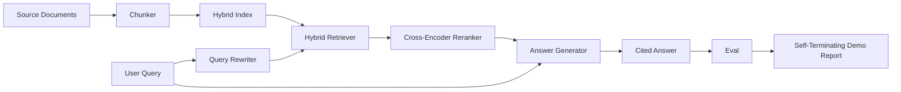

# Hệ thống RAG đầu cuối

> Sáu bài học về các thành phần. Một pipeline. Một vòng lặp đánh giá. Một bản demo tự kết thúc. Đây là hệ thống bạn ship.

**Loại:** Xây dựng
**Ngôn ngữ:** Python
**Kiến thức tiên quyết:** Giai đoạn 11 bài 06 (RAG), 10 (đánh giá); Nền tảng Giai đoạn 19 Track B (bài 20-29); Giai đoạn 19 bài 64, 65, 66, 67, 68
**Thời lượng:** ~90 phút

## Mục tiêu học tập
- Soạn chunker, hybrid retriever, query rewriter, cross-encoder reranker và trình tạo câu trả lời thành một pipeline end-to-end duy nhất.
- Triển khai trình tạo câu trả lời trích dẫn các tuyên bố của nó bằng chunk anchor, với dự phòng từ chối trên độ tin cậy thấp.
- Chạy đánh giá bài học 68 so với pipeline đã lắp ráp và chứng minh bản dựng theo giai đoạn chiến thắng trên mọi chỉ số so với các thành phần giống nhau một cách riêng biệt.
- Xây dựng bản demo CLI tự kết thúc thu nạp kho dữ liệu cố định, chạy bộ truy vấn cố định và thoát khỏi số không với báo cáo tóm tắt.

## Vấn đề

Sáu thành phần riêng lẻ không chứng minh được điều gì. Chunker có thể thắng recall@5 trước kho dữ liệu và thua trên recall@5 của hệ thống vì chó săn không thể xếp hạng những gì chunker phát ra. Người xếp hạng lại có thể nâng MRR trên một nhóm ứng cử viên tổng hợp và thất bại đối với các ứng cử viên lưỡng encoder thực sự vì recall của hai encoder ở ngân sách xếp hạng lại quá thấp. Trình viết lại truy vấn có thể quảng bá tài liệu vàng trên một truy vấn duy nhất và ngắt trên truy vấn tiếp theo vì mô phỏng LLM trả về một giả thuyết thoái hóa.

Kiểm tra tích hợp là toàn bộ pipeline chạy từ đầu đến cuối so với cùng một qrels cố định, với cùng một số liệu, với một tệp điều phối kết nối mọi thứ lại với nhau. Đó là những gì bài học này xây dựng. Nếu các chỉ số trên pipeline tích hợp đánh bại các chỉ số trên bản demo riêng biệt của mỗi giai đoạn, bạn đã chứng minh được hệ thống.

## Khái niệm



### Lựa chọn hệ thống dây điện

pipeline là một biểu đồ nhỏ. Mỗi giai đoạn là một chức năng có chữ ký rõ ràng.

| Sân khấu | Đầu vào | Đầu ra |
|-------|-------|--------|
| Chunker | Văn bản tài liệu | Danh sách các bản ghi Chunk |
| Chó tha mồi | Chuỗi truy vấn | Bản ghi Top-N Chunk |
| Rewriter (tùy chọn) | Chuỗi truy vấn | Danh sách viết lại + giả định |
| Xếp hạng lại | Truy vấn, ứng viên | Top-K Kỷ lục Chunk với điểm chéo |
| Máy phát điện | Truy vấn, top-K bản ghi Chunk | Chuỗi câu trả lời có trích dẫn |

Thành phần đơn giản khi mỗi chữ ký ổn định. Bài học `Pipeline` class có năm giai đoạn và một phương pháp `query` chạy chúng theo thứ tự. Mỗi giai đoạn đều có thể hoán đổi: vượt qua một chunker, retriever, rewriter, reranker hoặc generator khác nhau và pipeline vẫn chạy.

### Trình tạo câu trả lời có trích dẫn

Máy phát điện là công đoạn cuối cùng và dễ phá vỡ nhất. Bài học ships một trình tạo mô phỏng xác định:

1. Lấy top-K khối được xếp hạng lại.
2. Chọn tối đa hai phần có văn bản chứa token nội dung chồng chéo cao nhất với truy vấn.
3. Phát ra một câu trả lời là sự nối một câu từ mỗi đoạn được chọn, với mỗi câu theo sau là một mỏ neo `[doc_id:chunk_index]`.
4. Nếu không có đoạn nào chồng lên ngưỡng từ chối, sẽ phát ra "Tôi không biết" mà không có trích dẫn.

Trong production bạn hoán đổi mô phỏng cho một cuộc gọi LLM thực sự với mẫu prompt:

```
You are answering a question using only the snippets below.
Cite every claim with the anchor in parentheses.
If the snippets do not answer the question, say "I do not know".

Question: {query}

Snippets:
{enumerated chunks with anchors}

Answer:
```

Con đường từ chối trên độ tin cậy thấp là toàn bộ lý do ghi lại điểm số xếp hạng 1 giữa encoder. Nếu nó nằm dưới ngưỡng kho dữ liệu, máy phát điện sẽ từ chối. Đây là van an toàn chống lại các câu trả lời ảo giác.

### Bản demo tự kết thúc

Bản demo chạy mọi thứ từ đầu đến cuối. Nó in phân tích mỗi giai đoạn của một truy vấn, chạy đánh giá trên bốn qrel cố định, in bảng chỉ số và thoát với trạng thái không nếu tất cả các chỉ số bài học 68 đáp ứng các ngưỡng được đặt trong bản demo. Nếu bất kỳ chỉ số nào dưới ngưỡng, bản demo sẽ thoát ra với trạng thái không phải bằng không và thông báo đặt tên cho chỉ số không đạt.

Đây là hình dạng của một bài kiểm tra khói CI. pipeline chạy ngoại tuyến, nhanh, xác định. Các ngưỡng cố tình chặt chẽ đối với vật cố định, vì vậy sự hồi quy trong bất kỳ bài học nào trong số sáu bài học sẽ thất bại trong bản demo.

## Tự xây dựng

`code/main.py` thực hiện:

- `Chunk` - bản ghi được thực hiện qua tất cả các giai đoạn (mở rộng hình dạng của bài 64 với doc_id chunk_index và nguồn).
- `Chunker` - chọn một chiến lược từ bài 64 (phân tách đệ quy mặc định).
- `HybridIndex` - bó BM25 + dày đặc + RRF từ bài 65.
- `Rewriter` (tùy chọn) - chọn một trong các HyDE, nhiều truy vấn, phân tách từ bài 67 theo độ dài truy vấn và sự hiện diện của liên từ.
- `Reranker` - encoder chéo được huấn luyện từ bài 66, với một thiết bị cố định nhỏ hơn training đặt để nó hội tụ trong vài giây.
- `Generator` - trình tạo mô phỏng xác định với các trích dẫn và từ chối khi có độ tin cậy thấp.
- `Pipeline` - soạn năm giai đoạn bằng một phương thức `query(question)` trả về `Result(answer, top_k, latency_ms_per_stage)`.
- `run_demo()` - nhập kho dữ liệu, chạy ba truy vấn cố định, chạy đánh giá, in kết quả, đặt mã thoát theo ngưỡng.

Chạy nó:

```bash
python3 code/main.py
```

Đầu ra là một trace truy vấn được in, bảng đánh giá đầy đủ và trạng thái pass/fail cuối cùng. Trả về mã thoát 0 trên thiết bị cố định.

## Chế độ thất bại mà bản demo sẽ ẩn

**Trôi ranh giới Chunker.** Nếu bạn hoán đổi chiến lược chunker giữa thẻ ghi nhãn qrels đánh giá và bản demo, id tài liệu vàng sẽ không còn thẳng hàng nữa. Khóa chiến lược chunker trong tệp qrels. Bản demo bao gồm một tiêu đề đặt tên cho chunker.

**Reranker training bộ rò rỉ vào đánh giá.** 14 bộ ba training trong bài 66 bao gồm các truy vấn tương tự như các truy vấn đánh giá. Trong production, hãy đưa ra các truy vấn đánh giá một cách nghiêm ngặt. Các truy vấn đánh giá của bản demo được cố tình tách rời khỏi nhóm training được xếp hạng lại.

**Trình tạo mô phỏng che giấu nguy cơ ảo giác.** Mô phỏng không thể ảo giác vì nó chỉ phát ra văn bản từ các đoạn được truy xuất. Bài học lưu ý điều này và chỉ ra con đường hoán đổi production đến một model thực sự.

**Không streaming.** pipeline trả về câu trả lời đầy đủ vào cuối mỗi giai đoạn. Một hệ thống production sẽ truyền phát đầu ra của máy phát điện. Streaming nằm ngoài phạm vi; Các chỉ số cấp câu trả lời hoạt động trên chuỗi cuối cùng theo một trong hai cách.

**Độ trễ ngoại tuyến.** Các cuộc gọi LLM giả là thời gian không đổi. Các cuộc gọi LLM thực chiếm ưu thế. Lập kế hoạch ngân sách độ trễ trong phạm vi yêu cầu; Thời gian mỗi giai đoạn của bài học chỉ đo lường CPU việc.

## Ứng dụng

Production mẫu:

- Ship tệp pipeline trong một trình điều phối với giao diện giai đoạn rõ ràng. Tránh trải rộng hệ thống dây điện trên repo.
- Chạy đánh giá trước mỗi merge chạm vào một giai đoạn. Nếu tỷ lệ giảm, merge sẽ không hạ cánh.
- Duy trì chỉ số trace mỗi lần chạy CI để bạn có thể phân bổ hồi quy cho việc hoán đổi giai đoạn.
- Thêm một tập hợp khói gồm 20 truy vấn (tập hợp con của tập hồi quy) chạy trong vòng dưới 30 giây; Tập hồi quy đầy đủ chạy hàng đêm.

## Sản phẩm bàn giao

Tệp pipeline trong bài học này là hình dạng mà rest của các bài học Giai đoạn F của Giai đoạn 19 giả định. Các bài học tiếp theo sẽ thêm tự động hóa nhập, lập chỉ mục lại gia tăng, telemetry và lớp phân phát ở trên cùng. Các nửa truy xuất, xếp hạng lại, viết lại và đánh giá đã hoàn tất ở đây.

## Bài tập

1. Thêm bộ chọn chiến lược cho mỗi truy vấn bên trong trình viết lại: phỏng đoán từ bài 67 (độ dài, liên từ, tỷ lệ biệt ngữ) chọn HyDE, nhiều truy vấn hoặc phân tách.
2. Thêm lệnh gọi LLM thực cho trình tạo đằng sau cờ env. Mặc định là mock. Đo delta độ trễ.
3. Mở rộng bản demo để lấy cờ `--corpus path` tải một kho dữ liệu thực. Chạy lại đánh giá và kiểm tra ngưỡng.
4. Thêm cờ `--strategy` vào chunker. Đo lường mức độ đóng góp của từng chiến lược đối với recall từ đầu đến cuối.
5. Thêm giao diện trình tạo streaming và đưa nó vào đánh giá. Xác nhận rằng độ trung thực được tính trên chuỗi cuối cùng chứ không phải trên tiền tố được phát trực tuyến.

## Thuật ngữ chính

| Thuật ngữ | Những gì mọi người nói | Ý nghĩa thực sự của nó |
|------|-----------------|------------------------|
| Pipeline | "RAG pipeline" | Các giai đoạn sáng tác từ khi nhập đến câu trả lời được trích dẫn |
| Neo trích dẫn | "Liên kết nguồn" | Tham chiếu (doc_id, chunk_index) đính kèm với mỗi khiếu nại |
| Từ chối khi có độ tin cậy thấp | "Tôi không biết" | Trình tạo không trả về câu trả lời khi điểm số top-1 của người xếp hạng lại nằm dưới ngưỡng |
| Bộ khói | "CI đánh giá" | Tập hợp con qrels tối thiểu chạy trong mỗi lần kiểm tra PR |
| Giao diện sân khấu | "Chữ ký chức năng" | Loại đầu vào và đầu ra ổn định của từng giai đoạn pipeline |

## Đọc thêm

- [Anthropic, Building search and retrieval](https://www.anthropic.com/news/contextual-retrieval)
- [Pinterest, MCP internal search](https://medium.com/pinterest-engineering) - kiến trúc production tham khảo
- [Ragas: Automated Evaluation of RAG Pipelines](https://docs.ragas.io)
- Giai đoạn 11 bài 06 - RAG nguyên tắc cơ bản
- Giai đoạn 19 bài 64-68 - các thành phần được soạn thảo ở đây
