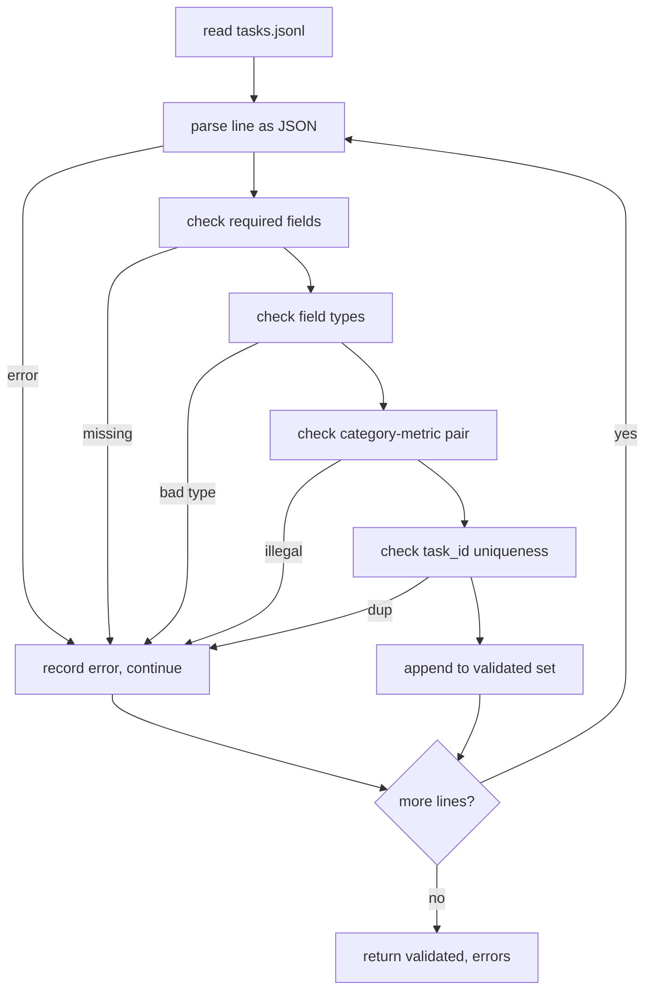

# Định dạng thông số kỹ thuật nhiệm vụ

> Một harness đánh giá chỉ tốt khi hợp đồng mà nhiệm vụ của nó tôn trọng. Cố định hình JSONL và từ vựng số liệu trước khi bạn viết một hàm tính điểm duy nhất.

**Loại:** Xây dựng
**Ngôn ngữ:** Python
**Kiến thức tiên quyết:** Giai đoạn 19 Nền móng theo dõi B
**Thời lượng:** ~90 phút

## Mục tiêu học tập

- Xác định schema bản ghi tác vụ JSONL bao gồm số học, trắc nghiệm, thực thi mã, phân loại và tóm tắt văn bản tự do trong một hình dạng.
- Ghim một từ vựng đóng của tên số liệu để các bài học hạ lưu (71-73) có thể gửi trên một trường duy nhất.
- Chỉ định few-shot ví dụ và quy tắc xử lý hậu kỳ như một phần của tác vụ, không phải trình chạy, để cùng một prompt tạo ra cùng một mục tiêu trên models.
- Triển khai trình xác thực nghiêm ngặt để từ chối các bản ghi sai định dạng trước khi chúng đến tay người chạy.
- Ship một bộ cố định 10 tác vụ thực hiện mọi branch của thông số kỹ thuật để trình xác thực có thứ gì đó thực sự để nhai.

## Tại sao lại có thông số kỹ thuật bị đóng băng

Cơ sở mã nghiên cứu sẽ tích lũy scripts đánh giá nhanh hơn so với tích lũy các bài kiểm tra. Sáu tháng trôi qua, mỗi sổ ghi chép đều có hình dạng JSON riêng, mỗi số liệu được thực hiện lại hai lần và không có gì có thể so sánh qua các lần chạy. Việc sửa chữa thật nhàm chán. Chọn một schema. Viết trình xác thực. Từ chối mọi thứ khác. Đó là những gì bài học này làm.

Hình dạng vay mượn ý tưởng từ harnesses phong cách BIG-bench, HELM và lm-eval, nhưng tên trường là của chúng tôi. Mỗi lĩnh vực đều có một chủ sở hữu duy nhất. Người chạy đọc nhiệm vụ. Chỉ số đọc các mục tiêu. Bước sau process bình thường hóa thế hệ. Không có trường nào có thể thay đổi giữa pipeline.

## Hình dạng bản ghi

Nhiệm vụ là một đối tượng JSON trên một dòng. harness đọc `tasks.jsonl` và xác thực từng dòng một cách độc lập. Một dòng tồi sẽ hủy bỏ bản ghi đó, không phải chạy.

```json
{
  "task_id": "arith_001",
  "category": "arithmetic",
  "prompt": "Compute the result. Question: 17 + 24\nAnswer:",
  "targets": ["41"],
  "metric_name": "exact_match",
  "few_shot_examples": [
    {"prompt": "Question: 2 + 2\nAnswer:", "completion": "4"}
  ],
  "post_process": "strip_whitespace",
  "metadata": {"difficulty": "easy"}
}
```

Các trường bắt buộc là `task_id`, `category`, `prompt`, `targets`, `metric_name`, `post_process`. `few_shot_examples` và `metadata` là tùy chọn. Các trường cấp cao nhất không xác định không xác thực được.

## Quy tắc trường

`task_id` là một chuỗi không có khoảng trắng. Trình xác thực thực thi tính duy nhất trên tệp.

`category` là một trong những `arithmetic`, `mcq`, `code_exec`, `classification`, `summary`. Danh mục hạn chế cặp số liệu và sau process nào là hợp pháp. Nhiệm vụ `code_exec` phải sử dụng `metric_name = code_exec` và nhiệm vụ `mcq` phải sử dụng `metric_name = exact_match` đối với mục tiêu một chữ cái.

`prompt` là một chuỗi không trống. Trình xác thực cấm khoảng trắng đuôi và từ chối các bản ghi đã chứa khối few-shot trong nội dung prompt. Kết xuất Few-shot xảy ra ở người chạy, không phải tác giả.

`targets` là một danh sách các chuỗi không trống. Đối với `exact_match`, bất kỳ phần tử nào phù hợp đều được tính. Đối với `f1` và `rouge_l`, mục tiêu ghi điểm cao nhất sẽ thắng. Đối với `mcq`, danh sách chứa chính xác một phần tử.

`metric_name` là một trong những `exact_match`, `f1`, `bleu_4`, `rouge_l`, `accuracy`, `code_exec`. Từ vựng đã đóng. Một số liệu mới yêu cầu một bài học mới và một mục mới ở đây.

`few_shot_examples` là danh sách các cặp `{prompt, completion}`. Trình xác thực giới hạn danh sách ở tám mục nhập để giữ prompts giới hạn.

`post_process` là một trong những `none`, `strip_whitespace`, `lower`, `extract_letter`, `extract_code_block`, `extract_first_line`. Mỗi quy tắc có một hành vi xác định duy nhất. Trình xác thực cấm kết hợp các quy tắc.

## Hành vi của trình xác thực



Trình xác thực trả về hai danh sách: bản ghi đã xác thực và bản ghi lỗi với dòng vi phạm, quy tắc vi phạm và trường bị lỗi. Người chạy từ chối bắt đầu nếu danh sách lỗi không trống trừ khi cờ `--allow-bad-tasks` rõ ràng được đặt.

## Kết xuất Few-shot

Người chạy nối few-shot ví dụ ở phía trước prompt bằng dấu phân cách dòng trống. Cùng một đường dẫn mã chạy cho mọi model, vì vậy nguồn variance duy nhất là chính model. Tác giả viết ví dụ một lần, không phải một lần cho mỗi nhà cung cấp.

```python
def render(task):
    parts = []
    for ex in task.get("few_shot_examples", []):
        parts.append(ex["prompt"] + " " + ex["completion"])
    parts.append(task["prompt"])
    return "\n\n".join(parts)
```

## Quy tắc sau process

Bước sau process chạy sau khi tạo, trước số liệu. Nó là quyết định và không quốc tịch.

- `none` trả về chuỗi không thay đổi.
- `strip_whitespace` dải khoảng trắng đứng đầu và đuôi.
- `lower` viết thường chuỗi.
- `extract_letter` trả về ký tự đầu tiên khớp với `[A-E]`, được sử dụng cho MCQ.
- `extract_code_block` trả về phần thân của khối hàng rào ba lần đầu tiên, được sử dụng cho code-exec.
- `extract_first_line` trả về dòng không trống đầu tiên, được sử dụng để phân loại tóm tắt.

Một nhiệm vụ cần một quy tắc bên ngoài danh sách này thuộc về một bài học mới.

## Bài học này không làm gì

Nó không ghi điểm. Nó không gọi một model. Nó không chạy mã. Những điều đó đến trong các bài 71, 72 và 75. Bài học này đóng băng hợp đồng mà tất cả họ tôn trọng.

Vật cố định 10 nhiệm vụ bao gồm hai mục số học, hai mục MCQ, hai mục code-exec, hai mục phân loại và hai mục tóm tắt. Trình xác thực chuyển tất cả 10. Một cố định riêng biệt (`tasks_bad.jsonl`) ngắt mọi quy tắc và trình xác thực trả về chính xác số lỗi đó.

## Cách đọc mã

`main.py` xác định `TaskSpec`, `validate_task`, `validate_file` và điểm vào CLI. Bộ nạp cố định là `load_fixtures`. Trình trợ giúp render và post-process nằm bên cạnh validation để runner trong bài 75 imports một mô-đun duy nhất.

Đọc `main.py` từ trên xuống dưới. Sau đó đọc `code/tests/test_spec.py`. Các bài kiểm tra ghim mọi quy tắc xác thực và mọi hành vi sau process. Bản demo ở cuối `main.py` xác thực thiết bị cố định đi kèm và in một bản tóm tắt.

## Tiến xa hơn

Các bộ đánh giá thực sự phát triển danh mục theo cách schemas phát triển cột. Động thái tỉnh táo là từ chối thêm một thể loại mà không thêm số liệu, quy tắc sau process và ít nhất một nhiệm vụ cố định. Coi thông số kỹ thuật giống như di chuyển cơ sở dữ liệu. Mọi thay đổi đều được xem xét, tạo phiên bản và đi kèm với các bài kiểm tra. Trình xác thực trong bài học này là cổng.
