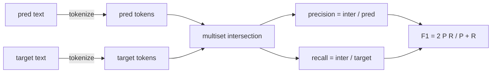
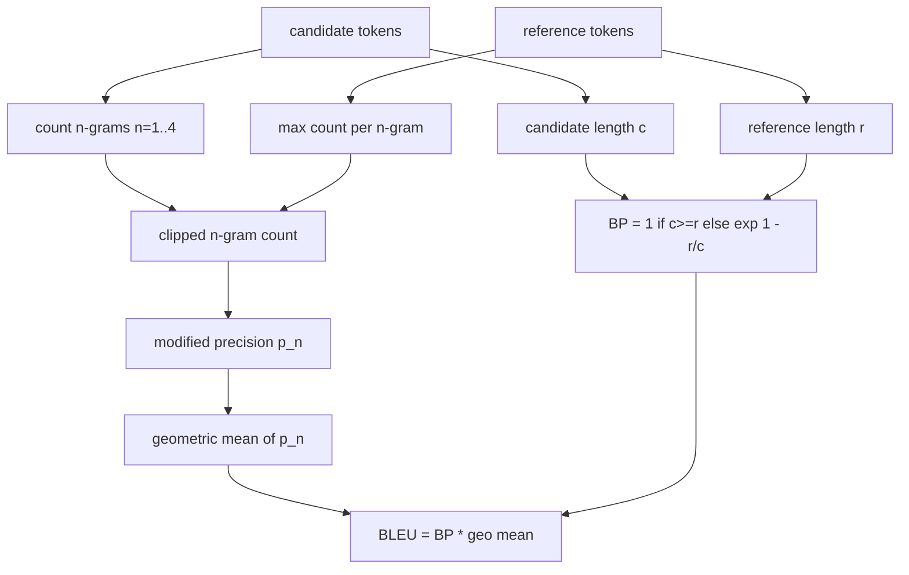

# Số liệu cổ điển

> BLEU, ROUGE-L, F1, khớp chính xác, accuracy. Năm chỉ số vẫn chiếm nhiều số LLM đánh giá được công bố nhất. Thực hiện từng nguyên tắc từ đầu tiên để bạn biết ý nghĩa của con số.

**Loại:** Xây dựng
**Ngôn ngữ:** Python
**Kiến thức tiên quyết:** Giai đoạn 19 Nền tảng theo dõi B, bài 70
**Thời lượng:** ~90 phút

## Mục tiêu học tập

- Triển khai đối sánh chính xác, F1 và accuracy cấp token với các quy tắc mã hóa rõ ràng.
- Thực hiện BLEU-4 từ đầu: precision n-gram sửa đổi, giá trị trung bình hình học trên n bằng 1 đến 4, hình phạt ngắn gọn.
- Thực hiện ROUGE-L bằng cách sử dụng dãy con chung dài nhất, với sự kết hợp F-beta của precision và recall.
- Gửi trên sân metric_name từ bài 70 để người chạy không phụ thuộc vào hệ mét.
- Ghim hành vi bằng vectors tham chiếu được rút ra từ các ví dụ đã làm việc, không phải từ thư viện của bên thứ ba.

## Tại sao nên triển khai lại

Bạn sẽ đọc các bài báo báo cáo BLEU 28.3 và một bài báo khác báo cáo BLEU 0.283. Bạn sẽ tìm thấy điểm ROUGE-L chênh lệch mười điểm trên hai thư viện vì một thư viện cắt bớt thành chữ thường và thư viện kia thì không. Cách nhanh nhất để ngừng nhầm lẫn là tự viết các số liệu, sau đó trỏ vào đường mà tokenizer được quyết định và dòng nơi áp dụng làm mịn. Sau đó, so sánh các con số giữa các bài báo trở thành vấn đề đọc thiết lập số liệu chứ không phải tranh cãi về thư viện.

Stdlib cộng với numpy là đủ. BLEU đang đếm và một cái kẹp. ROUGE-L là lập trình động. F1 là một giao lộ được thiết lập trên tokens. Phần khó nhất là chọn một tokenizer và cam kết với nó.

## Mã hóa

tokenizer là `re.findall(r"\w+", text.lower())`. Chữ thường, chạy chữ và số, thả dấu câu. Mọi số liệu trong bài học này đều sử dụng tokenizer chính xác này. Người chạy không được lựa chọn. Nếu bạn hoán đổi tokenizers, bạn đang chạy một benchmark khác.

```python
TOKEN_RE = re.compile(r"\w+", re.UNICODE)
def tokenize(text):
    return TOKEN_RE.findall(text.lower())
```

Đây là một sự đơn giản hóa có chủ ý. Production thiết lập sẽ quan tâm đến CJK, rút gọn và mã định danh. Điểm mấu chốt của bài học là tokenizer là một hợp đồng, không phải là một núm vặn.

## Đối sánh chính xác

```python
def exact_match(pred, targets):
    return float(any(pred.strip() == t.strip() for t in targets))
```

Nó trả về 1.0 hoặc 0.0 cho mỗi nhiệm vụ. Tổng hợp trên một dataset là giá trị trung bình. Đây là con ngựa làm việc cho các nhiệm vụ số học, MCQ và phân loại ngắn.

## F1 cấp Token

Thiết lập bộ đa token để dự đoán và mục tiêu. Precision là giao điểm đa tập chia cho đa tập của dự đoán. Recall là cùng một giao điểm chia cho đa tập của mục tiêu. F1 là giá trị trung bình hài. Việc triển khai xử lý các trường hợp biên dự đoán trống và mục tiêu trống.



Đối với các nhiệm vụ nhiều mục tiêu, chúng tôi sẽ F1 tốt nhất so với danh sách mục tiêu. Điều đó phù hợp với hành vi kiểu SQuAD được báo cáo rộng rãi trong tài liệu.

## BLEU-4 ·

BLEU là số liệu dịch máy chuẩn và nó vẫn hiển thị trong công việc tóm tắt. Công thức chúng tôi sử dụng là BLEU-4 cấp ngữ liệu với hình phạt ngắn gọn tiêu chuẩn và làm mịn phụ gia trên số lượng n-gram đã sửa đổi để một 4 gram bị thiếu không đẩy điểm về không.

Đối với mỗi cặp tham chiếu ứng viên, chúng tôi đếm precision n-gram đã sửa đổi cho n bằng 1, 2, 3, 4. precision sửa đổi cắt số lượng n-gram của ứng cử viên theo số lượng tối đa của n-gram đó trong bất kỳ tài liệu tham khảo nào, vì vậy một ứng cử viên không thể thổi phồng bằng cách lặp lại một cụm từ. Giá trị trung bình hình học trên bốn độ chính xác được bao bọc bởi hình phạt ngắn gọn.



Quy tắc làm mịn là quy tắc mà Lin và Och gọi là phương pháp 1: thêm một vào cả tử số và mẫu số của mỗi n-gram precision trước khi lấy log. Điều này tránh `log 0` khi tham chiếu không có 4 gam phù hợp và gần với giá trị không được làm mịn trên các ứng cử viên dài.

## ĐỎ-L

ROUGE-L so sánh dãy con chung dài nhất của dãy ứng cử viên và dãy token tham chiếu. LCS nắm bắt thứ tự từ mà không buộc phải tiếp giáp với nhau, đó là lý do tại sao nó là số liệu tóm tắt mặc định. Chúng ta tính toán độ dài LCS với một bảng lập trình động tiêu chuẩn, sau đó suy ra recall là `lcs / reference length`, precision là `lcs / candidate length` và kết hợp với F-beta trong đó beta bằng một cho dạng F1 đối xứng.

```python
def lcs_length(a, b):
    n, m = len(a), len(b)
    dp = numpy.zeros((n + 1, m + 1), dtype=int)
    for i in range(n):
        for j in range(m):
            if a[i] == b[j]:
                dp[i+1, j+1] = dp[i, j] + 1
            else:
                dp[i+1, j+1] = max(dp[i+1, j], dp[i, j+1])
    return int(dp[n, m])
```

Bảng numpy làm cho việc triển khai dễ đọc; danh sách Python thuần túy cũng sẽ hoạt động. Các nhiệm vụ chọn tham gia ROUGE-L phải trả chi phí O(n m) cho mỗi nhiệm vụ. Đối với độ dài tóm tắt điển hình dưới một mili giây.

## Accuracy

Đối với các nhiệm vụ phân loại đa mục tiêu, accuracy giảm xuống đối sánh chính xác với một mục tiêu chuẩn hóa duy nhất. Chúng ta hiển thị nó như một hàm riêng biệt để trình điều phối có thể gửi trên `metric_name` mà không cần thông qua các so sánh chuỗi bên trong trình chạy.

## Hợp đồng phái cử

Điểm vào duy nhất là `score(metric_name, prediction, targets)`. Nó trả về một float trong `[0, 1]`. Người chạy không branch tên số liệu. Nó chuyển cuộc gọi và viết kết quả. Đây là bề mặt mà bài 75 sẽ dán vào thông số kỹ thuật nhiệm vụ từ bài 70.

```python
def score(metric_name, pred, targets):
    if metric_name == "exact_match":
        return exact_match(pred, targets)
    if metric_name == "f1":
        return max(f1_score(pred, t) for t in targets)
    if metric_name == "bleu_4":
        return max(bleu4(pred, t) for t in targets)
    if metric_name == "rouge_l":
        return max(rouge_l(pred, t) for t in targets)
    if metric_name == "accuracy":
        return accuracy(pred, targets)
    raise ValueError(f"unknown metric_name: {metric_name}")
```

`code_exec` được xử lý trong bài 72 và được đưa vào điều phối viên ở đó.

## Bài học này không làm gì

Nó không gọi một model. Nó không bình thường hóa các thế hệ vượt quá những gì các quy tắc hậu process từ bài 70 đã làm. Nó không tính toán các khoảng tin cậy. Nó không làm BLEURT hoặc BERTScore (những người đó cần một model và sống trong một bài học khác). Vấn đề là sàn: năm chỉ số, một tokenizer, một bảng điều phối.

## Cách đọc mã

`main.py` xác định mỗi chỉ số là một hàm miễn phí cộng với trình điều phối. Tham chiếu vectors nằm trong khối `_reference_examples` ở cuối tệp. Bản demo chạy người điều phối dựa trên tám ví dụ và in điểm số trên mỗi chỉ số. Các bài kiểm tra trong `code/tests/test_metrics.py` ghim vectors tham chiếu và nhấn mạnh mọi trường hợp cạnh (dự đoán trống, tham chiếu trống, không có tokens dùng chung, khớp chính xác, cắt cụm từ lặp lại).

Đọc `main.py` từ trên xuống dưới. Các chức năng được sắp xếp theo độ phức tạp. exact_match và accuracy là mỗi dòng một dòng. F1 là sáu dòng. BLEU và ROUGE-L là những phần nặng và chúng bao gồm các nhận xét chi tiết về quy tắc làm mịn và sự lặp lại của LCS.

## Tiến xa hơn

Các số liệu cổ điển là cần thiết, không đủ. Chúng thưởng cho bề mặt chồng chéo và bỏ lỡ ý nghĩa. Cách khắc phục là xếp lớp các chỉ số dựa trên model lên trên (BLEURT, BERTScore, GEval) khi bạn tin tưởng sàn cổ điển. Đó là một bài học sau. Bây giờ: làm cho năm điều này hoạt động, ghim chúng bằng các bài kiểm tra và bạn có một stack số liệu có thể kiểm tra, nhanh chóng và có thể tái tạo.
