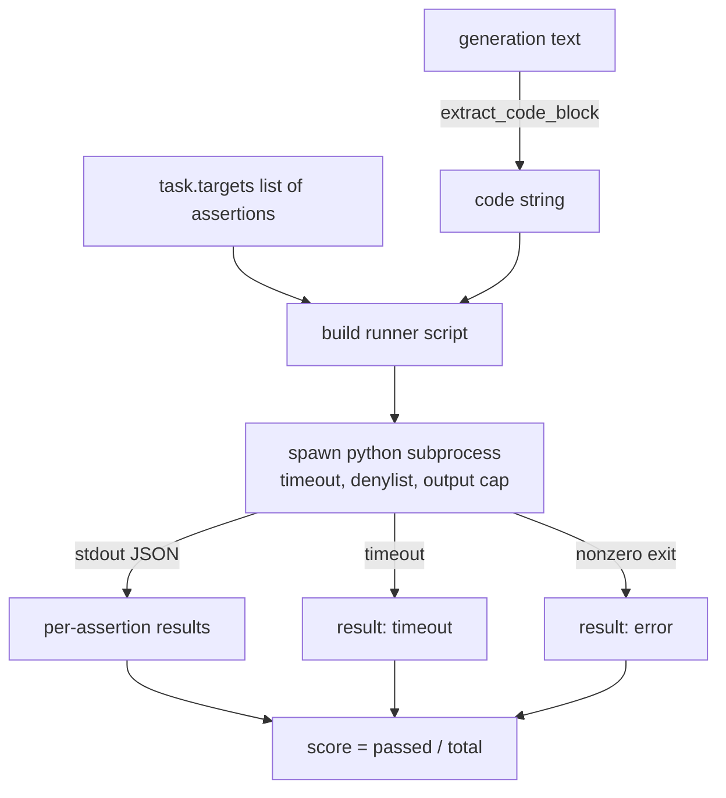
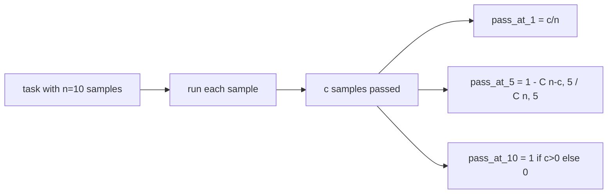

# Mã Exec Metric

> Mã được tạo là đúng khi nó vượt qua các bài kiểm tra. Các harness đánh giá phải trích xuất mã, chạy nó mà không làm máy chủ gặp sự cố và kiểm đếm tỷ lệ vượt qua một cách trung thực. Bài học này xây dựng bề mặt đó.

**Loại:** Xây dựng
**Ngôn ngữ:** Python
**Kiến thức tiên quyết:** Giai đoạn 19 Nền tảng theo dõi B, bài 70 và 71
**Thời lượng:** ~90 phút

## Mục tiêu học tập

- Trích xuất một khối mã từ một thế hệ dạng tự do theo cách phù hợp với quy tắc sau process từ bài 70.
- Thực thi mã ứng viên trong một quy trình con biệt lập với timeout đồng hồ treo tường, giới hạn đầu ra và danh sách từ chối import.
- Chấm điểm một nhiệm vụ dưới dạng phần của các chuỗi xác nhận được cung cấp vượt qua ứng viên.
- Tính toán truyền tại k cho các tác vụ lấy mẫu nhiều thế hệ từ một model.
- Coi sandbox sự cố, lỗi cú pháp và timeouts là chế độ thất bại class đầu tiên với các mã thoát riêng biệt mà người chạy có thể ghi lại.

## Tại sao lại là một quy trình con bị cô lập

`exec` nội tuyến là một mối nguy hiểm về an ninh và ổn định. Một `while True: pass` được tạo sẽ chặn đánh giá mãi mãi. Một `import shutil; shutil.rmtree('/')` được tạo ra chính xác là thảm khốc như âm thanh của nó. Cách khắc phục là tạo ra một trình thông dịch Python mới cho mỗi ứng viên, truyền mã trên stdin, ghi kết quả xác nhận vào stdout và giết các process nếu nó vượt quá mức. Máy chủ đánh giá process tiếp tục chạy.

Các đánh giá thực như HumanEval, MBPP, BigCodeBench và LiveCodeBench đều sử dụng một quy trình con sandbox. Một số lớp Docker lên trên. Chúng ta dừng lại ở quy trình con vì một lý do: nó có thể di động, nó là stdlib và nó nắm bắt các chế độ thất bại quan trọng đối với đánh giá giáo dục. Triển khai Production thêm Seccomp, cách ly mạng và hệ thống tệp chỉ đọc. Bài học tiếp theo về cuộc sống cứng rắn bên ngoài đường đua này.

## Hình dạng của một nhiệm vụ code-exec

Một nhiệm vụ `code_exec` mang chuỗi xác nhận trong `targets`. Người chạy trích xuất một khối mã có hàng rào từ thế hệ, xây dựng một harness thử nghiệm xung quanh nó và chạy kết quả.



Điểm số chỉ là một phần nhỏ trong `[0, 1]`. Một nhiệm vụ với ba khẳng định trong đó hai lần vượt qua điểm 0,667. Trình chạy trả về cùng một hình dạng bất kể điều gì thất bại: các sự cố quy trình con được ánh xạ đến mã lỗi chuẩn hóa, không phải là một Python truy xuất sủi bọt lên harness.

## Người từ chối

Danh sách từ chối dựa trên import. Trước khi chạy mã ứng viên, người chạy script viết lại imports các mô-đun nguy hiểm thành một sơ khai để tăng `ImportError("denied")`. Danh sách này cố tình bảo thủ: `os.system`, `subprocess`, `socket`, `requests`, `urllib`, `urllib.request`, `urllib.error`, `urllib.parse`, `ctypes`, `shutil`, `http.client`, `asyncio.subprocess`.

Chúng ta không giả vờ rằng điều này là chống đạn. Mã đối thủ được xác định có thể thoát khỏi bất kỳ process sandbox nào trong Python. Người từ chối là một điểm tựa. Đồng hồ treo tường timeout và nắp đầu ra là bộ điều khiển chịu tải.

```python
DENIED = {
    "os.system": True,
    "subprocess": True,
    "socket": True,
    "shutil": True,
    "requests": True,
    "urllib": True,
    "ctypes": True,
}
```

Chúng ta bọc ứng cử viên bằng cách đặt trước `import sys` và một người bảo vệ mà khỉ vá `os.system` để nâng lên. Mẫu đầy đủ đã được `main.py`.

## Đồng hồ treo tường timeout

Mỗi quy trình con đều có ngân sách mặc định là ba giây đồng hồ treo tường. Người chạy sử dụng `subprocess.run(..., timeout=t)`. Nếu timeout nổ súng, người chạy sẽ bắt được `TimeoutExpired`, giết process và ghi lại lý do thoát `timeout` cho nhiệm vụ. Điểm cho nhiệm vụ đó bằng không. Người chạy tiếp tục.

timeout có thể định cấu hình cho mỗi tác vụ thông qua `task.metadata.timeout_s`. Các bài kiểm tra đơn vị chạy lâu dài có thể yêu cầu nhiều hơn; Trình xác thực từ bài 70 giới hạn giá trị ở ba mươi giây để giữ cho bộ bị giới hạn.

## Nắp đầu ra

Quá trình con có thể làm tràn ngập stdout, làm cạn kiệt bộ nhớ máy chủ. Người chạy truyền stdout vào một bộ đệm và giết đứa trẻ ngay khi tổng số chạy vượt qua 256 KB. Kết quả được ghi lại dưới dạng `exit_code = error` với chuỗi chi tiết `"output overflow"`. Điều này xuất hiện trong thực tế khi một thế hệ vô tình viết một vòng lặp vô hạn để in.

## Truyền tại k

Pass-at-k là công cụ ước tính không thiên vị được sử dụng bởi HumanEval và bạn bè. Cho `n` mẫu độc lập cho mỗi nhiệm vụ và `c` trong số chúng vượt qua, xác suất một mẫu có kích thước `k` từ `n` chứa ít nhất một dung dịch đi qua là:

```
pass_at_k(n, c, k) = 1 - C(n - c, k) / C(n, k)
```

Khi `n - c < k` tử số không được xác định và giá trị `1`. Việc triển khai xử lý trực tiếp trường hợp biên. Chúng ta hiển thị `pass_at_k(n, c, k)` để lớp bảng xếp hạng sử dụng trong bài 74.



## Mã thoát

Người chạy trả về một trong năm kết quả cho mỗi nhiệm vụ:

- `pass` khi mọi khẳng định đều được thông qua.
- `assertion_fail` khi mã chạy nhưng ít nhất một xác nhận không thành công.
- `syntax_error` khi mã không import hoặc có SyntaxError.
- `timeout` khi đồng hồ treo tường hết hạn.
- `error` cho bất kỳ sự cố nào khác, bao gồm các lần truy cập vào danh sách từ chối và tràn đầu ra (bề mặt tràn có `"output overflow"` chi tiết).

Điểm số vẫn chỉ là một phần nhỏ. Mã thoát là siêu dữ liệu. Các bài học xuôi dòng có thể quyết định tính một timeout là không hay là dữ liệu bị thiếu.

## Bài học này không làm gì

Nó không cung cấp cho bạn một sandbox thực sự. Nó không chạy mã không đáng tin cậy từ web mở. Nó không xử lý các tác vụ có trạng thái như I/O tệp hoặc lệnh gọi mạng. Những người đó cần một container hoặc microVM. Điểm mấu chốt của bài học này là hợp đồng: một quá trình con biệt lập, một danh sách từ chối, một timeout, một giới hạn đầu ra, một từ vựng mã thoát sạch sẽ và toán học truyền tại k.

## Cách đọc mã

`main.py` định nghĩa `extract_code`, `run_candidate`, `score_code_exec` và `pass_at_k`. Trình chạy quá trình con script được xây dựng dưới dạng một chuỗi và được chuyển dưới dạng `-c` đến trình thông dịch Python mới. Các bài kiểm tra trong `code/tests/test_exec.py` thực hiện bốn mã thoát cộng với pass-at-k so với các ví dụ đã làm việc được rút ra từ phong cách HumanEval.

Đọc `main.py` từ trên xuống dưới. Mẫu người chạy là mảnh chịu lực. Nhìn chằm chằm vào vòng lặp xác nhận cho đến khi bạn có thể dự đoán phong bì JSON mà nó ghi lại cho process mẹ.

## Tiến xa hơn

Một khi hình dạng quy trình con hoạt động, mối quan tâm tiếp theo là tính di động. Các phiên bản Python khác nhau xử lý SIGKILL khác nhau trên Windows. Cách khắc phục sạch sẽ nhất là đặt người chạy vào Docker image. Điều tiếp theo sau đó là thay thế các chuỗi xác nhận bằng các tệp kiểm tra đơn vị thực để đánh giá phù hợp với những gì production CI làm. Ngừng gọi kiểm tra chuỗi xác nhận tại thời điểm đó; Chúng là các bài kiểm tra đồ chơi và chúng có các chế độ thất bại của đồ chơi.
