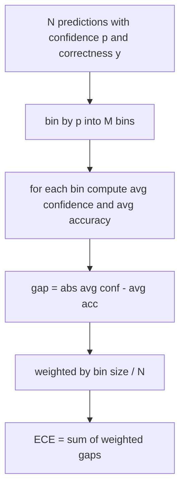
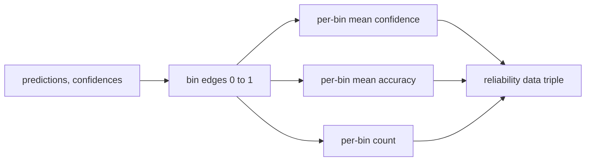

# Perplexity và hiệu chuẩn

> Nếu model của bạn tự tin 90% trên một nghìn câu trả lời và trả lời đúng sáu trăm, thì nó không được hiệu chỉnh tốt. Hiệu chuẩn là một nửa của đánh giá đáng tin cậy. Nửa còn lại là perplexity, cho bạn biết liệu model có nghĩ rằng văn bản được đưa ra là hợp lý hay không.

**Loại:** Xây dựng
**Ngôn ngữ:** Python
**Kiến thức tiên quyết:** Giai đoạn 19 Nền tảng theo dõi B, bài 70 và 71
**Thời lượng:** ~90 phút

## Mục tiêu học tập

- Tính toán perplexity cấp token trên một kho dữ liệu được giữ lại từ token xác suất nhật ký âm do bộ điều hợp model cung cấp.
- Tính toán sai số hiệu chuẩn dự kiến (ECE) của bộ phân loại hoặc đánh giá trắc nghiệm từ xác suất dự đoán được đóng gói.
- Tính điểm Brier (sai số bình phương trung bình so với chỉ số chính xác) và giải thích khi nào nó làm những gì ECE không làm.
- Xây dựng dữ liệu sơ đồ độ tin cậy cần thiết để vẽ đường cong độ tin cậy so với accuracy.
- Nối cả ba vào harness đánh giá để người chạy có thể đính kèm các số `perplexity`, `ece` và `brier` vào báo cáo model.

## Những gì perplexity cho bạn biết

Perplexity là log-likelihood âm trung bình theo cấp số nhân trên mỗi token. Thấp hơn là tốt hơn. Một perplexity của một có nghĩa là model gán xác suất một cho mọi token thực tế. Một perplexity về kích thước từ vựng có nghĩa là model đồng nhất và không học được gì. Các con số thực nằm ở giữa: model cơ sở mạnh mẽ năm 2026 trên WikiText-103 nằm trong khoảng tám đến mười hai. Một cái xấu trên cùng một văn bản nằm ở mức năm mươi trở lên.

harness không tự tính toán xác suất log. Chúng đến từ bộ chuyển đổi model. Các harness tổng hợp: nó lấy một danh sách xác suất nhật ký trên mỗi token, một danh sách số lượng token trên mỗi chuỗi và trả về kho dữ liệu perplexity.

```python
def perplexity(neg_log_probs, token_counts):
    total_nll = sum(neg_log_probs)
    total_tokens = sum(token_counts)
    return math.exp(total_nll / total_tokens)
```

Việc triển khai xử lý các trường hợp biên token không và khẳng định rằng xác suất log âm là không âm. Một sai lầm phổ biến là quên phủ định: một bộ chuyển đổi trả về `log p` thay vì `-log p` tạo ra một perplexity dưới một, điều này là không thể. Chức năng bắt đó là vi phạm hợp đồng.

## ECE đo lường gì

Lỗi hiệu chuẩn dự kiến nhóm dự đoán theo độ tin cậy của chúng vào một số thùng cố định, sau đó đo khoảng cách trung bình giữa độ tin cậy và accuracy trên các thùng, có trọng số theo kích thước thùng.



Công thức tiêu chuẩn sử dụng mười thùng có chiều rộng bằng nhau trên `[0, 1]`. Việc triển khai hỗ trợ bất kỳ số nguyên dương nào. Chúng ta hiển thị một `bins` parameter để người chạy có thể chọn giữa quy ước xuất bản (10) và quy ước so sánh (15).

ECE bị phân cực bởi số lượng thùng và kích thước mẫu. Với mười thùng và một trăm dự đoán, bạn không thể phân biệt 0,02 ECE với nhiễu ngẫu nhiên. Việc triển khai trả về số lượng thùng được điền cùng với ECE để người chạy có thể từ chối báo cáo một số duy nhất trên quá ít mẫu.

## Điểm Brier nào mà ECE không

ECE chỉ quan tâm đến khoảng cách trung bình. Một model quá tự tin trên một nửa thùng và thiếu tự tin ở nửa còn lại có thể có ECE thấp trong khi được hiệu chỉnh cục bộ kém. Điểm Brier đo lường sai số bình phương so với kết quả thực cho mỗi dự đoán, vì vậy nó phạt trực tiếp chênh lệch.

Đối với kết quả nhị phân, Brier là `mean((p_i - y_i)^2)`. Nó phân hủy thành độ tin cậy, độ phân giải và độ không chắc chắn. Chúng ta tính điểm số và sự phân hủy. Người chạy báo cáo vô hướng nhưng ghi lại quá trình phân tách cho bảng thông tin.

```python
def brier(p, y):
    return float(np.mean((p - y) ** 2))
```

## Dữ liệu sơ đồ độ tin cậy

Sơ đồ độ tin cậy vẽ biểu đồ độ tin cậy dự đoán so với accuracy thực nghiệm trong mỗi thùng. Đường chéo là hiệu chuẩn hoàn hảo. Hàm trả về ba mảng: độ tin cậy trung bình trên mỗi thùng, accuracy trung bình trên mỗi thùng và số lượng trên mỗi thùng. Mã biểu đồ sống ở hạ lưu; Bài học này dừng lại ở hình dạng dữ liệu.



Bộ dữ liệu được trả về là những gì một lớp gọi cần để vẽ biểu đồ hoặc tính toán một biến thể ECE tùy chỉnh (ECE thích ứng, ECE quét, v.v.). Chúng ta trả về numpy mảng để mã xuôi dòng không phải chuyển đổi.

## Nguồn tin cậy

harness không cho rằng sự tự tin đến từ softmax. Nó chấp nhận bất kỳ số nào tính bằng `[0, 1]` cho mỗi dự đoán. Đối với các nhiệm vụ trắc nghiệm, sự tự tin tự nhiên là `softmax over option log-likelihoods`. Đối với văn bản tự do, độ tin cậy tự nhiên là xác suất tự báo cáo của model hoặc hàm mũ của log-likelihood trung bình. Đánh giá chỉ tiêu thụ con số. Nó đến từ đâu là công việc của bộ chuyển đổi.

## Trường hợp cạnh

- Tất cả các dự đoán đều sai: ECE là độ tin cậy trung bình, Brier là cao, perplexity là bất cứ điều gì model nghĩ về văn bản.
- Tất cả các dự đoán đều chính xác với độ tin cậy cao: ECE gần không, Brier gần không.
- Yếu tố dự đoán hoàn toàn không chắc chắn ở p = 0,5: ECE là 0,5 trừ accuracy, Brier là 0,25 trừ một số hạng điều chỉnh.
- Đầu vào trống: ECE, Brier và `0.0` trả về độ tin cậy (hoặc mảng không lấp đầy bằng không). Perplexity trả về `NaN` cho trường hợp không token. Không có con đường nào trong số này phát ra cảnh báo; Người chạy kiểm tra các giá trị và quyết định báo cáo hay bỏ qua.

Những trường hợp này được đưa vào các bài kiểm tra. Một model thực sự trên một benchmark thật sẽ không va vào chúng, nhưng một bộ chuyển đổi bị lỗi hoặc một mẫu nhỏ sẽ va chạm, và người chạy sẽ không bị va chạm.

## Công văn

Hiệu chuẩn không phải là số liệu cho mỗi tác vụ như F1. Đó là một báo cáo cho mỗi model. Người chạy tích lũy `(confidence, correct)` cặp trên toàn bộ đánh giá và tính toán ECE, Brier và dữ liệu độ tin cậy một lần. Perplexity được tính toán trên một kho dữ liệu văn bản được giữ lại, tách biệt với tính điểm từng nhiệm vụ.

Giao diện là:

```python
report = CalibrationReport.from_predictions(confidences, correct)
report.ece          # float
report.brier        # float
report.reliability  # tuple of three numpy arrays
report.populated_bins  # int
```

`PerplexityResult.from_token_nll(neg_log_probs, token_counts)` trả về perplexity và log-likelihood âm trung bình mỗi token.

## Bài học này không làm gì

Nó không gọi một model. Nó không thực hiện softmax. Nó không ước tính độ tin cậy từ tokens đầu ra; đó là công việc của bộ chuyển đổi. Nó không thực hiện temperature mở rộng quy mô hoặc tỷ lệ Platt; Đó là những bản sửa lỗi sau khi sống trong một bài học khác. Mục đích của bài học này là làm cho ba con số (perplexity, ECE, Brier) đáng tin cậy và có thể tái tạo.

## Cách đọc mã

`main.py` xác định các lớp dữ liệu `perplexity`, `expected_calibration_error`, `brier_score`, `reliability_diagram` và `CalibrationReport` / `PerplexityResult`. Bản demo chạy dựa trên các dự đoán tổng hợp trong đó ground truth được biết đến: một model được hiệu chỉnh tốt, một sự tự tin thái quá và một sự thiếu tự tin. Các thử nghiệm trong `code/tests/test_calibration.py` ghim mọi trường hợp cạnh cộng với các giá trị tham chiếu cho các yếu tố dự đoán tổng hợp.

Đọc `main.py` từ trên xuống dưới. Thứ tự hàm đi vô hướng đến vector báo cáo. Mỗi hàm có một chuỗi tài liệu ngắn với toán học và hợp đồng.

## Tiến xa hơn

Hiệu chuẩn là trục bị bỏ qua nhiều nhất trong đánh giá được công bố. Hầu hết các bảng xếp hạng báo cáo một số accuracy duy nhất và gọi nó là xong. Một model thắng trên accuracy và thua Brier là một production triển khai tồi tệ hơn một model ghi điểm thấp hơn vài điểm so với accuracy nhưng báo cáo một cách đáng tin cậy về sự không chắc chắn của nó. Khi bạn đã có hệ thống ống nước hiệu chuẩn, hãy thêm tỷ lệ temperature trên lát xác thực được giữ lại, tính toán lại ECE và xem khoảng cách thu hẹp. Đó là một bài học riêng biệt, nhưng sàn nhà sống ở đây.
