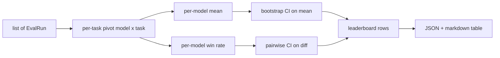
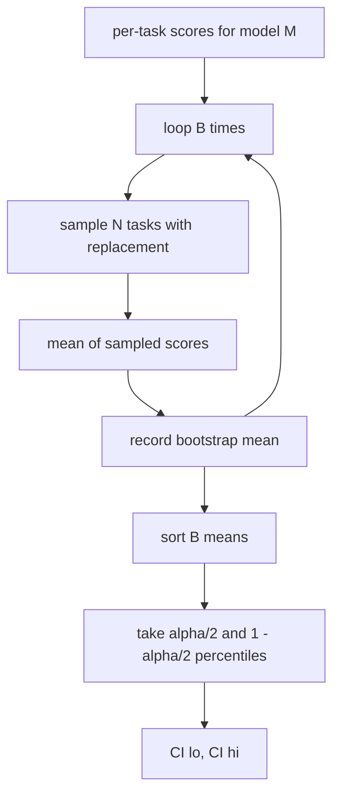

# Tổng hợp bảng xếp hạng

> Điểm số cho mỗi nhiệm vụ rất dễ dàng. Xếp hạng mỗi model trên các nhiệm vụ không đồng nhất khó hơn. Ý nghĩa thống kê trên bảng xếp hạng nghìn dự đoán là phần mà mọi người bỏ qua. Bài học này không bỏ qua nó.

**Loại:** Xây dựng
**Ngôn ngữ:** Python
**Kiến thức tiên quyết:** Nền tảng Giai đoạn 19 Theo dõi B, bài 70, 71, 73
**Thời lượng:** ~90 phút

## Mục tiêu học tập

- Tổng hợp điểm số cho mỗi nhiệm vụ trên nhiều models và nhiều nhiệm vụ thành một hàng gọn gàng trên mỗi model.
- Chuẩn hóa điểm số không đồng nhất để tỷ lệ đậu và giá trị BLEU không ảnh hưởng quá mức đến tổng hợp.
- Xếp hạng models theo giá trị trung bình và tỷ lệ thắng, đồng thời giải thích khi nào mỗi người là bản tóm tắt đúng.
- Tính toán khoảng tin cậy bootstrap trên điểm trung bình trên model và chênh lệch theo cặp.
- Xuất bảng xếp hạng dưới dạng báo cáo JSON và dưới dạng bảng đánh dấu mà người chạy trong bài 75 có thể dán vào nhận xét CI.

## Hình dạng của đầu vào

Trình tổng hợp sử dụng danh sách các bản ghi `EvalRun`:

```python
@dataclass
class EvalRun:
    model_id: str
    task_id: str
    metric_name: str
    score: float          # in [0, 1]
    category: str
```

Vận động viên chạy trong bài 75 phát ra một kỷ lục cho mỗi `(model, task)` đôi. Người tổng hợp không quan tâm đến việc điểm số được tạo ra như thế nào. Họ hy vọng việc bình thường hóa đã xảy ra: mọi điểm số đều ở `[0, 1]`.

## Đầu ra

Ba bảng xuất hiện:



Hàng bảng xếp hạng chứa: `model_id`, `mean_score`, `mean_ci_lo`, `mean_ci_hi`, `win_rate`, `tasks_completed` và bản đồ `categories` tùy chọn cho giá trị trung bình của mỗi danh mục.

## Bình thường hóa

Nếu một nhiệm vụ ghi điểm bằng `[0, 1]` và một nhiệm vụ khác bằng `[0, 100]`, nhiệm vụ thứ hai âm thầm thống trị giá trị trung bình. Công cụ tổng hợp xác nhận rằng mọi điểm đầu vào đều nằm trong `[0, 1]` và từ chối chạy. Bản sửa lỗi nằm ngược dòng: chỉ số phải trả về một phân số. Bài 71 đến 73 thực thi hợp đồng đó.

## Trung bình và tỷ lệ thắng

Hai sơ đồ xếp hạng phục vụ các mục tiêu khác nhau.

Điểm trung bình là điểm trung bình của mỗi nhiệm vụ trong một model. Đó là báo cáo bảng xếp hạng số tiêu đề. Nó nhạy cảm với các ngoại lệ và mất cân bằng nhiệm vụ.

Tỷ lệ thắng tính tần suất một model đánh bại mọi model khác trong cùng một nhiệm vụ. Đối với mỗi nhiệm vụ, model có số điểm cao nhất sẽ giành chiến thắng (chia hòa). Tỷ lệ thắng bằng chiến thắng chia cho số nhiệm vụ mà model có điểm. Nó ít nhạy cảm hơn với các ngoại lệ và tỷ lệ khác biệt nhưng mất thông tin.

```python
def win_rate(model_id, runs_by_task, all_models):
    wins, total = 0, 0
    for task_id, runs in runs_by_task.items():
        scores = {r.model_id: r.score for r in runs if r.model_id in all_models}
        if model_id not in scores:
            continue
        total += 1
        best = max(scores.values())
        if scores[model_id] >= best:
            wins += 1
    return wins / total if total else 0.0
```

harness báo cáo cả hai. Người chạy trong bài 75 xếp hạng trung bình theo mặc định; Cột đánh dấu cho tỷ lệ thắng nằm ngay trong trường hợp người dùng thích nó.

## Khoảng tin cậy của Bootstrap

Mỗi model có nghĩa là đi kèm với một khoảng tin cậy được ước tính bằng cách lấy mẫu lại bootstrap trên các tác vụ. Chúng ta lấy mẫu lại id nhiệm vụ bằng cách thay thế, tính giá trị trung bình trên tập được lấy mẫu lại, lặp lại `B` lần và lấy khoảng phần trăm ở cấp `alpha`.



Đối với so sánh theo cặp, chúng tôi khởi động `score_A - score_B` chênh lệch mỗi tác vụ, lấy khoảng phần trăm và báo cáo nó. Người dùng đọc xem khoảng thời gian có loại trừ số không. Nếu có, sự khác biệt là đáng kể ở cấp alpha. Nếu không, bảng xếp hạng sẽ coi models là hòa.

Các trợ giúp cấp thấp (`bootstrap_mean_ci`, `bootstrap_pairwise_diff`) mặc định là `B=1000`; Các công cụ tổng hợp công khai (`aggregate`, `pairwise_diffs`) mặc định là `b=500` để bản demo và thử nghiệm diễn ra nhanh chóng. Alpha mặc định là 0,05. Bài học giữ cho bootstrap thuần túy numpy, không có scipy.

## Thể loại

Nếu giá `EvalRun.category` được đặt, công cụ tổng hợp cũng báo cáo giá trị trung bình của mỗi danh mục. Đây là cột trên mọi bảng xếp hạng có nội dung `math`, `reasoning`, `code`, `safety`. Nó cho phép người chạy xác định xem một model có tốt về tổng thể nhưng yếu về mã hay không, đó là thông tin mà tiêu đề có nghĩa là ẩn.

## Kết xuất Markdown

Bảng xếp hạng được hiển thị dưới dạng bảng đánh dấu:

```text
| Rank | Model | Mean | 95% CI | Win rate | Tasks |
|------|-------|------|--------|----------|-------|
| 1    | gpt   | 0.78 | 0.74-0.82 | 0.62 | 50 |
| 2    | claude| 0.75 | 0.71-0.79 | 0.34 | 50 |
| 3    | random| 0.10 | 0.07-0.13 | 0.04 | 50 |
```

Bảng được sắp xếp theo điểm trung bình. CI được hiển thị thành hai số thập phân. Id model dài được cắt ngắn xuống còn hai mươi ký tự.

## Bài học này không làm gì

Nó không chạy models. Nó không gọi lớp hệ mét. Nó không thực hiện ECE thích ứng hoặc các biến thể hiệu chuẩn khác; Đó là bài 73. Nó không thực hiện trọng số nhiệm vụ. Mọi nhiệm vụ đều có giá trị như nhau ở đây. Production bảng xếp hạng trọng số nhiệm vụ; Chúng ta để hook đó mở thông qua trường `weight` nhưng bỏ qua nó trong trình tổng hợp. Thêm trọng số trong bài học tiếp theo nếu bạn cần.

## Cách đọc mã

`main.py` định nghĩa `EvalRun`, `LeaderboardRow`, `aggregate`, `bootstrap_mean_ci`, `bootstrap_pairwise_diff` và `render_markdown`. Bản demo xây dựng một bộ tổng hợp gồm ba models và mười hai nhiệm vụ, tổng hợp và in bảng xếp hạng cộng với bảng chênh lệch theo cặp. Các thử nghiệm trong `code/tests/test_leaderboard.py` ghim bootstrap, kết xuất đánh dấu, các trường hợp cạnh tỷ lệ thắng và hành vi đầu vào trống.

Đọc `main.py` từ trên xuống dưới. Hình dạng dữ liệu (EvalRun, LeaderboardRow) xuất hiện trước, tiếp theo là tổng hợp, bootstrap thứ ba, kết xuất cuối cùng. Mỗi hàm có một hợp đồng tập trung.

## Tiến xa hơn

Bước tiếp theo tự nhiên là ý nghĩa tác vụ được ghép nối thay vì bootstrap không ghép nối. Nếu model A và B đều chạy cùng một trăm tác vụ, thì thử nghiệm thích hợp là bootstrap được ghép nối trên sự khác biệt của từng tác vụ, mà chúng tôi thực hiện. Ngoài ra, bạn muốn có một bootstrap phân cấp tôn trọng các họ nhiệm vụ (các bài toán không độc lập với nhau; một mẫu lỗi số học ảnh hưởng đến mười trong số chúng). Đó là một phần tiếp theo. Mục đích của bài học này là làm cho sàn đúng để đánh giá báo cáo một con số bạn có thể bảo vệ.
