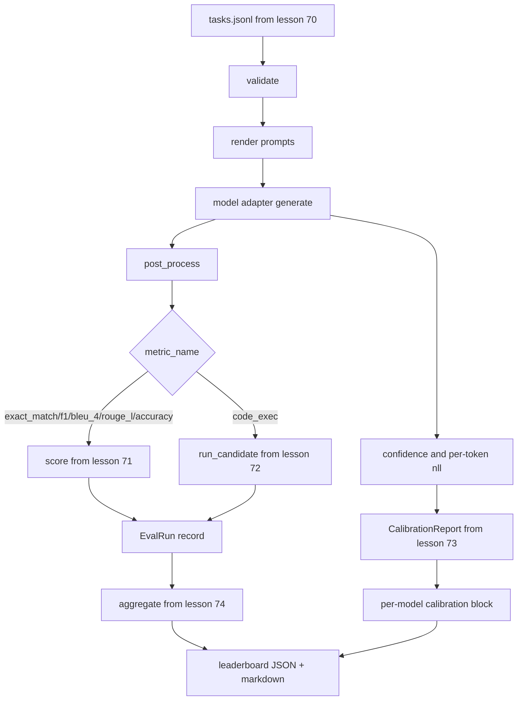

# Người chạy Eval từ đầu đến cuối

> Năm bài học về hệ thống ống nước, một bài học để dán chúng. Người chạy đọc thông số kỹ thuật nhiệm vụ từ bài 70, gọi model thông qua bộ chuyển đổi, ghi điểm với bài 71 và 72, đính kèm báo cáo hiệu chuẩn từ bài 73 và phát ra bảng xếp hạng từ bài 74. Bản demo tự chấm dứt.

**Loại:** Xây dựng
**Ngôn ngữ:** Python
**Kiến thức tiên quyết:** Giai đoạn 19 Nền tảng theo dõi B, bài 70 đến 74
**Thời lượng:** ~90 phút

## Mục tiêu học tập

- Xác định một giao diện `ModelAdapter` mà bất kỳ model nào (mock, local, API) đều có thể đáp ứng với một giao diện phương thức nhỏ.
- Chạy đánh giá trên tệp JSONL cố định có thực thi tác vụ song song trên nhóm worker.
- Soạn lớp hệ mét (exact_match, F1, BLEU-4, ROUGE-L, code_exec) với lớp hiệu chuẩn trong một lần.
- Phát ra các bản ghi trên mỗi model `EvalRun` và đưa thẳng vào trình tổng hợp bảng xếp hạng.
- Xuất cả báo cáo JSON và bảng đánh dấu; Tự kết thúc với Exit zero khi chạy sạch, không phải zero khi xác thực hoặc runtime lỗi.

## Các pipeline



Người chạy là điểm tích hợp. Mỗi bài học từ 70 đến 74 sở hữu một mô-đun mà người chạy soạn thảo. Người chạy không sao chép bất kỳ logic nào từ các mô-đun đó: nó imports chúng.

## Giao diện bộ điều hợp

Bộ chuyển đổi là đường nối giữa người chạy và bất kỳ model nào. Giao diện có chủ ý nhỏ.

```python
class ModelAdapter:
    model_id: str

    def generate(self, prompt: str, task: TaskSpec) -> Generation: ...
```

`Generation` là một lớp dữ liệu với:

- `text`: đầu ra dạng tự do của model
- `confidence`: một float trong `[0, 1]` đại diện cho xác suất tự báo cáo của model cho câu trả lời
- `token_nll`: tổng tùy chọn của log-likelihoods âm trên tokens được tạo
- `token_count`: số lượng tokens được tạo tùy chọn

Bộ điều hợp giả trong người chạy cung cấp ba hương vị: `RuleBasedAdapter` (xác định, gần hoàn hảo), `NoisyAdapter` (quá tự tin, thường sai) và `BiasedAdapter` (giỏi ở một loại, khủng khiếp ở một loại khác). Bản demo chạy cả ba trong lịch thi đấu bài 70.

## Thực hiện song song

Người chạy sử dụng `concurrent.futures.ThreadPoolExecutor` để chạy các tác vụ song song trong mỗi model. Số lượng worker mặc định nhỏ hơn trong số tám và số lượng nhiệm vụ. Threads là đủ vì nút thắt cổ chai cho các cuộc gọi model thực là mạng I/O. Đường dẫn code-exec tạo ra quá trình con của riêng nó bên trong tác vụ và trình thực thi chỉ lên lịch chờ đợi.

Đối với các bài kiểm tra xác định, người chạy hiển thị `run_eval(adapters, tasks, parallel=False)` để các bài kiểm tra có thể ghim lệnh thực hiện.

## Vòng ghi điểm một lần

Đối với mỗi nhiệm vụ:

1. Hiển thị prompt (tiền tố few-shot cộng với nội dung prompt).
2. Gọi bộ điều hợp và tính thời gian cuộc gọi.
3. Sau process thế hệ theo quy tắc của nhiệm vụ.
4. Gửi đến lớp hệ mét.
5. Xây dựng bản ghi `EvalRun` với siêu dữ liệu điểm số và chỉ số.
6. Nối cặp `(confidence, correct)` vào bộ đệm hiệu chuẩn.

Tín hiệu `correct` được `score >= 1.0` cho các chỉ số kiểu exact_match (`exact_match`, `accuracy`, `code_exec`) và `score >= 0.5` cho các chỉ số được phân loại. Ngưỡng cửa nằm trong `_correct_from_score` và người chạy không tiết lộ ghi đè công khai.

## Tổng hợp

Sau khi mỗi nhiệm vụ có kết quả, người chạy gọi `aggregate` và `pairwise_diffs` từ bài 74 và `CalibrationReport.from_predictions` từ bài 73. Đầu ra là một phong bì JSON duy nhất:

```json
{
  "leaderboard": [...],
  "pairwise": [...],
  "calibration": {
    "model_id_a": {"ece": 0.04, "brier": 0.10, "populated_bins": 8, ...},
    ...
  },
  "summary": {
    "tasks": 10,
    "models": 3,
    "wall_seconds": 1.2
  }
}
```

Người chạy cũng viết một bảng đánh dấu vào stdout để người dùng có thể dán kết quả vào đánh giá PR.

## Bản demo tự chấm dứt

Bản demo chạy ba bộ điều hợp giả trên mười nhiệm vụ cố định từ bài 70. Thời gian tường nên dưới mười giây. Mã thoát bằng không khi chạy sạch.

Các tiêu chí chạy sạch là:

- Mọi nhiệm vụ đều được xác thực theo bài 70.
- Mọi nhiệm vụ đều đạt điểm trong bài 71 và 72.
- Báo cáo hiệu chuẩn được tổng hợp theo bài 73 mà không có sai sót.
- Bảng xếp hạng xếp hạng bộ điều hợp dựa trên quy tắc cao hơn bộ điều hợp ngẫu nhiên.

Nếu bất kỳ lỗi nào trong số đó bị hỏng, người chạy sẽ thoát ra không phải bằng không với lỗi cấu trúc trong phong bì JSON.

## Bài học này không làm gì

Nó không gọi là một model thực sự. Nó không thực hiện xử lý luồng phím API hoặc giới hạn tốc độ. Nó không thực hiện streaming hoặc phát một phần; Bộ điều hợp trả về một thế hệ cho mỗi cuộc gọi. Nó không thử lại hoặc lưu vào bộ nhớ đệm. Những mối quan tâm đó sống ở lớp bộ chuyển đổi; người chạy là bất khả tri về số liệu và bất khả tri về nhà cung cấp.

## Cách đọc mã

`main.py` là sự tích hợp. Nó imports từ năm mô-đun bài học khác thông qua một trình trợ giúp `_load_sibling` nhỏ giải quyết chúng theo đường dẫn tương đối. Các lớp dữ liệu `Generation`, `EvalReport` và `ModelAdapter` được xác định cục bộ. Các bộ điều hợp mô phỏng nằm ở cuối tệp.

Đọc `main.py` từ trên xuống dưới. Lướt qua imports, sau đó nhìn vào `run_eval`, sau đó `_score_one`, sau đó là các bộ điều hợp. Bản demo ở cuối là điểm vào lệnh.

Các thử nghiệm trong `code/tests/test_runner.py` ghim giao diện bộ điều hợp, vòng lặp một lần, tương đương song song so với tuần tự, bộ đệm hiệu chuẩn và hình dạng phong bì JSON.

## Tiến xa hơn

Người chạy này là sàn nhà. Hệ thống đánh giá production bổ sung: bộ nhớ đệm kết quả được khóa bởi `(task_id, model_id, model_version)`, sổ cái chi phí theo dõi đô la và tokens mỗi lần chạy, lớp thử lại lùi lại khi rate limits, sampling policy cho các tác vụ truyền tại k và định dạng đầu ra streaming cho các bộ dài. Mỗi người trong số đó là một mối quan tâm duy nhất bao bọc người chạy mà không thay đổi các lớp số liệu hoặc tổng hợp. Sự tách biệt đó là điểm mấu chốt của hợp đồng.

Thêm một bộ chuyển đổi cho một nhà cung cấp thực sự sau khi bạn có các mô phỏng hoạt động. Chọn một trong những bậc miễn phí, viết ba mươi dòng keo, xem bảng xếp hạng sáng lên. Sau đó, thêm nhà cung cấp thứ hai và để harness thực hiện công việc.
