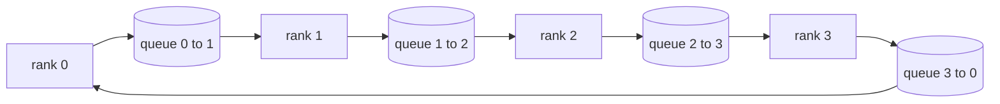

# Hoạt động tập thể từ đầu

> Bốn hoạt động tập thể giữ các training phân tán lại với nhau là allreduce, broadcast, allgather và reduce_scatter. Mọi primitive khác mà training framework cung cấp đều là một lớp bọc xung quanh những thứ này. Xây dựng chúng một lần trên lưới `multiprocessing.Queue`, xác minh chúng dựa trên triển khai tham chiếu và rest của đường ray trở thành hệ thống ống nước.

**Loại:** Xây dựng
**Ngôn ngữ:** Python
**Kiến thức tiên quyết:** Giai đoạn 19 Bài học theo dõi C 42-49
**Thời lượng:** ~90 phút

## Mục tiêu học tập

- Triển khai allreduce vòng trong hai lần (reduce-scatter sau đó allgather) và chứng minh volume giao tiếp trên mỗi cấp là 2 (N-1) / N byte trên mỗi phần tử.
- Xây dựng chương trình phát sóng, thu thập tất cả và reduce_scatter trên các lần gửi điểm-điểm qua `multiprocessing.Queue`.
- Xác minh mọi primitive với tham chiếu `torch.distributed` gloo cho cùng một đầu vào.
- Bảo vệ sự lựa chọn của vòng so với cây trên hình dạng cụm, sàn độ trễ và trần băng thông.

## Vấn đề

Một allreduce ngây thơ trên N thứ hạng sẽ gửi N lần tensor đến gốc và phát lại N lần. Tỷ lệ băng thông là O (N) trên mỗi cấp bậc, gốc trở thành nút cổ chai và sàn đồng hồ treo tường là liên kết chậm nhất với N. Ring allreduce làm phẳng nó thành 2 (N-1) khối có kích thước T/N, do đó byte trên mỗi thứ hạng giảm xuống 2T (N-1) / N không phụ thuộc vào kích thước cụm. Tree allreduce chiến thắng trên các liên kết N nhỏ và độ trễ cao vì độ sâu là log2 (N) nhảy thay vì 2 (N-1). Chọn cấu trúc liên kết sai cho hình dạng cụm và GPU chậm nhất quyết định thời gian bước.

Mỗi training framework phân phối mà bạn sẽ đọc bài hát này đều phụ thuộc vào bốn primitives này. PyTorch DDP đồng bộ hóa gradients với một allreduce trên mỗi parameter bucket. ZeRO phân đoạn trạng thái tối ưu hóa theo reduce_scatter và các chương trình phát sóng được cập nhật parameters bởi allgather. FSDP biến toàn bộ tiền đạo thành allgather cộng với reduce_scatter. Pipeline song song cần phát sóng để kích hoạt giữa các nhóm giai đoạn. Nếu bạn không thể thực hiện bốn tập thể, bạn không thể lý luận về lý do tại sao training gian hàng, tại sao gradient không khớp lại xuất hiện ở thứ hạng 3 hoặc tại sao bong bóng pipeline lại tăng gấp đôi khi bạn hoán đổi cấu trúc liên kết.

## Khái niệm



### Đổ chuông allgiảm trong hai lần

Chia tensor thành N phần bằng nhau được lập chỉ mục 0..N-1. Mỗi cấp bậc sở hữu chỉ số khối bằng với thứ hạng của nó. Vượt qua 1, giảm-tán xạ, chạy các bước N-1. Ở bước s, rank r gửi chunk (r - s) mod N đến xếp hạng (r + 1) mod N và nhận chunk (r - s - 1) mod N từ rank (r - 1) mod N, tích lũy chunk nhận được vào bản sao cục bộ của nó. Sau các bước N-1, hạng r sở hữu toàn bộ số tiền cho khối r. Vượt qua 2, tất cả tập hợp, chạy một bước N-1 khác và xoay các khối đã hoàn thành xung quanh vòng cho đến khi mọi thứ hạng giữ toàn bộ tổng cho mỗi khối.

| Primitive | Số byte trên mỗi thứ hạng | Các bước | Trường hợp sử dụng |
|-----------|---------------|-------|-------------|
| Đổ vòng allreduce | 2T (N-1) / N | 2 (N-1) | T lớn, cụm đồng nhất ống mỡ |
| Cây allreduce | T log2 (N) | 2 nhật ký2 (N) | Liên kết T nhỏ hoặc độ trễ cao |
| Phát sóng | T | cây log2(N) | Parameter init, config vô hướng |
| Tất cả tập hợp | T (N-1) / N | N-1 · | Sharded forward, ZeRO unshard |
| Reduce_scatter | T (N-1) / N | N-1 · | ZeRO gradient sharding |

### Lưới xếp hàng thay thế cho NCCL

NCCL chạy trên PCIe và NVLink với các biện pháp giảm tải phần cứng. Trên CPU bạn không có điều đó. Cạnh `multiprocessing.Queue` trên mỗi vòng cung cấp cho bạn giao hàng điểm-điểm theo thứ tự với một nhà sản xuất và người tiêu dùng duy nhất. Việc giảm xảy ra trong không gian người dùng, vì vậy bạn phải trả Python chi phí, nhưng mẫu dây giống hệt với vòng NCCL allreduce. Lý do về tính đúng đắn trên phiên bản hàng đợi và hành vi cụm sau đây.

### Xác minh chống lại gloo

Mỗi primitive đều có một bài kiểm tra đơn vị so sánh đầu ra của nó với `torch.distributed` được khởi tạo với phần phụ trợ gloo trên cùng một tensor trên cùng kích thước thế giới. Nếu chiếc nhẫn của bạn allreduce phân kỳ khỏi gloo nhiều hơn float32 epsilon, bài kiểm tra không thành công. Việc xác minh đối với việc triển khai tham chiếu là không thể thương lượng; Nếu không có nó, primitive có vẻ chính xác cho đến bước 10000 của một training chạy thực sự.

## Tự xây dựng

`code/main.py` thực hiện:

- `Mesh` class dây N `multiprocessing.Queue` cá thể vào một vòng và để lộ `send(dst, tensor)` và `recv(src)` trên mỗi cấp bậc.
- `ring_allreduce(mesh, rank, world_size, tensor)` chạy thuật toán hai lượt.
- `broadcast(mesh, rank, world_size, tensor, src)` trên một cây logarit.
- `allgather(mesh, rank, world_size, tensor)` sử dụng vòng quay N-1.
- `reduce_scatter(mesh, rank, world_size, tensor)` là nửa đầu của allreduce.
- `_gloo_reference(op, world_size, tensor)` chạy cùng một đầu vào thông qua `torch.distributed` với gloo để so sánh bằng byte.

Chạy nó:

```bash
python3 code/main.py
```

Đầu ra: bảng xác minh trên mỗi primitive so sánh đầu ra lưới hàng đợi và gloo, tiếp theo là bộ đếm byte trên mỗi thứ hạng chứng minh tỷ lệ 2T (N-1) / N.

## Production mô hình trong tự nhiên

Ba mẫu làm cứng primitives đủ để ship.

**Bucket gradients trước khi allreduce.** Một parameter model 1B có hàng chục nghìn gradient tensors. Một allreduce mỗi tensor trả sàn độ trễ N lần. Các vùng lưu trữ DDP gradients thành các khối ~25 MB và phát hành một allreduce cho mỗi vùng lưu trữ; tensors nhỏ cưỡi trên lưng những con lớn. Nếu không cần xô, chi phí độ trễ sẽ chi phối bước.

**Giao tiếp chồng chéo với tính toán.** Tính toán ngược gradients lớp theo thứ tự ngược lại. Khoảnh khắc các gradient của layer cuối cùng đã sẵn sàng, hãy khởi động allreduce của nó trong khi layer tiếp tục tính toán. PyTorch DDP nối dây này với hooks sẵn sàng cho gầu. Sự chồng chéo làm giảm một nửa thời gian giao tiếp có thể nhìn thấy khi mạng bị chùng xuống.

**Chọn vòng hoặc cây theo kích thước tin nhắn, không phải tôn giáo.** NCCL ships một trình phát hiện cấu trúc liên kết chọn vòng cho các thư trên ~1 MB và cây bên dưới. Sự giao nhau là băng thông so với độ trễ: trên 1 MB, thuật ngữ băng thông 2T (N-1) / N chiếm ưu thế và vòng thắng; dưới 1 MB, số bước nhảy log2 (N) sẽ thắng. Mã hóa cứng một cấu trúc liên kết tốn thông lượng trên kích thước tin nhắn sai.

## Ứng dụng

Production mẫu:

- **PyTorch DDP.** Gọi `dist.all_reduce` trên gradients được xô sau khi lùi. Kích thước thùng có thể điều chỉnh được; mặc định 25 MB là hợp lý cho Ethernet 100Gbit.
- **DeepSpeed ZeRO.** Các vấn đề reduce_scatter để phân mảnh gradients và tất cả tập hợp để tái tạo toàn bộ parameters trước khi chuyển tiếp. Bài học primitives chính xác là những cuộc gọi mà ZeRO thực hiện.
- **FSDP.** Chuyển tiếp bắt đầu với allgather để giải phân mảnh lớp, tính toán, sau đó giảm với reduce_scatter và loại bỏ phân đoạn. Cùng một primitives, lịch trình khác nhau.

## Sản phẩm bàn giao

Sử dụng primitives lưới hàng đợi trong bài 77-81. Bài 77 dây tất cả giảm thành DDP. Bài 78 dây reduce_scatter vào ZeRO. Bài 79 dây phát vào pipeline kích hoạt. Bài 81 tổng hợp cả bốn thành bản demo từ đầu đến cuối.

## Bài tập

1. Thêm biến thể cây allreduce và chuyển đổi giữa vòng và cây theo kích thước tin nhắn. Đo độ phân tần.
2. Thêm một `recv_timeout_ms` để thứ hạng bị đình trệ xuất hiện lỗi thời hạn thay vì treo mãi mãi.
3. Thay thế `multiprocessing.Queue` bằng ổ cắm TCP cho bốn primitives. Các bài kiểm tra tương tự, dây thật.
4. Thêm hook đo băng thông để bộ đếm byte theo thứ hạng ghi nhật ký vào JSONL.
5. So sánh thời gian đồng hồ treo tường của nhẫn so với cây trên 4 thứ hạng cho tensors có kích thước 1KB, 1MB, 16MB. Bảo vệ sự giao thoa theo kinh nghiệm.

## Thuật ngữ chính

| Thuật ngữ | Những gì mọi người nói | Ý nghĩa thực sự của nó |
|------|----------------|------------------------|
| Giảm tất cả | "Tổng qua các cấp bậc" | Sau cuộc gọi, mọi cấp bậc đều giữ tensor giảm như nhau |
| Nhẫn | "Cấu trúc liên kết nhanh" | Các khối N-1 có kích thước T/N chảy quanh chu kỳ hai lần |
| Cây | "Cấu trúc liên kết nhật ký" | Rút gọn theo một cây nhị phân; độ sâu là log2 (N) hops |
| Tất cả tập hợp | "Nối các mảnh" | Mỗi cấp bậc kết thúc bằng mảnh vỡ của mọi cấp bậc khác |
| Reduce_scatter | "Chia tổng" | Mỗi thứ hạng chỉ kết thúc với tổng của một khối |
| Xô | "Cầu chì tensors nhỏ" | Hợp nhất N nhỏ allbiến thành một cái lớn |

## Đọc thêm

- [PyTorch Distributed: NCCL collectives](https://pytorch.org/docs/stable/distributed.html#collective-functions)
- [Horovod ring allreduce paper](https://arxiv.org/abs/1802.05799)
- [NCCL topology and algorithm selection](https://docs.nvidia.com/deeplearning/nccl/user-guide/docs/index.html)
- [Patarasuk and Yuan, Bandwidth optimal allreduce algorithms](https://www.cs.fsu.edu/~xyuan/paper/09jpdc.pdf)
- Giai đoạn 10 Bài 05 - tổng quan về training phân tán
- Giai đoạn 19 Bài 77 - DDP có dây trên các primitives này
