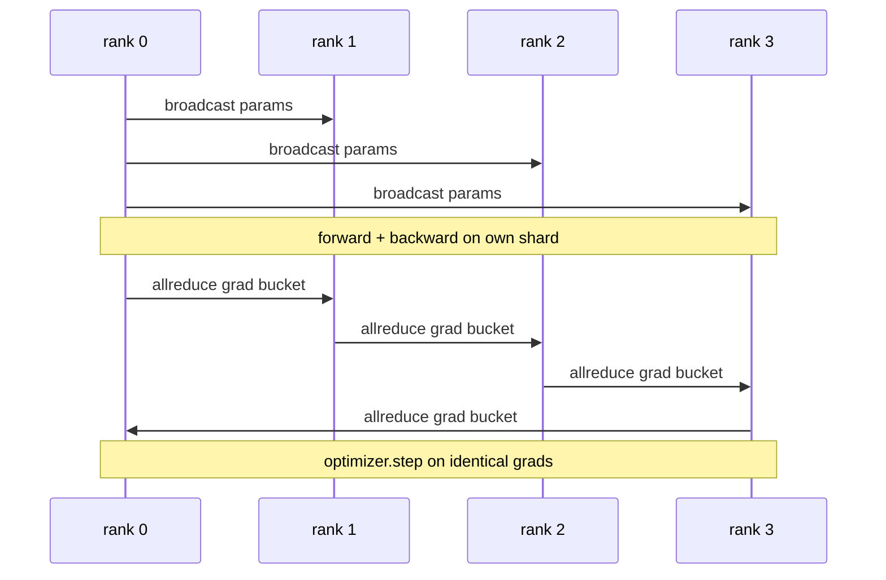

# DDP song song dữ liệu từ đầu

> DistributedDataParallel là một hook trên allreduce. Bọc một model, phát parameters ban đầu từ hạng 0 để mọi thứ hạng bắt đầu giống hệt nhau, cài đặt hook ngược trên mọi parameter đưa ra allreduce của gradient và rest là gradient descent. Toàn bộ mô hình là 200 dòng.

**Loại:** Xây dựng
**Ngôn ngữ:** Python
**Kiến thức tiên quyết:** Giai đoạn 19 Bài học theo dõi C 42-49
**Thời lượng:** ~90 phút

## Mục tiêu học tập

- Nối dây một lớp bọc hình `DistributedDataParallel` phát parameters ban đầu và tất cả giảm gradients sau khi lùi lại.
- Spawn N CPU xếp hạng với độ `torch.multiprocessing.spawn` trên phần phụ trợ u ám với điểm hẹn dựa trên tệp.
- Chứng minh tính đúng đắn gradient đồng bộ hóa bằng cách training cùng một model trên cùng một dữ liệu một cách tuần tự và hiển thị tính tương đương parameter mỗi bước.
- Bảo vệ việc sử dụng các nhóm (hợp nhất gradient) và chồng chéo (giao tiếp trong quá trình lùi) như hai thay đổi biến DDP đang hoạt động thành DDP production.

## Vấn đề

1 tỷ parameter model với 12 GB kích hoạt không phù hợp với một GPU tiêu dùng. Ngay cả khi nó vừa vặn, training mất hàng tuần. Song song dữ liệu chia batch thành N cấp bậc, mỗi cấp tính tiến và lùi trên mảnh của nó và ở mỗi bước, mỗi gradients của cấp bậc được tổng hợp để tất cả N bản sao vẫn giống hệt nhau. Tổng gradient là những gì trình tối ưu hóa bước vào.

Nếu không có đồng bộ hóa gradient, các bản sao N sẽ phân kỳ theo bước 2. model không phải là "một model được huấn luyện về nhiều dữ liệu hơn" nữa, nó là N models riêng biệt tình cờ chia sẻ trọng số ban đầu. Với gradient đồng bộ hóa được thực hiện kém (một allreduce mỗi parameter, không chồng chéo, không xô) mạng là nút cổ chai và GPUs nhàn rỗi chờ đợi dây. Kỹ thuật của DDP đang làm cho đồng bộ hóa gradient gần như tự do so với tính toán. Chuẩn PyTorch DDP đạt được điều đó bằng cách nhóm gradients, chồng allreduce với lớp tiếp theo ngược và sử dụng NCCL trên NVLink. Chúng ta có thể làm cả ba CPU với sự u ám và học được những bài học tương tự.

## Khái niệm



### Ba hoạt động DDP cần

| Sân khấu | Tập thể | Tại sao |
|-------|-----------|-----|
| Bắt đầu | Phát sóng từ hạng 0 | Mỗi cấp bậc bắt đầu với cùng một parameters |
| Sau khi lùi lại | allgiảm của mỗi sinh viên tốt nghiệp | gradient trung bình là những gì trình tối ưu hóa bước lên |
| Đôi khi | phát sóng bộ đệm | Batchnorm thống kê chạy luôn đồng bộ |

### Tại sao có nghĩa là và không phải tổng

Allreduce-SUM chia cho world_size cho gradient trung bình. Giá trị trung bình là bất biến với world_size: một learning rate được điều chỉnh ở một bậc hoạt động ở bốn bậc vì độ lớn gradient mỗi bước không thay đổi. Allreduce-SUM không có phép chia buộc bạn phải điều chỉnh lại learning rate mỗi khi bạn thay đổi kích thước cụm. DDP bao bọc SUM và chia; Làm tương tự trong bài học.

### Tại sao nên gradients xô

Một transformer có hàng nghìn parameter tensors. Một allreduce mỗi tensor trả sàn độ trễ gloo hàng nghìn lần. Các nhóm DDP gradients vào các vùng lưu trữ ~25 MB và phát hành một allreduce cho mỗi vùng lưu trữ. Tổng số byte giống nhau di chuyển trên dây nhưng độ trễ được khấu hao trên vùng lưu trữ. Đối với những model nhỏ của bài học, chúng tôi nhóm mọi thứ vào một xô; cấu trúc là những gì mang theo.

### Tại sao ghim hạt giống

Mọi cấp bậc phải gọi `torch.manual_seed(seed + rank)` để xáo trộn nhưng `torch.manual_seed(seed)` cho parameter bắt đầu. Một hạt giống được chia sẻ duy nhất có nghĩa là mọi cấp bậc đều thấy cùng một thứ tự batch (đánh bại dữ liệu song song); Hạt giống theo cấp bậc cụ thể cho các tham số có nghĩa là ban đầu parameters không đồng ý với float epsilon và đồng bộ hóa gradient không còn làm cho các bản sao giống hệt nhau. Thực hiện đúng mẫu hạt giống hoặc kiểm tra tương đương parameter không thành công ở bước 1.

## Tự xây dựng

`code/main.py` thực hiện:

- `MiniMLP`: MLP 3 lớp đủ nhỏ để hội tụ trong vài giây, đủ lớn để lộ hệ thống dây điện.
- `DistributedDataParallel(model, world_size)`: phát các tham số tại thời điểm xây dựng, trả về một trình bao bọc có `sync_grads` chia các grad tổng allReduce tích lũy cho world_size.
- `worker(rank, world_size, ...)`: vòng lặp training đầy đủ với `torch.distributed` bắt đầu trên gloo, tiến, lùi, đồng bộ hóa, bước.
- `_reference_single_process_loop(...)`: huấn luyện cùng một model trên cùng một dữ liệu tuần tự trên một cấp bậc, được sử dụng bởi bài kiểm tra tính tương đương parameter bằng byte sau mỗi bước.

Chạy nó:

```bash
python3 code/main.py
```

Đầu ra: bảng training mỗi bước so sánh tổng kiểm tra một process loss và parameter với DDP chạy trên 4 bậc. Hai đường dẫn tạo ra các đường cong loss giống hệt nhau để nổi epsilon, chứng tỏ đồng bộ hóa gradient là chính xác.

## Production mô hình trong tự nhiên

Ba mẫu làm cứng DDP đủ để ship.

**Tìm parameters không sử dụng.** Một số đường dẫn chuyển tiếp bỏ qua parameters có điều kiện (thoát sớm, bộ định tuyến kết hợp các chuyên gia). Những parameters bị bỏ qua không có gradient, nhưng hook sẵn sàng cho xô của DDP vẫn chờ đợi họ và bế tắc tất cả. `find_unused_parameters=True` yêu cầu DDP xem tham số nào được gradients trước khi giảm. Chi phí là một biểu đồ đi bộ cho mỗi bước, vì vậy hãy bỏ nó trừ khi chuyển tiếp của bạn branches.

**Tối ưu hóa biểu đồ tĩnh.** Khi chuyển tiếp ổn định qua các bước, `static_graph=True` cho phép DDP tính toán trước lịch trình vùng lưu trữ. Tối ưu hóa quan trọng trên quy mô lớn: tính toán trước tiết kiệm vài mili giây trên mỗi bước, kết hợp trên 10000 bước.

**Gradient tích lũy cần được chăm sóc.** Tích lũy gradients trên K microbatch mà không đồng bộ hóa từng microbatch là chiến thắng thông lượng gấp 10 lần. DDP hiển thị `no_sync()` như một trình quản lý ngữ cảnh tạm dừng allreduce sau lùi. Quên người quản lý và tất cả các bạn đều giảm K lần mà không có gì; thông lượng giảm xuống sàn.

## Ứng dụng

Production mẫu:

- **PyTorch DDP.** Việc triển khai chính tắc. `torch.nn.parallel.DistributedDataParallel(model)` dây xô, chồng lên nhau và ngữ cảnh no_sync.
- **HuggingFace Accelerate.** Thêm trình khởi chạy xử lý `torchrun` môi trường và model bọc. Cùng một DDP dưới mui xe.
- **Dữ liệu song song Megatron-LM.** Kết hợp DDP với tensor song song cho models lớn; mảnh song song dữ liệu là cùng một mô hình allreduce-after-backward.

## Sản phẩm bàn giao

Bài 78 (ZeRO sharding) thay thế allreduce mỗi parameter bằng reduce_scatter để mỗi thứ hạng chỉ lưu trữ phân đoạn của trạng thái tối ưu hóa. Bài 81 soạn DDP với ZeRO thành bản demo đầu cuối.

## Bài tập

1. Thêm gradient nhóm có kích thước có thể định cấu hình và đo lường tốc độ so với một lần giảm mỗi parameter trên model sâu hơn.
2. Triển khai `no_sync()` như một trình quản lý ngữ cảnh và xác minh gradient tích lũy khớp với đường cơ sở một process trên K vi mẻ.
3. Thêm chế độ `find_unused_parameters` trong đó chuyển tiếp đôi khi bỏ qua một trong các layer MLP; Nếu không có lá cờ, cuộc chạy sẽ bế tắc.
4. Thay thế gloo bằng đồng bộ hóa chỉ `torch.distributed.barrier()` để cảm nhận sự khác biệt giữa đồng bộ hóa dựa trên allreduce và dựa trên rào cản.
5. Đo chi phí đồng bộ hóa gradient dưới dạng một phần thời gian bước cho batch kích thước 1, 16, 256 và giải thích tỷ lệ.

## Thuật ngữ chính

| Thuật ngữ | Những gì mọi người nói | Ý nghĩa thực sự của nó |
|------|----------------|------------------------|
| DDP | "Dữ liệu song song" | Trình bao bọc phát các tham số và allgiảm điểm mỗi bước |
| Xô | "Cầu chì tốt nghiệp" | Nhóm N nhỏ tất cả giảm thành một nhóm lớn |
| Chồng chéo | "Ẩn liên lạc" | Issue allreduce trong khi các layer sau vẫn tính toán ngược |
| no_sync | "Tích lũy" | Bỏ qua allreduce sau lùi để tích lũy gradient |
| find_unused | "Phân nhánh về phía trước" | Phát hiện parameters không có grad trước khi giảm |

## Đọc thêm

- [PyTorch DistributedDataParallel docs](https://pytorch.org/docs/stable/generated/torch.nn.parallel.DistributedDataParallel.html)
- [PyTorch DDP internals tutorial](https://pytorch.org/tutorials/intermediate/ddp_tutorial.html)
- [Li et al, PyTorch Distributed: Experiences on Accelerating Data Parallel Training](https://arxiv.org/abs/2006.15704)
- Giai đoạn 19 Bài 76 - các tập thể DDP được xây dựng dựa trên
- Giai đoạn 19 Bài 78 - ZeRO sharding thay thế allreduce trên mỗi thông số bằng reduce_scatter
