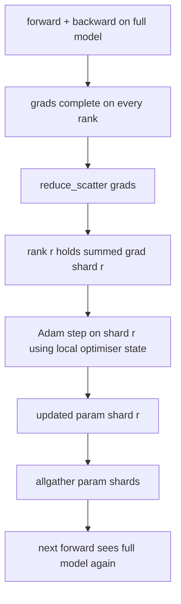

# ZeRO Optimizer Tiểu bang Sharding

> Adam lưu trữ hai ước tính thời điểm mỗi parameter, cả hai đều trong float32. 7B-parameter model mang trạng thái tối ưu hóa 56 GB. ZeRO giai đoạn 1 phân mảnh trên N hạng; Mỗi thứ hạng sở hữu 1/N của Optimizer. Sau bước cục bộ, các mảnh parameter cập nhật được phát lại, mọi cấp bậc sẽ tái tạo toàn bộ model và bước tiếp theo bắt đầu. Chiến thắng là một sự sụt giảm bộ nhớ tuyến tính trên phân bổ đơn lẻ lớn nhất trong training stack.

**Loại:** Xây dựng
**Ngôn ngữ:** Python
**Kiến thức tiên quyết:** Giai đoạn 19 Bài học theo dõi C 42-49
**Thời lượng:** ~90 phút

## Mục tiêu học tập

- Trạng thái tối ưu hóa phân đoạn (khoảnh khắc đầu tiên, khoảnh khắc thứ hai, bản sao chính fp32) trên N cấp bậc để mỗi cấp độ sở hữu 1/N.
- Sử dụng reduce_scatter để phân phối mỗi thứ hạng chỉ tổng gradient của phân đoạn của nó, sau đó allgather để phát lại các phân đoạn parameter đã cập nhật.
- Tính toán bảng tiết kiệm bộ nhớ cho giai đoạn 1, giai đoạn 2, giai đoạn 3 so với DDP vani.
- Bảo vệ sự lựa chọn giữa giai đoạn 1 so với giai đoạn 2 so với giai đoạn 3 dựa trên model kích thước và ngân sách băng thông.

## Vấn đề

Vanilla DDP sao chép mọi thứ: trạng thái parameters, gradients và tối ưu hóa có mặt đầy đủ trên mọi cấp bậc. Đối với 7B-parameter model trong fp16, điều đó có nghĩa là 14 GB parameters, 14 GB gradients và 28 GB trạng thái tối ưu hóa trên mỗi cấp bậc. Trạng thái tối ưu hóa là thuật ngữ lớn nhất và dễ phân mảnh nhất vì nó chỉ được chạm vào trong bước, không phải trong quá trình tiến hoặc lùi.

ZeRO giai đoạn 1 phân mảnh trạng thái tối ưu hóa. Mỗi cấp bậc nắm giữ 1/N khoảnh khắc Adam. Sau khi lùi lại, thay vì giảm toàn bộ gradient và bước cục bộ, ZeRO reduce_scatters để mỗi thứ hạng chỉ nhận được tổng gradient của mảnh vỡ của nó. Xếp hạng áp dụng bước tối ưu hóa cho mảnh của parameters chính. Các mảnh parameter được cập nhật sau đó tập hợp lại để mọi cấp bậc đều có đầy đủ model cho tiền đạo tiếp theo. Bộ nhớ tối ưu hóa giảm N. Lưu lượng truy cập trên mỗi bước giống như DDP: một reduce_scatter cộng với một allgather bằng một allgiảm băng thông. Bộ nhớ chiến thắng, thông lượng được giữ lại.

## Khái niệm



### Các giai đoạn của ZeRO

| Sân khấu | Phân mảnh là gì | Bộ nhớ trên mỗi cấp bậc | Giao tiếp mỗi bước |
|-------|----------------|------------------|---------------|
| DDP | Không có gì | Tham số + Grads + Optim | 1x giảm tất cả |
| ZeRO-1 · | trạng thái tối ưu hóa | tham số + tốt nghiệp + optim/N | 1x reduce_scatter + 1x tất cả |
| ZeRO-2 · | Optim + Sinh viên tốt nghiệp | tham số + grads/N + optim/N | 1x reduce_scatter + 1x tất cả |
| ZeRO-3 · | Optim + Grads + Tham số | params/N + grads/N + optim/N | 1x allgather mỗi lớp + 1x reduce_scatter mỗi lớp |

Giai đoạn 1 là chiến thắng rẻ nhất vì trạng thái tối ưu hóa chi phối ngân sách. Giai đoạn 2 cần logic tích lũy gradient phân đoạn nhưng băng thông là như nhau. Giai đoạn 3 (FSDP) trả tiền cho mỗi lớp giao tiếp cho mỗi lần tiến và lùi, giảm bộ nhớ parameter phân đoạn. Bài học thực hiện đầy đủ giai đoạn 1.

### Toán học trí nhớ, số thực

Đối với model có P parameters được huấn luyện với Adam trong mixed precision:

| Thuật ngữ | Vani | ZeRO-1 · | Tại sao |
|------|---------|--------|-----|
| Tham số FP16 | 2P byte | 2P byte | cần thiết cho chuyển tiếp |
| Tốt nghiệp FP16 | 2P byte | 2P byte | cần thiết cho lùi |
| Bản sao chính FP32 | 4P byte | 4P/N byte | Chỉ có Optim mới sử dụng nó |
| FP32 Khoảnh khắc đầu tiên | 4P byte | 4P/N byte | Chỉ có Optim mới sử dụng nó |
| FP32 Khoảnh khắc thứ hai | 4P byte | 4P/N byte | Chỉ có Optim mới sử dụng nó |
| Tổng cộng | 16P byte | 4P + 12P/N byte ||

Ở N = 8: vani 16P, ZeRO-1 5.5P, giảm 65%. Ở N = 64: vani 16P, ZeRO-1 4.19P, giảm 74%.

### Tại sao reduce_scatter đánh bại allreduce-then-shard

Allreduce cung cấp cho mọi thứ hạng tổng gradient. Nếu bạn chỉ cần mảnh r, (N-1)/N của gradient bị giảm sẽ bị lãng phí ở hạng r. Reduce_scatter cung cấp chính xác mảnh vỡ mà mỗi cấp bậc sở hữu; Các byte trên mỗi thứ hạng giống như allReduce (vì allReduce là reduce_scatter + allgather) nhưng nửa sau được thay thế bằng parameter-shard allgather sau đó. Dây lưới giống với DDP, bộ nhớ được phân chia.

## Tự xây dựng

`code/main.py` thực hiện:

- `flatten_params(module)` và `unflatten_into(module, flat)` đó đóng gói parameters của một model vào một tensor liền kề và mở gói trở lại. Bố cục phẳng là điều làm cho sharding theo thứ hạng trở thành một lát cắt đơn giản.
- `ZeroOptimizer(model, world_size, rank, lr)` sở hữu mảnh của cấp bậc của bản sao chính và Adam khoảnh khắc.
- `step()` chạy reduce_scatter trên gradient phẳng, áp dụng Adam cho mảnh vỡ của thứ hạng và thu thập tất cả các parameters cập nhật trở lại.
- Bản demo huấn luyện MLP 3 lớp cho 20 bước và in ngân sách bộ nhớ cho mỗi bước cùng với đường cơ sở DDP vani.

Chạy nó:

```bash
python3 code/main.py
```

Đầu ra: loss mỗi bước và bảng bộ nhớ hiển thị ZeRO-1 giữ 1/N trạng thái tối ưu hóa trên mỗi thứ hạng so với bản sao đầy đủ của DDP.

## Production mô hình trong tự nhiên

Ba mẫu làm cứng ZeRO đủ để ship.

**Điểm kiểm tra phân mảnh rất quan trọng.** Trạng thái tối ưu hóa của ZeRO-1 được chia thành các cấp bậc; checkpoint phải ghi lại thứ hạng nào sở hữu cái gì. Bài 80 xây dựng tệp kê khai checkpoint đã phân mảnh tiếp tục chạy ZeRO trên cùng kích thước thế giới. Nếu không có nó, trạng thái đã lưu sẽ không thể đọc được khi khởi động lại.

**Mixed precision là vấn đề. **ZeRO là một kỹ thuật hỗn hợp precision; Bản sao chính FP32 là những gì được phân đoạn. Chạy ZeRO mà không cần mixed precision sẽ trả thuế bộ nhớ trên fp32 master mà không có chiến thắng chuyển tiếp fp16 tương ứng. Production lần chạy luôn ghép nối ZeRO với trọng lượng tự động hoặc bf16.

**Giai đoạn 1 là một chiến thắng gần như miễn phí.** Giao tiếp giống hệt với DDP theo băng thông. Tiết kiệm bộ nhớ là tuyến tính trong N. Chi phí duy nhất là sổ sách kế toán cho phân đoạn tối ưu hóa. Production stacks mặc định ở giai đoạn 1 trừ khi bộ nhớ phân đoạn parameter cũng là một vấn đề; Sau đó, giai đoạn 2 hoặc 3 trao đổi giao tiếp để lấy bộ nhớ.

## Ứng dụng

Production mẫu:

- **DeepSpeed ZeRO.** Triển khai tham chiếu. `deepspeed_config.json` chọn kích thước 1/2/3 giai đoạn và phân vùng.
- **PyTorch FSDP.** Tương đương PyTorch bản địa. `ShardingStrategy.SHARD_GRAD_OP` là ZeRO-2; `FULL_SHARD` là ZeRO-3.
- **HuggingFace Accelerate.** Bao bọc cả DeepSpeed và FSDP dưới một config đồng nhất.

## Sản phẩm bàn giao

Bài 79 (pipeline song song) là trục sharding trực giao: thay vì sharding trạng thái tối ưu hóa trên cùng một model, pipeline phân đoạn các lớp trên các cấp bậc. Bài 81 soạn DDP + ZeRO trên bản demo đầu cuối.

## Bài tập

1. Mở rộng đến ZeRO-2 theo sharding gradients: mỗi cấp chỉ lưu trữ gradient cho mảnh vỡ của nó, đạt được bằng cách loại bỏ phần không phải mảnh sau khi lùi.
2. Thêm trình phân tích bộ nhớ in mức sử dụng fp32 byte thực tế ở hạng 0 so với dự đoán công thức.
3. Đo thời gian đồng hồ treo tường trên mỗi bước của DDP vani so với ZeRO-1 và phân hủy thành tiến, lùi, giao tiếp.
4. Thực hiện cắt gradient theo ZeRO-1: định mức L2 phải được tính toán trên tất cả các phân đoạn thông qua allreduce bình phương định mức cục bộ.
5. Triển khai "ZeRO ngây thơ" với allreduce thay vì reduce_scatter, đo chênh lệch thời gian dây. Bảo vệ sự lựa chọn reduce_scatter bằng những con số.

## Thuật ngữ chính

| Thuật ngữ | Những gì mọi người nói | Ý nghĩa thực sự của nó |
|------|----------------|------------------------|
| ZeRO-1 · | "Phân mảnh công cụ tối ưu hóa" | Mỗi thứ hạng chứa 1/N bậc thầy fp32 + Adam khoảnh khắc |
| ZeRO-2 · | "Sinh viên tốt nghiệp mảnh vỡ" | Mỗi cấp bậc cũng rơi ra gradients không phải mảnh sau reduce_scatter |
| ZeRO-3 · | "Tham số mảnh" | Mỗi cấp bậc giữ 1/N tham số fp16; allgather trên mỗi layer trong forward |
| Bản chính | "Trọng lượng FP32" | Bản sao chép precision parameter cao các bản cập nhật trình tối ưu hóa |
| Reduce_scatter | "Chia tổng" | Cung cấp mỗi thứ hạng chỉ có gradient tổng hợp của mảnh vỡ của nó |

## Đọc thêm

- [Rajbhandari et al, ZeRO: Memory Optimizations Toward Training Trillion Parameter Models](https://arxiv.org/abs/1910.02054)
- [DeepSpeed ZeRO documentation](https://www.deepspeed.ai/tutorials/zero/)
- [PyTorch FSDP documentation](https://pytorch.org/docs/stable/fsdp.html)
- Giai đoạn 19 Bài 76 - reduce_scatter và tất cả bài học này đứng trên
- Giai đoạn 19 Bài 80 - điểm kiểm tra phân mảnh mà trạng thái ZeRO phải sử dụng
