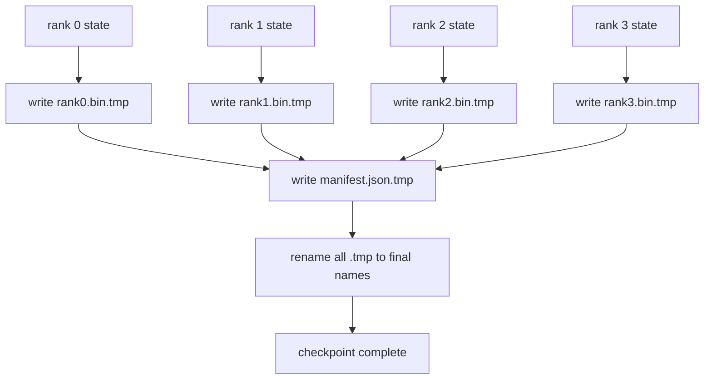

# Sharded Checkpoint và Atomic Resume

> Công việc 70B-parameter training bị tạm dừng do nút bị lỗi vài giờ một lần. Định dạng checkpoint quyết định xem bạn mất 30 phút hay 30 giờ. Một checkpoint được phân mảnh viết song song các phân đoạn của mọi cấp bậc và ghi lại quyền sở hữu trong một bản kê khai. Resume tải phân đoạn của mỗi thứ hạng từ tệp riêng của nó, xây dựng lại trạng thái trên cùng kích thước thế giới và các bước tối ưu hóa như thể không có gì xảy ra. Viết nguyên tử giữ cho một checkpoint đã hoàn thành một nửa không đầu độc sơ yếu lý lịch tiếp theo.

**Loại:** Xây dựng
**Ngôn ngữ:** Python
**Kiến thức tiên quyết:** Giai đoạn 19 Bài học theo dõi C 42-49
**Thời lượng:** ~90 phút

## Mục tiêu học tập

- Lưu một checkpoint nhiều cấp dưới dạng tệp phân đoạn theo thứ hạng cộng với một tệp kê khai ghi lại thứ hạng nào sở hữu cái gì.
- Sử dụng mẫu ghi nguyên tử (ghi vào đường dẫn tạm thời sau đó đổi tên) để sự cố giữa ghi không bao giờ tạo ra checkpoint hoàn thành một nửa.
- Tiếp tục từ tệp kê khai, xác minh trạng thái bằng byte cho cả parameters fp16 và trạng thái tối ưu hóa ZeRO trên mọi cấp bậc.
- Bảo vệ schema kê khai chống lại ba chế độ lỗi: thay đổi kích thước thế giới, số phân đoạn không khớp và ghi một phần.

## Vấn đề

Một checkpoint vani đọc tất cả trạng thái parameters và tối ưu hóa vào thứ hạng 0, thu thập và ghi một tệp duy nhất. Đối với model 70B, đó là 1.1 TB trạng thái thông qua cổng mạng của một cấp bậc. Viết chặn mọi cấp bậc khác vì họ nhàn rỗi chờ đợi tập hợp. Băng thông IO là liên kết mạng của một GPU chậm nhất, không phải tổng hợp. Trên một cụm thực tế, bước thu thập sau đó ghi có thể mất nhiều thời gian hơn training giờ trước đó, có nghĩa là công việc ships ít hơn một checkpoint mỗi ngày training.

Sharded checkpoints lật mẫu: mỗi rank viết song song shard của riêng mình vào tệp của riêng mình. Các bản ghi hiển nhiên mà xếp hạng sở hữu phân đoạn nào để tiếp tục có thể đặt mỗi phân đoạn trở lại nơi nó xuất phát. Băng thông ghi tổng hợp thay đổi quy mô theo cụm. Một checkpoint 1 TB mất 4 giờ qua một xếp hạng mất 4 phút qua 64 cấp bậc. Thêm vào đó, tệp kê khai cung cấp cho bạn một hợp đồng cho các sơ yếu lý lịch không tương thích: có thể phát hiện thay đổi kích thước thế giới, có thể phát hiện ghi một phần và đường dẫn tải có thể bị lỗi lớn thay vì âm thầm sử dụng dữ liệu cũ.

## Khái niệm



### Biểu hiện schema

```json
{
  "world_size": 4,
  "step": 1234,
  "wall_clock_seconds": 4521,
  "shards": [
    {"rank": 0, "path": "rank0.bin", "sha256": "...", "param_shard_offset": 0, "param_shard_numel": 65536},
    {"rank": 1, "path": "rank1.bin", "sha256": "...", "param_shard_offset": 65536, "param_shard_numel": 65536}
  ],
  "schema_version": 1
}
```

Ba lĩnh vực chịu tải. `world_size` làm cho một sơ yếu lý lịch ở một kích thước khác lớn tiếng thất bại thay vì âm thầm tham nhũng. `sha256` mỗi phân đoạn bắt được các bài ghi một phần hoặc bị hỏng. `param_shard_offset` và `param_shard_numel` trên mỗi mảnh để máy nạp tái tạo parameter tensor phẳng ở đúng vị trí.

### Ghi nguyên tử

Mẫu tiêu chuẩn: viết mọi phân đoạn vào `<name>.tmp`, viết tệp kê khai vào `manifest.json.tmp`, đồng bộ hóa từng phân đoạn, sau đó đổi tên. POSIX đổi tên trong cùng một hệ thống tệp là nguyên tử; hoặc tệp mới có đầy đủ hoặc tệp cũ có. Một sự cố trước khi đổi tên cuối cùng để lại checkpoint trước đó là sự cố đang hoạt động. Nếu không ghi nguyên tử, sự cố có thể để lại một phần phân đoạn với tệp kê khai hiện tại trỏ vào nó và tải làm hỏng trạng thái tối ưu hóa trên tiếp tục.

### Ba chế độ hỏng hóc mà schema phải bảo vệ

| Thất bại | Triệu chứng | Phòng thủ |
|---------|---------|---------|
| Thay đổi quy mô thế giới | tiếp tục trên N = 8 với tệp kê khai từ N = 4 | world_size không phù hợp trong bản kê khai, thất bại lớn tiếng |
| Số lượng phân đoạn không khớp | sơ yếu lý lịch thấy ít tệp xếp hạng*.bin hơn so với các phân đoạn trong tệp kê khai | liệt kê các phân đoạn, xác minh mọi phân đoạn tồn tại |
| Ghi một phần | Tệp phân đoạn bị cắt bớt giữa xả | Xác minh SHA256 khi tải |

Mỗi phòng thủ từ chối tải trọng xấu sớm; giải pháp thay thế là tham nhũng thầm lặng xuất hiện 100 bước sau khi loss đến NaN.

### Tại sao lại là các tệp theo cấp bậc, không phải một tệp lớn

Ghi đồng thời vào một tệp thông qua `O_APPEND` hoạt động trên POSIX để ghi theo byte, nhưng trên thực tế, độ lệch trong một phân đoạn span các vùng có kích thước MB và khóa chiếm ưu thế. Các tệp theo thứ hạng không có tranh chấp và được hưởng lợi từ việc phân dải khi hệ thống tệp cơ bản song song (Lustre, GPFS). Production stacks (DeepSpeed, FSDP, NeMo) đều sử dụng các tệp theo cấp bậc vì lý do đó.

## Tự xây dựng

`code/main.py` thực hiện:

- `ShardManifest` lớp dữ liệu với các schema ở trên cộng với `to_json`/`from_json`.
- `save_sharded(state_dict_per_rank, dir, step)` ghi trạng thái nhị phân của mọi thứ hạng vào tệp riêng của nó bằng cách sử dụng mẫu atomic temp-then-rename, sau đó viết tệp kê khai.
- `load_sharded(dir, expected_world_size)` đọc bản kê khai, xác minh SHA256 của từng phân đoạn và trả về các chỉ số trạng thái trên mỗi cấp bậc.
- Kiểm tra khứ hồi: xây dựng trạng thái trên mỗi thứ hạng, lưu, tải, xác nhận byte bằng nhau.

Chạy nó:

```bash
python3 code/main.py
```

Đầu ra: 4 tệp phân đoạn cộng với tệp kê khai được ghi, sau đó tải lại với xác minh bằng byte.

## Production mô hình trong tự nhiên

Ba mẫu làm cứng checkpoint đủ để ship.

**Ghi không đồng bộ.** Production stacks đưa ra checkpoint ghi trên một thread hoặc process riêng biệt để training tiếp tục. Rào cản ở checkpoint tiếp theo: không bắt đầu lưu tiếp theo cho đến khi lưu trước đó hoàn tất. Cờ `async_io` của DeepSpeed thực hiện chính xác điều này. Bài học giữ cho việc ghi đồng bộ để các bước hiển thị.

**Đĩa nhanh cục bộ trước, sau đó tải lên không đồng bộ.** Ghi vào NVMe cục bộ (nhanh) sau đó tải lên S3 hoặc GCS. Mẫu hai tầng giữ cho checkpoint trong cụm nhanh chóng để tiếp tục trong khi shipping một bản sao ngoài cụm bền bỉ để lưu trữ. Bản kê khai mang con đường địa phương; Tệp kê khai tải lên mang đường dẫn từ xa.

**Xoay vòng rất quan trọng.** Production lần chạy giữ K checkpoints cuối cùng (thường là 3-5) và xoay K cũ nhất. Nếu không xoay, đĩa sẽ lấp đầy giữa chừng và checkpoint tiếp theo không thành công. Với xoay, bản lưu tiếp theo sẽ xóa bản lưu cũ nhất trước, giải phóng ngân sách.

## Ứng dụng

Production mẫu:

- **Điểm kiểm tra DeepSpeed.** `deepspeed.save_checkpoint(tag=step)` ghi các tệp theo cấp bậc và tệp `latest` trỏ đến thẻ đang hoạt động.
- **PyTorch điểm kiểm tra FSDP.** `torch.distributed.checkpoint` lưu trạng thái phân mảnh với một `Planner` quyết định bố cục trên mỗi cấp bậc.
- **NeMo.** Bao bọc DeepSpeed và FSDP với một `save_to_checkpoint` API thống nhất bổ sung siêu dữ liệu.

## Sản phẩm bàn giao

Bài 81 lưu một checkpoint phân mảnh của quá trình chạy DDP + ZeRO từ đầu đến cuối và tải lại nó trên cùng một kích thước thế giới để chứng minh hợp đồng tiếp tục được giữ nguyên.

## Bài tập

1. Thêm ghi không đồng bộ: bắt đầu lưu trong một thread và để training tiếp tục. Chặn lần lưu tiếp theo cho đến khi bản lưu trước đó hoàn tất.
2. Thêm vòng quay `last_5_steps`: giữ lại 5 checkpoints gần đây nhất, xóa  cũ nhất trước khi lưu mới.
3. Thêm đường dẫn xác minh nhanh chỉ CRC để tải lại vòng lặp bên trong (xoay cuộn một checkpoint trở thành đường dẫn hoạt động mới mà không có đầy đủ sha256).
4. Thêm tải kích thước xuyên thế giới: cân bằng lại phân đoạn từ N=4 đến N=8 bằng cách đọc tệp kê khai, nối và sharding lại.
5. Thêm tải lên S3 giả mạo (thư mục thứ hai) và viết tệp kê khai tải lên. Bảo vệ policy lưu trữ hai tầng.

## Thuật ngữ chính

| Thuật ngữ | Những gì mọi người nói | Ý nghĩa thực sự của nó |
|------|----------------|------------------------|
| checkpoint phân mảnh | "Lưu theo cấp bậc" | Mỗi cấp bậc viết song song tệp phân đoạn của riêng mình |
| Bản kê khai | "Mục lục" | JSON file ghi đường dẫn phân đoạn, bù đắp và SHA256 |
| Ghi nguyên tử | "TMP sau đó đổi tên" | Ghi vào .tmp sau đó đổi tên POSIX để một sự cố khiến tệp trước đó hoạt động |
| Ghi một phần | "Mảnh vỡ bị cắt bớt" | Sự cố trong quá trình ghi tạo ra một phân đoạn bị hỏng; SHA256 bắt được nó |
| Xoay | "Giữ K cuối cùng" | Xóa checkpoint cũ nhất trước khi ghi mới vào việc sử dụng đĩa liên kết |

## Đọc thêm

- [DeepSpeed checkpointing](https://www.deepspeed.ai/tutorials/checkpointing/)
- [PyTorch torch.distributed.checkpoint](https://pytorch.org/docs/stable/distributed.checkpoint.html)
- [POSIX rename atomicity](https://pubs.opengroup.org/onlinepubs/9699919799/functions/rename.html)
- Giai đoạn 19 Bài 78 - ZeRO tuyên bố checkpoint này được định hình để tiết kiệm
- Giai đoạn 19 Bài 81 - bản demo từ đầu đến cuối khứ hồi trạng thái đã lưu
