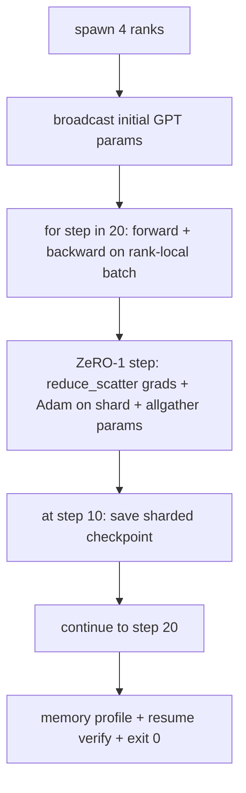

# Training phân tán từ đầu đến cuối

> Các bài học từ 76 đến 80 mỗi bài được xây dựng một mảnh. Đây là lắp ráp: một GPT nhỏ được huấn luyện trên 4 cấp bậc mô phỏng với DDP để đồng bộ hóa gradient, ZeRO-1 cho sharding trạng thái tối ưu hóa và một checkpoint phân mảnh ở nửa chừng. Bản demo chạy 20 bước, tự kết thúc, in đường cong loss cộng với hồ sơ bộ nhớ và ghi checkpoint có thể tiếp tục.

**Loại:** Xây dựng
**Ngôn ngữ:** Python
**Kiến thức tiên quyết:** Giai đoạn 19 Bài học theo dõi C 42-49
**Thời lượng:** ~90 phút

## Mục tiêu học tập

- Soạn DDP (bài 77) cộng với ZeRO-1 (bài 78) cộng với checkpoints phân mảnh (bài 80) thành một vòng lặp training.
- Huấn luyện một model ngôn ngữ transformer 2 lớp trên một kho dữ liệu tổng hợp nhỏ trong 20 bước trên 4 cấp bậc mô phỏng.
- In bảng loss mỗi bước, hồ sơ bộ nhớ theo thứ hạng và tệp kê khai checkpoint tiếp tục bằng byte trên cùng kích thước thế giới.
- Bảo vệ bố cục: mỗi tác phẩm có thể kiểm tra độc lập trong các bài học trước đó và bài học này chứng minh họ sáng tác.

## Vấn đề

Capstone là bằng chứng cho thấy các mảnh ghép khớp với nhau. Bài 76 thực hiện tập thể. Bài 77 gói chúng thành DDP. Bài 78 phân mảnh trạng thái tối ưu hóa bằng reduce_scatter. Bài 79 đã phân tích pipeline. Bài 80 đã cứu một checkpoint bị phân đoạn. Mỗi bài học đứng một mình với bài kiểm tra riêng của nó. Một cuộc chạy training thực sự sử dụng mọi primitive cùng một lúc; Nếu thành phần sai, loss phân kỳ, checkpoint từ chối tiếp tục hoặc bộ nhớ mỗi cấp tăng lên khi nó nên thu hẹp.

Bài học này chạy bản demo từ đầu đến cuối và xác minh bốn bất biến: (a) loss giảm đơn điệu qua 20 bước trong nhiễu nổi, (b) mọi thứ hạng giữ cùng một định mức parameter ở mọi bước, (c) bộ nhớ tối ưu hóa trên mỗi thứ hạng bằng công thức ZeRO-1 12P/N byte và (d) checkpoint ở bước 10 tải lại bằng byte khi khởi động lại. Bản demo tự kết thúc: 20 bước, lệnh đơn, thoát 0.

## Khái niệm



### Máy GPT mini

Các model có mục đích nhỏ: 2 khối transformer, nhúng mờ 32, 4 đầu attention, từ vựng 64, độ dài trình tự 16 batch 4. Vài nghìn parameters. Đủ lớn để thực hiện mọi quyết định đi dây (multi-head attention chạy đường dẫn mặt nạ tiêu chuẩn; LayerNorm có trọng số để đồng bộ hóa; đầu LM là một phép chiếu tuyến tính riêng biệt trở lại từ vựng). Đủ nhỏ để 20 bước trên 4 CPU xếp hạng kết thúc trong vài giây.

### Quy tắc thành phần

| Bài học | Những gì nó sở hữu | Những gì nó để lại cho vòng lặp |
|--------------|--------------|----------------------------|
| Phát sóng DDP | Đồng bộ hóa parameter ban đầu | Một cuộc gọi tại thời điểm xây dựng |
| Bước ZeRO-1 | Gradient đồng bộ hóa, cập nhật bản sao chính parameter phát sóng | Một lệnh gọi cho mỗi bước thay thế optimiser.step |
| checkpoint phân mảnh | Duy trì trạng thái trên mỗi cấp bậc, biểu hiện bằng sha256 | Được gọi ở hạng 0 với trạng thái được thu thập thông qua allgather |
| Training vòng lặp | Tiến, lùi loss ghi nhật ký | Gọi ba điều trên theo thứ tự |

Vòng lặp không biết về các tệp reduce_scatter hoặc điểm hẹn. Các mô-đun ZeRO và checkpoint hiển thị các giao diện hẹp mà vòng lặp tạo ra.

### Tại sao lại là một GPT nhỏ chứ không chỉ là MLP

MLP từ bài 77 là đủ để xác minh gradient đồng bộ hóa. Một GPT nhỏ bổ sung ba điều: một đầu LM riêng biệt trên từ vựng (trong bài học này, không bị ràng buộc để rõ ràng; full GPT thường ràng buộc đầu với token embedding), softmax+cross-entropy là loss (nhiều trường hợp cạnh số hơn MSE) và một chuyển tiếp không đối xứng (embeddings sau đó attention MLP mỗi lớp). Gắn bó với MLP cho capstone sẽ che giấu liệu bố cục có xử lý chính xác LayerNorm hay hình grad của layer embedding hay không.

### Tự kết thúc có nghĩa là thoát 0

Vòng lặp chạy cố định 20 bước và thoát ra. Không `while True`, không có sự can thiệp của con người, không có sơ yếu lý lịch từ trạng thái bên ngoài. Một capstone mà bạn có thể để chạy mà không cần giám sát và tìm thấy một nhật ký hoàn chỉnh khi nó kết thúc là một capstone chứng minh hệ thống được nối dây chính xác. Nếu bất kỳ phần nào bị bế tắc, bản demo sẽ không bao giờ quay trở lại và giàn thử nghiệm sẽ bắt được nó.

## Tự xây dựng

`code/main.py` thực hiện:

- `MiniGPT`: transformer 2 lớp với self-attention mặt nạ và đầu LM riêng biệt.
- `make_corpus(seed, total_tokens)`: dữ liệu dự đoán token tiếp theo xác định.
- `_train_worker`: sinh ra trên mỗi cấp bậc; phát sóng các tham số init, chạy vòng lặp, gọi bước ZeRO, viết checkpoint đã phân mảnh ở bước 10.
- `verify_resume`: Sau khi chạy chính, tải lại bước 10 checkpoint trong process và xác nhận các phân đoạn chính đã lưu khớp với bản kết xuất nhanh trong bộ nhớ từng byte.
- `main`: điều phối toàn bộ bản demo, in bảng loss, hồ sơ bộ nhớ và kết quả xác minh.

Chạy nó:

```bash
python3 code/main.py
```

Đầu ra: bảng loss 20 hàng, hồ sơ bộ nhớ mỗi xếp hạng 4 hàng, tệp kê khai checkpoint và dòng "TIẾP TỤC XÁC MINH" khi thành công.

## Production mô hình trong tự nhiên

Ba mẫu hoàn thành bố cục cho các lần chạy thực sự.

**Checkpoint cứ sau K phút, không phải K bước mỗi bước.** Thời gian bước thay đổi theo độ dài seq và số lượng vi mẻ. Nhịp checkpoint 10 phút bắt cùng một điện toán bất kể kích thước model. Bài học sử dụng dựa trên từng bước để đơn giản; production sử dụng dựa trên đồng hồ treo tường.

**Phát hiện sớm sự phân kỳ.** Production lần chạy thêm một bộ phận bảo vệ NaN sau khi lùi và một máy dò loss-gai; Nếu loss nhảy hơn 2 lần trong một bước, hãy quay trở lại checkpoint trước đó thay vì để trình tối ưu hóa chuyển sang trạng thái thoái hóa. Đường cong loss của bài học mượt mà nên bảo vệ không được sử dụng nhưng hook vẫn còn.

**Tổng hợp hồ sơ bộ nhớ giữa các cấp bậc.** Bộ nhớ mỗi thứ hạng khác nhau theo thứ hạng trong các lần chạy thực tế (thứ hạng có giai đoạn pipeline lớn nhất có nhiều kích hoạt hơn). Production ghi lại mức tối đa trên các cấp bậc cộng với giá trị trung bình; Bài học in theo thứ hạng để hiển thị các kết quả trùng khớp với công thức.

## Ứng dụng

Production mẫu:

- **DeepSpeed.** Kết hợp DDP + ZeRO + pipeline + điểm kiểm tra kích hoạt trong một config. Thành phần của bài học là hình dạng DeepSpeed thu nhỏ.
- **PyTorch FSDP.** Tương đương bản địa. `FullyShardedDataParallel` với `ShardingStrategy.SHARD_GRAD_OP` là ZeRO-2.
- **NeMo và Megatron-LM.** Thêm tensor song song cho models lớn nhất; nếu không, thành phần có cùng hình dạng.

## Sản phẩm bàn giao

Toàn bộ bài hát kết thúc tại đây. 6 bài học cùng nhau là hệ thống con training phân tán mà một nhóm thực sự sẽ xây dựng trước khi áp dụng DeepSpeed; Sự trừu tượng hóa đã được chứng minh chống lại Gloo và các chế độ thất bại đã được thực hiện. Giai đoạn 17 (cơ sở hạ tầng và production) là nơi để đưa điều này đến một cụm thực sự.

## Bài tập

1. Thêm phần chia tensor song song của đầu attention và xác minh loss khớp với đường cơ sở một hạng. Hai cấp bậc: một nửa số đầu mỗi cấp bậc, tất cả giảm đầu ra attention.
2. Thêm gradient tích lũy trên 4 vi mẻ và chứng minh gradient bằng gradient của một batch lớn.
3. Thêm một đường dẫn tiếp tục từ bước 10 thực sự tiếp tục training đến bước 20 và tạo ra loss cuối cùng giống như lần chạy ban đầu.
4. Thêm số liệu xuất (loss, định mức tốt nghiệp, thời gian bước) vào JSONL để có thể trực quan hóa quá trình chạy sau khi thực tế.
5. Thêm một bộ phận bảo vệ NaN quay trở lại checkpoint trước đó khi tăng đột biến loss và buộc tăng đột biến với hệ số LR một bước để thực hiện rollback.

## Thuật ngữ chính

| Thuật ngữ | Những gì mọi người nói | Ý nghĩa thực sự của nó |
|------|----------------|------------------------|
| Đầu cuối | "Nối dây tất cả" | Một lần chạy tạo thành từng mảnh, không phải một đơn vị kiểm tra cho mỗi mảnh |
| Cấu hình bộ nhớ | "GB mỗi hạng" | Byte được giữ trên mỗi thứ hạng cho các tham số, grads, trạng thái tối ưu hóa |
| Tiếp tục hợp đồng | "Lưu và tải" | Trạng thái mỗi thứ hạng byte bằng nhau sau một chuyến đi khứ hồi checkpoint |
| Tự chấm dứt | "Chạy có giới hạn" | Số bước cố định, thoát 0 khi hoàn thành, không có người trong vòng lặp |

## Đọc thêm

- [DeepSpeed end-to-end training tutorial](https://www.deepspeed.ai/getting-started/)
- [PyTorch FSDP advanced tutorial](https://pytorch.org/tutorials/intermediate/FSDP_advanced_tutorial.html)
- [Megatron-LM training script reference](https://github.com/NVIDIA/Megatron-LM)
- Giai đoạn 19 Bài học 76-80 - mỗi phần bài học này soạn thảo
- Giai đoạn 17 - di chuyển bố cục đến một cụm thực
