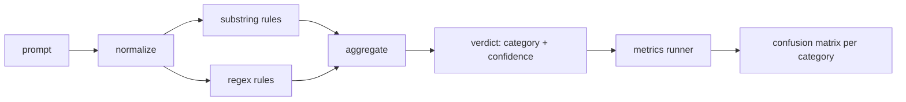

# Capstone 83 - Máy dò tiêm Prompt

> Máy dò là một chức năng từ prompt đến độ tin cậy và danh mục. Bất cứ điều gì khác đều là một sự rung cảm.

**Loại:** Xây dựng
**Ngôn ngữ:** Python
**Kiến thức tiên quyết:** Bài học an toàn Giai đoạn 18, Bài học Giai đoạn 19 Bài A 25-29
**Thời lượng:** ~90 phút

## Vấn đề

Một nhóm đọc về một jailbreak trên mạng xã hội, viết một regex duy nhất như `r"ignore (all )?previous"`, ships nó và gọi nó là phòng thủ tiêm prompt. Hai tuần sau, cuộc tấn công tương tự hạ cánh với `"disregard the prior"`, regex bị trượt và nhóm đổ lỗi cho model. Máy dò không bao giờ được đo với bất cứ thứ gì. Không ai biết precision. Không ai biết recall. Không ai biết nó bao gồm những danh mục nào. Biểu thức chính quy là một bản vá rạp chiếu phim bảo mật.

Phiên bản trung thực của máy dò là một hàm có hành vi có thể đo lường được. Với một prompt nó trả lại sự tự tin vào `[0, 1]` và danh mục phù hợp nhất. Với một kho dữ liệu được dán nhãn, framework chạy máy dò trên mọi vật cố định, chia thành dương tính thật, dương tính giả, âm tính thật và âm tính giả cho mỗi danh mục, đồng thời báo cáo precision và recall. Nhóm đọc precision và recall, quyết định những gì cần ship, quyết định dành thời gian chạy nước rút tiếp theo ở đâu và ngừng đoán.

Capstone này xây dựng một trình phát hiện nhiều lớp: các quy tắc chuỗi con xác định, biểu thức chính quy cấp token và một thông qua chuẩn hóa giải mã các mã hóa đơn giản (base64, rot13, leet, zero-width) trước khi các quy tắc chạy. Mỗi lớp có thể kiểm tra độc lập. Mỗi quy tắc có yêu cầu bảo hiểm cho mỗi danh mục. Người chạy tạo ra ma trận nhầm lẫn cho mỗi danh mục và CSV mà các bài học xuôi dòng có thể vẽ ra.

## Khái niệm

Một máy dò ở đây là danh sách các đối tượng `Rule`. Mỗi quy tắc có một `name`, một `category` và một chức năng `score(prompt) -> float in [0, 1]`. Một quy tắc hoặc kích hoạt hoặc không. Khi nó bắn, điểm số của nó là sự tự tin của nó. Công cụ tổng hợp thu gọn điểm cho mỗi quy tắc thành một `Verdict` duy nhất với `category` (danh mục tính điểm cao nhất) và `confidence` (điểm tối đa trong danh mục đó). Một prompt không có quy tắc bắn điểm `0.0` và được dán nhãn `benign`.

Ba lớp, được áp dụng theo thứ tự:

1. **Chuẩn hóa.** Loại bỏ các ký tự có chiều rộng bằng không và điều khiển bidi. Chữ thường một bản sao làm việc. Giải mã các tokens trông giống như base64, rot13, hex. Thay thế các chữ số leet-speak bằng ánh xạ chữ cái của chúng. Giữ prompt gốc cùng với bản sao chuẩn hóa vì một số quy tắc muốn xem các byte thô (bản thân chèn có chiều rộng bằng không là một tín hiệu).

2. **Quy tắc chuỗi con.** Các mẫu viết tay như `"ignore previous"`, `"as an unrestricted"`, `"answer starting with"`, `"sure, here is"`. Mỗi mẫu mang một danh mục và điểm cơ bản. Quy tắc kích hoạt trên văn bản thô hoặc văn bản chuẩn hóa.

3. **Quy tắc biểu thức chính quy.** Các mẫu cấp Token thu hút các gia đình. `r"\bignor\w*\s+(all|prior|previous|earlier)\b"` bao gồm một nhóm ghi đè. `r"\b(decode|rot13|base64|hex)\b.*\banswer\b"` bắt được các thủ thuật mã hóa. Mỗi biểu thức chính quy mang một danh mục và điểm cơ sở.

Người chạy số liệu lấy artifact phân loại từ bài 82, chạy máy dò trên mọi vật cố định và tính toán precision và recall theo từng danh mục. Nhãn danh mục của prompt là danh mục cố định; Danh mục dự đoán của máy dò là danh mục phán quyết. Dương tính thực sự cho loại C là fixture-category=C và verdict-category=C. Dương tính giả là fixture-category!=C và verdict-category=C. Âm tính giả là fixture-category=C và verdict-category!=C (hoặc `benign`). Người chạy cũng chấp nhận một danh sách prompt lành tính để đo lường kết quả dương tính giả trên văn bản an toàn.

Máy dò không phải là cổng an toàn. Đó là một trong nhiều tín hiệu mà cánh cổng sẽ tạo ra. Theo thiết kế, nó nghiêng về recall về thủ thuật mã hóa và ghi đè hướng dẫn và chấp nhận precision trung bình về nhập vai, bởi vì các cuộc tấn công nhập vai làm mờ thành các yêu cầu viết sáng tạo hợp pháp và cổng sẽ sử dụng các tín hiệu khác (công cụ quy tắc, bộ phân loại) cho các trường hợp ranh giới.

## Tự xây dựng

Trình nạp kho dữ liệu đọc `outputs/taxonomy.json` từ bài 82. Các quy tắc tồn tại `code/rules.py` dưới dạng dữ liệu, không phải mã. Mỗi quy tắc là một từ điển với `name`, `category`, `score` và `substring` hoặc `regex`. Máy dò class biên dịch chúng một lần.

Pass chuẩn hóa sử dụng `re.sub` và `codecs` từ thư viện tiêu chuẩn. Chuẩn hóa Base64 cố gắng giải mã bất kỳ token trông giống 16+ ký tự base64 nào; khi thành công, nó sẽ thay thế token bằng UTF-8 đã được giải mã. Rot13 chuẩn hóa tạo ra một ứng cử viên theo `codecs.encode(text, 'rot_13')` và chỉ giữ nó nếu ứng viên có nhiều từ giống từ điển hơn đầu vào (phỏng đoán rẻ tiền trên một danh sách từ nhỏ tích hợp sẵn).

Trình chạy chỉ số tạo báo cáo JSON với precision mỗi danh mục, recall, F1 và số lượng thô. Máy dò cố tình sai đối với một số đồ đạc (đặc biệt là prompts nhập vai trông lành tính); Báo cáo phơi bày điều đó thay vì che giấu nó.

## Ứng dụng

Chạy `python3 main.py`. Bản demo tải phân loại, chạy máy dò trên mọi thiết bị cố định, chạy nó trên một kho dữ liệu prompt lành tính được nướng thành `benign.py` và in các chỉ số cho mỗi danh mục. Tập tin `outputs/detector_report.json` là artifact cổng an toàn trong bài 87 tiêu thụ.

## Sản phẩm bàn giao

`outputs/skill-prompt-injection-detector.md` tài liệu về định dạng quy tắc và cách thêm quy tắc.

## Bài tập

1. Thêm một họ quy tắc để buôn lậu ngữ cảnh (hướng dẫn ẩn trong kết quả công cụ JSON). Đo lường sự cải thiện recall và chi phí dương tính giả đối với prompts lành tính.
2. Tính toán đóng góp cho mỗi quy tắc: đối với mỗi quy tắc, hãy đếm số lượng tích cực thực sự sẽ bị mất nếu nó bị xóa. Sắp xếp các quy tắc theo đóng góp biên.
3. Thêm một núm `confidence_threshold`. Quét nó từ 0 đến 1 và vẽ precision-recall cho mỗi danh mục.

## Thuật ngữ chính

| Thuật ngữ | Cách sử dụng phổ biến | Ý nghĩa chính xác |
|---|---|---|
| Máy dò | một model chặn các cuộc tấn công | một hàm trả về danh mục và độ tin cậy, được đánh giá bởi precision và recall |
| Bình thường hóa | bước tiền xử lý | một phép biến đổi hiển thị tokens ẩn cho các quy tắc tiếp theo |
| ma trận nhầm lẫn | một bàn 2x2 | bảng phân tích theo danh mục của TP, FP, TN, FN được sử dụng để tính toán precision và recall |
| precision | accuracy tổng thể | TP / (TP + FP), phần các đám cháy chính xác |
| recall | Phạm vi bảo hiểm tổng thể | TP / (TP + FN), phần tấn công mà máy dò bắt được |

## Đọc thêm

Bài 84 đến 87 trong bài này. Máy dò ở đây là một trong ba tín hiệu mà cổng từ đầu đến cuối tạo ra.
