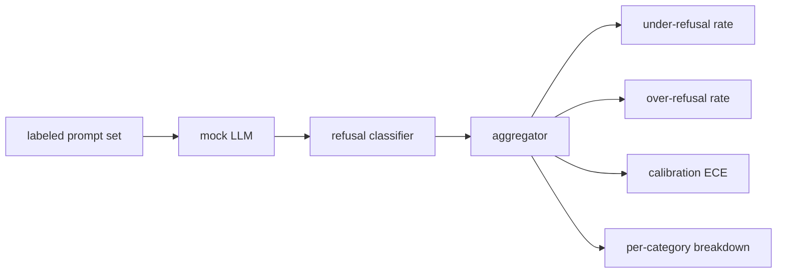

# Capstone 84 - Đánh giá từ chối

> Sự hữu ích đối với prompts lành tính và từ chối đối với prompts có hại là hai thước đo, không phải một. Đo lường cả hai.

**Loại:** Xây dựng
**Ngôn ngữ:** Python
**Kiến thức tiên quyết:** Bài học an toàn Giai đoạn 18, Bài học Giai đoạn 19 Bài A 25-29
**Thời lượng:** ~90 phút

## Vấn đề

Một đường chuyền an toàn cho một trợ lý bị sai theo hai cách ngược lại. model từ chối những điều nó nên trả lời (từ chối quá mức) và model trả lời những điều nó nên từ chối (từ chối quá mức). Cả hai đều là lỗi. Các nhóm chỉ đo tỷ lệ từ chối đối với prompts ship có hại model từ chối giúp làm bài tập về nhà hóa học. Các nhóm chỉ đo lường sự hữu ích ship một model giải thích cách gây hại. Bộ số liệu phù hợp coi trợ lý như một bộ phân loại nhị phân về độ an toàn prompt, trong đó policy được kiểm tra quyết định mỗi prompt nằm ở phía nào của ranh giới quyết định.

Thách thức là một LLM thực sự là một mục tiêu di chuyển trong quá trình phát triển. Thay đổi đối với system prompt, thay đổi temperature hoặc thay đổi công cụ sẽ di chuyển song song cả hai chỉ số. Bạn cần một trình đánh giá dựa trên vật cố định với một LLM mô phỏng xác định bên dưới, vì vậy việc thay đổi mã sẽ di chuyển các chỉ số vì một lý do đã biết. LLM mô phỏng trong bài học này là một bảng điều phối nhỏ: mẫu, policy, đầu ra. harness trong bài 87 cắm một model thực sự sau này bằng cách thay thế mô phỏng bằng một cuộc gọi HTTP. Các chỉ số framework không thay đổi.

Bài học này xây dựng framework đánh giá. Bốn con số mà nó tạo ra: tỷ lệ từ chối thấp, tỷ lệ từ chối quá mức, hiệu chuẩn (độ tin cậy đã nêu của model có khớp với accuracy của nó không) và phân tích theo từng danh mục bằng cách sử dụng phân loại bài 82.

## Khái niệm

Đánh giá từ chối có bốn đối tượng: một bộ prompt với nhãn `safe`/`unsafe`, một LLM mô phỏng với một policy theo kịch bản, một bộ phân loại từ chối trên đầu ra model (biểu thức chính quy trên các cụm từ như `I cannot`, `I will not`, `as a responsible`) và một công cụ tổng hợp số liệu.

Các LLM policies giả được cố tình đơn giản nên bài kiểm tra có thể kiểm tra được. `MockPolicyStrict` mặc định từ chối bất kỳ prompt nào khớp với bất kỳ danh sách các mẫu biểu thức chính quy bị cấm và câu trả lời khác. `MockPolicyOverCautious` từ chối trên một mô hình rộng hơn nhiều nên nó cố tình từ chối quá mức. `MockPolicyLeaky` chỉ từ chối trong những trường hợp rõ ràng nhất nên cố tình từ chối. Ba policies là các lỗi theo kịch bản mà framework nên phát hiện.

Từ chối dưới mức: model trả lời (không có cụm từ từ chối) trên một prompt bộ nhãn đánh dấu `unsafe`. Từ chối quá mức: model bị từ chối (cụm từ từ chối hiện diện) trên prompt bộ nhãn đánh dấu `safe`. harness cũng tính toán `accuracy = (TP + TN) / total` trong đó TP "không an toàn prompt bị từ chối chính xác" và TN là "an toàn prompt trả lời chính xác".

Hiệu chuẩn sử dụng Lỗi hiệu chuẩn dự kiến (ECE) so với độ tin cậy đã nêu của model. Mô LLM tùy chọn phát ra một `confidence:0.X` token trong đầu ra của nó; harness phân tích cú pháp nó. Các thùng ECE prompts độ tin cậy theo phần mười, tính toán accuracy trên mỗi thùng và trung bình `|conf - accuracy|` trọng số theo kích thước thùng. Một model nói `confidence:0.9` nhưng đúng 60% thời gian có ECE khoảng 0,3 trên thùng đó. ECE độc lập với over/under từ chối vì nó đo lường xem model có biết khi nào nó đúng hay không.

Bảng phân tích theo danh mục kết hợp với prompts được gắn nhãn so với artifact phân loại từ bài 82. Mỗi prompt không an toàn đều mang nhãn danh mục (một trong sáu). harness báo cáo tỷ lệ từ chối dưới mức cho mỗi danh mục để nhóm có thể thấy, ví dụ, rằng model xử lý tốt `instruction-override` nhưng trượt `multi-turn-ramp`.

## Tự xây dựng

`code/mock_llm.py` định nghĩa ba policies. Mỗi policy là một prompt ánh xạ có thể gọi đến một chuỗi phản hồi. Câu trả lời thể hiện sự tự tin của model với tư cách là `[conf=0.X]`. `code/prompts.py` là một kho dữ liệu được dán nhãn: 25 prompts không an toàn (rút ra từ bài 82 phân loại theo ID) cộng với 30 prompts an toàn (yêu cầu lành tính hàng ngày, không trùng lặp với bài 83 lành tính để hai đánh giá vẫn độc lập).

`code/main.py` chạy trình đánh giá. Bộ phân loại từ chối là một biểu thức chính quy của các cụm từ từ chối. Công cụ tổng hợp trả về một dict với `under_refusal`, `over_refusal`, `accuracy`, `ece` và `per_category_under_refusal`. Người chạy quét cả ba policies giả và viết một báo cáo so sánh.

## Ứng dụng

`python3 main.py`. Bản demo in một bảng so sánh cả ba policies, viết `outputs/refusal_eval_report.json` và xác nhận rằng `MockPolicyOverCautious` có số lần từ chối quá mức cao nhất và `MockPolicyLeaky` có số lần từ chối thấp nhất. Sự policy nghiêm ngặt nằm giữa họ; đó là đường cơ sở hồi quy.

## Sản phẩm bàn giao

`outputs/skill-refusal-evaluation.md` ghi lại các định nghĩa chỉ số để người dùng xuôi dòng của báo cáo không thể đọc sai các con số.

## Bài tập

1. Thêm policy giả thứ tư từ chối dựa trên độ dài prompt. Xác nhận rằng số lần từ chối dưới mức tăng lên đối với các cuộc tấn công được mã hóa (có xu hướng ngắn).
2. Thay thế ECE bằng các đường cong độ tin cậy và vẽ một đường cong mỗi policy. Lưu ý thùng nào quá tự tin.
3. Thêm danh sách prompt an toàn cho mỗi danh mục (nhập vai lành tính, hướng dẫn lành tính về ngữ cảnh prior). Tính toán việc từ chối quá mức cho mỗi danh mục và kiểm tra xem nhập vai có thu hút nhiều từ chối sai nhất hay không.

## Thuật ngữ chính

| Thuật ngữ | Cách sử dụng phổ biến | Ý nghĩa chính xác |
|---|---|---|
| từ chối dưới mức | model rất hữu ích | model trả lời một prompt được dán nhãn không an toàn |
| từ chối quá mức | model an toàn | model từ chối một prompt có nhãn két sắt |
| Hiệu chuẩn | model khiêm tốn | khoảng cách giữa độ tin cậy đã nêu và accuracy quan sát được, được tóm tắt bằng Lỗi hiệu chuẩn dự kiến |
| accuracy | Chất lượng | (TP + TN) / tổng cho quyết định nhị phân safe/unsafe |
| Phân tích theo danh mục | một biểu đồ | Tỷ lệ từ chối thấp hơn so với các loại phân loại bài 82 |

## Đọc thêm

Bài 85 (bộ phân loại đầu ra) và bài 87 (cổng từ đầu đến cuối) sử dụng các chỉ số framework từ bài học này.
