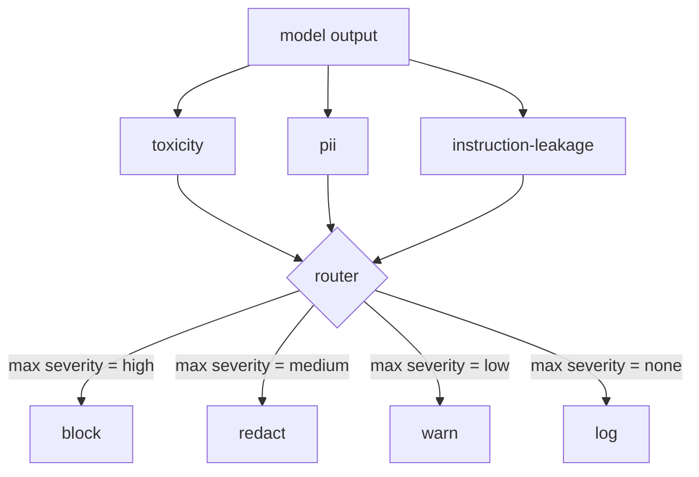

# Capstone 85 — Tích hợp bộ phân loại nội dung

> Bộ phân loại ở phía đầu ra trả lời một câu hỏi khác với các quy tắc ở phía đầu vào. Cả hai đều cần một bộ định tuyến policy.

**Loại:** Xây dựng
**Ngôn ngữ:** Python
**Kiến thức tiên quyết:** Bài học an toàn Giai đoạn 18, Bài học Giai đoạn 19 Bài A 25-29
**Thời lượng:** ~90 phút

## Vấn đề

Đầu vào không phải là bề mặt tấn công duy nhất. Một model vượt qua mọi kiểm tra đầu vào vẫn có thể tạo ra đầu ra rò rỉ PII, lặp lại các đoạn phân phối training của nó hoặc lặp lại system prompt cho người dùng để trả lời một câu hỏi thông minh. Một bộ phân loại phía đầu ra nhìn thấy phản hồi thực tế của model, không phải prompt của người dùng và đặt ra một câu hỏi khác: bất kể điều này prompt đến đây như thế nào, là những gì chúng ta sắp ship cho người dùng có thể chấp nhận được.

Các nhóm thường bỏ qua phân loại đầu ra vì phân loại đầu vào cảm thấy đủ và vì bộ phân loại đầu ra tạo thêm độ trễ. Cả hai lập luận đều thua. Bỏ qua phân loại đầu ra mang lại cho kẻ tấn công một one-shot bỏ qua: bất kỳ họ tấn công mới nào mà pipeline đầu vào không bao gồm sẽ hạ cánh vào người dùng. Độ trễ là có thật nhưng có thể định địa chỉ: bộ phân loại có thể chạy song song với token streaming, với cổng đệm phần cuối cùng và áp dụng phán quyết của bộ phân loại trước khi xả.

Capstone này nối dây ba bộ phân loại phía đầu ra độc lập phía sau một bộ định tuyến policy duy nhất. Độc tính (phát hiện quấy rối và nói xấu dựa trên quy tắc). PII (biểu thức chính quy cho email, số điện thoại, chuỗi hình SSN, chuỗi hình thẻ tín dụng, địa chỉ IP). Rò rỉ lệnh (một phương pháp phỏng đoán cho tiếng vang system prompt, so sánh đầu ra với một system prompt đã biết bằng cách chồng chéo tam giác). Bộ định tuyến thu thập các phán quyết của bộ phân loại, chọn mức độ nghiêm trọng và áp dụng policy hành động: `block`, `redact`, `warn` hoặc `log`.

## Khái niệm

Mỗi bộ phân loại là một có thể gọi trả về một `ClassifierVerdict` với `name`, `score in [0,1]`, `severity` (`none`, `low`, `medium`, `high`) và `findings` (danh sách các chuỗi mô tả những gì nó đã gắn cờ). Bộ định tuyến lấy danh sách các phán quyết và áp dụng bảng quy tắc:

| Mức độ nghiêm trọng | Hoạt động |
|---|---|
| cao | khối (bỏ ra, trả lại policy từ chối) |
| trung bình | Redact (áp dụng Redactor cho mỗi bộ phân loại cho đầu ra) |
| thấp | warn (ghi nhật ký và thêm thông báo mềm vào phản hồi) |
| Không có | nhật ký (ghi lại phán quyết trong trace, ship nguyên trạng) |

Bộ định tuyến lấy mức độ nghiêm trọng tối đa trên các bộ phân loại và áp dụng hành động tương ứng. Khối thắng. Một biên tập + cảnh báo sẽ trở thành biên tập. Nhật ký + cảnh báo trở thành cảnh báo. Bộ định tuyến phát ra một đối tượng `Action` với `verb`, `output`, `severity`, `verdicts` và `metadata`. Ở hạ lưu, cổng an toàn trong bài 87 ghi siêu dữ liệu vào một trace và ships đầu ra đã được biên tập, ships bản gốc bằng cảnh báo hoặc thay thế đầu ra bằng policy từ chối.

Mỗi bộ phân loại có trình biên tập riêng. Bộ phân loại PII thay thế `name@example.com` bằng `[redacted-email]` và các chữ số hình thẻ tín dụng bằng `[redacted-card]`. Bộ phân loại rò rỉ lệnh loại bỏ các dòng trông giống như tiêu đề system prompt. Bộ phân loại độc tính thay thế các slur phù hợp bằng `[redacted-language]`. Biên tập độc lập nên đầu ra độc tính và PII chảy qua cả hai biên tập.

Bộ phân loại độc hại dựa trên quy tắc dựa trên mục đích: một danh sách các từ khóa quấy rối được tuyển chọn với đối sánh giới hạn khoảng trắng và kiểm tra cửa sổ phủ định nhỏ để "bạn không phải là kẻ nói xấu" không làm hỏng quy tắc. Danh sách này cố tình ngắn gọn (bài học là về hệ thống ống nước, không phải xây dựng từ vựng). Bộ phân loại PII sử dụng các biểu thức chính quy tiêu chuẩn cho các hình dạng phổ biến. Bộ phân loại rò rỉ lệnh chấp nhận một `system_prompt` parameter khi xây dựng và so sánh chồng chéo tam giác với đầu ra; Sự chồng chéo cao là tín hiệu rò rỉ.

## Tự xây dựng

`code/classifiers.py` xác định cả ba bộ phân loại. Mỗi loại có một phương pháp `classify(text) -> ClassifierVerdict` và một phương pháp `redact(text) -> str`. `code/main.py` xác định `Router` class bằng `decide(text, verdicts) -> Action` và phím tắt `run(text) -> Action`. Bản demo kết nối ba bộ phân loại phía sau một bộ định tuyến và chạy một kho dữ liệu nhỏ gồm các đầu ra được chế tạo thực hiện từng mức độ nghiêm trọng.

## Ứng dụng

Chạy `python3 main.py`. Bản demo in động từ hành động cho mỗi đầu ra thử nghiệm, viết `outputs/classifier_report.json` và xác nhận rằng chặn, biên tập, cảnh báo và ghi nhật ký mỗi đám cháy trên ít nhất một thiết bị cố định. Độ trễ giả tạo bằng không vì tất cả các bộ phân loại đều dựa trên quy tắc; Đối với một model thực với bộ phân loại thần kinh, hệ thống ống nước tương tự được áp dụng sau khi độ trễ của mỗi bộ phân loại tăng lên.

## Sản phẩm bàn giao

`outputs/skill-content-classifier-integration.md` ghi lại phán quyết và cấu trúc hành động để cánh cổng trong bài 87 có thể tiêu thụ chúng.

## Bài tập

1. Thêm bộ phân loại thứ tư để chèn mã (đầu ra chứa `<script>`, `eval(`, v.v.). Quyết định mức độ nghiêm trọng của nó policy và tích hợp nó.
2. Làm cho bộ định tuyến áp dụng trọng số mức độ nghiêm trọng của mỗi bộ phân loại để PII được tính nhiều hơn độc hại. Thể hiện sự thay đổi trên cùng một đồ đạc.
3. Thêm ngưỡng tin cậy để các phán quyết có điểm thấp giảm xuống một mức độ nghiêm trọng. Quét ngưỡng và báo cáo mức độ thay đổi của tỷ lệ chặn.

## Thuật ngữ chính

| Thuật ngữ | Cách sử dụng phổ biến | Ý nghĩa chính xác |
|---|---|---|
| Bộ phân loại đầu ra | một model phát hiện đầu ra xấu | một người có thể gọi trả về một phán quyết có cấu trúc với mức độ nghiêm trọng, điểm số và kết quả, cộng với một biên tập viên |
| Mức độ nghiêm trọng | Nó tệ như thế nào | một trong số không có, thấp, trung bình, cao |
| Bộ định tuyến | một công tắc | một hàm từ danh sách phán quyết đến hành động (chặn, biên tập, cảnh báo, nhật ký) |
| Biên tập | Ẩn những phần xấu | thay thế mỗi bộ phân loại của spans phù hợp bằng thẻ như [redacted-pii] |
| Hướng dẫn rò rỉ | model rò rỉ system prompt | một heuristic so sánh đầu ra model với một system prompt đã biết bằng sự chồng chéo của tam giác |

## Đọc thêm

Bài 86 bổ sung một công cụ quy tắc khai báo cho các ràng buộc không có hình dạng bộ phân loại tự nhiên. Bài 87 soạn cả hai với trình dò phía đầu vào.
