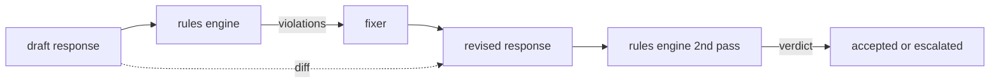

# Capstone 86 — Công cụ quy tắc hiến pháp

> Quy tắc là một cái tên, một vị ngữ và một lời giải thích. Bất cứ điều gì thiếu một trong ba điều đó là một sự rung cảm, không phải là một quy tắc.

**Loại:** Xây dựng
**Ngôn ngữ:** Python, YAML
**Kiến thức tiên quyết:** Bài học an toàn Giai đoạn 18, Bài học Giai đoạn 19 Bài A 25-29
**Thời lượng:** ~90 phút

## Vấn đề

Bộ phân loại bao gồm các lỗi có thể nhận biết. Các công cụ quy tắc bao gồm các công cụ hợp đồng. Một nhóm viết trợ lý mã hóa muốn có một ràng buộc như "mọi phản hồi có chứa mã phải kết thúc bằng một khối có thể chạy được hoặc một giả định đã nêu". Một nhóm điều hành bot hỗ trợ khách hàng muốn "mọi từ chối phải đưa ra bước tiếp theo". Những ràng buộc này không phải là mục tiêu phân loại tự nhiên. Chúng là vị ngữ trên phản hồi, cuộc trò chuyện và policy hệ thống, và chúng cần phải được đọc bởi một người không phải là kỹ sư.

Biểu diễn trung thực là một tệp khai báo. Một hiến pháp tồn tại trong YAML cùng với bộ mã, trong kiểm soát phiên bản, với một process xem xét riêng biệt. Mỗi quy tắc có một `name`, một `predicate`, một `severity` và một mẫu `explanation`. Công cụ tải tệp, đánh giá từng quy tắc dựa trên đầu ra của ứng viên và trả về `Violation` có cấu trúc cho mỗi quy tắc đã kích hoạt. Công cụ quy tắc trong capstone này soạn các vị ngữ với `all_of`, `any_of` và `not_` để một quy tắc duy nhất có thể thể hiện "nếu phản hồi chứa mã, nó phải kết thúc bằng một khối có thể chạy VÀ không tham chiếu thư viện chỉ nội bộ."

Nửa còn lại của bài học là ôn tập. Một công cụ quy tắc chỉ chặn được xây dựng một nửa. Một công cụ quy tắc đề xuất một bản sửa lỗi hữu ích về mặt hoạt động: trợ lý soạn thảo một phản hồi, công cụ gắn cờ vi phạm, một trình sửa lỗi tạo ra một phản hồi sửa đổi và công cụ xác nhận việc sửa đổi thỏa mãn các quy tắc. Bài học ships một trình sửa chữa tối thiểu (thay thế regex cho mỗi quy tắc) và một sự khác biệt có cấu trúc (thêm, xóa, chỉnh sửa từng dòng) giữa bản nháp và sửa đổi.

## Khái niệm



Một quy tắc có hình dạng

```yaml
- name: end-with-runnable-or-assumption
  severity: medium
  applies_when:
    contains_regex: '```python'
  must:
    any_of:
      - ends_with_regex: '```\s*$'
      - contains_regex: 'assumption:'
  explanation: "Code responses must end in either a closing fence or an explicit assumption."
  fix:
    append_if_missing: "\n\nAssumption: example inputs are valid."
```

Vị ngữ là nguyên tử: `contains_regex`, `not_contains_regex`, `ends_with_regex`, `starts_with_regex`, `max_words`, `min_words`. Các tác phẩm là `all_of`, `any_of`, `not_`. Động cơ đánh giá `applies_when` trước; Nếu quy tắc không áp dụng, vi phạm được ghi nhận là `not_applicable`. Nếu không, động cơ sẽ đánh giá `must` và tạo ra `pass` hoặc `violation`.

Mức độ nghiêm trọng là `low`, `medium`, `high`, phản chiếu bài 85. Cổng xuôi dòng (bài 87) xử lý vi phạm quy tắc `high` giống như phán quyết của bộ phân loại `high`: block.

Trình sửa lỗi là một danh sách các hoạt động khai báo: `append_if_missing`, `prepend_if_missing`, `replace_regex`. Mỗi hoạt động ánh xạ một quy tắc theo tên với một phép biến đổi. Trình sửa lỗi được cố ý giới hạn trong các sửa đổi cục bộ; Viết lại cấu trúc thuộc về một lớp từ chối và trợ giúp riêng biệt không được đề cập ở đây.

Sự khác biệt được tính toán dựa trên bản gốc và bản sửa đổi. Đó là danh sách các bản ghi `Change` với `op` (thêm, xóa, chỉnh sửa) và văn bản có liên quan. Cổng xuôi dòng có thể ghi lại sự khác biệt để người đánh giá kiểm tra hành vi của người sửa lỗi theo thời gian.

## Tự xây dựng

`code/rules.yml` nắm giữ hiến pháp. Trình tải trong `code/main.py` chấp nhận tệp YAML (khi PyYAML) hoặc tệp JSON (tích hợp sẵn). Bài học ships một `rules.yml` rằng các bài kiểm tra phân tích cú pháp theo cả hai đường dẫn mã. `code/main.py` định nghĩa `Engine` và `Fixer` classes và hàm `diff`. Các thành phần được đánh giá đệ quy với ngắn mạch trên `any_of`.

Hiến pháp như shipped:

- `no-empty-refusal` (trung bình) - từ chối phải bao gồm đề xuất hoặc chuyển hướng
- `end-with-runnable-or-assumption` (trung bình) - phản hồi mã phải đóng gọn gàng
- `no-pii-in-examples` (cao) - dữ liệu ví dụ không được chứa email hoặc hình dạng điện thoại
- `cite-when-asserting-fact` (thấp) - các dòng bắt đầu bằng "Theo cho" phải chứa trích dẫn trong ngoặc đơn
- `no-internal-library-leak` (cao) - các từ `internal-only` và `policybot-internal` không được xuất hiện trong đầu ra
- `bounded-length` (thấp) - câu trả lời không được vượt quá 800 từ

## Ứng dụng

`python3 main.py`. Bản demo chạy ba phản hồi nháp thông qua công cụ, in vi phạm, chạy trình sửa lỗi, in diff và viết `outputs/rules_report.json`. Một cố định có quy tắc không áp dụng (không có khối mã trong bản nháp) và báo cáo hiển thị `not_applicable` cho quy tắc đó để nhóm thấy công cụ đánh giá nó một cách rõ ràng.

## Sản phẩm bàn giao

`outputs/skill-constitutional-rules-engine.md` ghi lại ngữ pháp quy tắc và các hoạt động sửa chữa.

## Bài tập

1. Thêm một quy tắc yêu cầu mọi câu trả lời phải bao gồm cụm từ "Nếu điều này là khẩn cấp" khi prompt đề cập đến sự an toàn. Sử dụng bố cục.
2. Thay thế trình sửa lỗi biểu thức chính quy bằng trình sửa lỗi mẫu lấy các vị trí được đặt tên. Thể hiện một quy tắc được viết lại theo thiết kế mới.
3. Thêm một chỉ số endpoint, với một kho dữ liệu bản nháp, trả về tỷ lệ vi phạm trên mỗi quy tắc để nhóm có thể xem quy tắc nào đang kích hoạt quá mức.

## Thuật ngữ chính

| Thuật ngữ | Cách sử dụng phổ biến | Ý nghĩa chính xác |
|---|---|---|
| Hiến pháp | Một tài liệu policy mơ hồ | một tệp quy tắc YAML với các vị ngữ, mức độ nghiêm trọng và giải thích |
| Vị ngữ | một tấm séc | có thể gọi từ văn bản thành bool, nguyên tử hoặc sáng tác qua all_of/any_of/not_ |
| Vi phạm | một thất bại | một bản ghi có cấu trúc với tên quy tắc, mức độ nghiêm trọng, giải thích và span phù hợp |
| người sửa chữa | một model fine-tune | một bản nháp ánh xạ chuyển đổi theo quy tắc xác định thành sửa đổi |
| khác biệt | so sánh chuỗi | Danh sách có cấu trúc các thao tác thêm, xóa, chỉnh sửa giữa bản nháp và sửa đổi |

## Đọc thêm

Bài 87 kết hợp công cụ này với bộ dò phía đầu vào và bộ phân loại phía đầu ra thành một cổng an toàn duy nhất.
