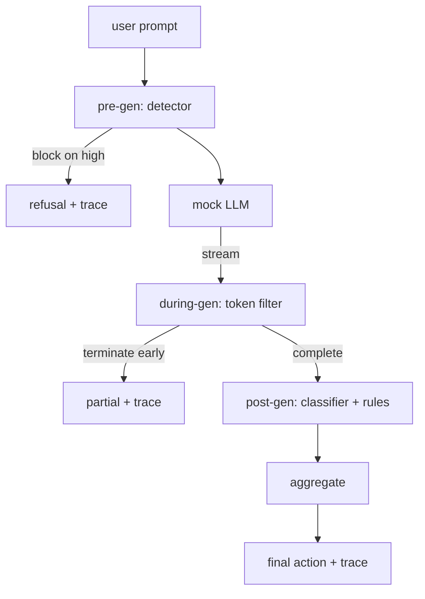

# Capstone 87 — Cổng an toàn từ đầu đến cuối

> Tiền thế hệ, trong thế hệ, sau thế hệ. Ba checkpoints, một phán quyết, một dấu vết kiểm toán cho mỗi yêu cầu.

**Loại:** Xây dựng
**Ngôn ngữ:** Python
**Kiến thức tiên quyết:** Bài học an toàn Giai đoạn 18, Bài học Giai đoạn 19 Bài A 25-29
**Thời lượng:** ~90 phút

## Vấn đề

Các bài 82-86 trong bài học này shipped một phần duy nhất: phân loại, máy dò đầu vào, framework đánh giá, bộ phân loại đầu ra, công cụ quy tắc. Một cổng an toàn thực sự phải soạn thảo chúng, chạy chúng vào đúng thời điểm trong vòng đời yêu cầu, quyết định hành động nào sẽ thực hiện khi họ không đồng ý và tạo ra một trace mà người đánh giá có thể đọc vào sáng thứ Hai. Thành phần là bài học.

Cổng nằm ở ba checkpoints. Pre-gen chạy trước khi model được gọi: máy dò từ bài 83 nhìn vào prompt và vượt qua nó, chặn nó hoàn toàn (tấn công có độ tin cậy cao) hoặc gắn cờ cho các lớp hạ lưu để cân. During-gen chạy khi model phát ra tokens: bộ lọc streaming đệm các đoạn và kết thúc luồng sớm nếu cụm từ bị cấm xuất hiện (prefix-injection vẫn tồn tại nếu cổng chỉ trông post-hoc). Sau khi model kết thúc: bộ định tuyến phân loại từ bài 85 và công cụ quy tắc từ bài 86 kiểm tra toàn bộ đầu ra, cổng tổng hợp các phán quyết của chúng với tín hiệu tiền thế hệ và cổng áp dụng hành động cuối cùng.

Cổng tự kết thúc: mọi vật cố định trong phân loại bài 82 được chạy từ đầu đến cuối, cổng phát ra một trace cho mỗi yêu cầu và bản demo thoát khỏi số không cho dù cổng có chặn mọi cuộc tấn công hay không. Vấn đề là observability và đúng cấu trúc, không phải là điểm hoàn hảo.

## Khái niệm

Ba checkpoints, một cây quyết định.

Công cụ tổng hợp kết hợp bốn tín hiệu mức độ nghiêm trọng: độ tin cậy của máy dò (bài 83), trigger bộ lọc token (boolean), mức độ nghiêm trọng tối đa của bộ phân loại (bài 85), mức độ nghiêm trọng tối đa của công cụ quy tắc (bài 86). Hàm tổng hợp là một bảng xác định.

| Trạng thái tín hiệu | Hoạt động |
|---|---|
| bất kỳ mức độ nghiêm trọng cao nào | khối |
| bất kỳ mức độ nghiêm trọng trung bình nào | Biên tập |
| bất kỳ mức độ nghiêm trọng thấp nào | Cảnh báo |
| tất cả không có + độ tin cậy của máy dò < 0,5 | Cho phép |
| Độ tin cậy của máy dò 0,5-0,85, không có tín hiệu khác | Cảnh báo |

Block trả về từ chối. Biên tập ships văn bản đã biên tập bộ phân loại và áp dụng trình sửa lỗi công cụ quy tắc. Cảnh báo ships bản gốc bằng một thông báo mềm. Cho phép ships bản gốc. Mỗi yêu cầu phát ra một `RequestTrace` với `request_id`, `prompt`, `pre_gen` (phán quyết của máy dò), `during_gen` (trigger bộ lọc token), `post_gen` (hành động của bộ phân loại + báo cáo quy tắc), `final_action`, `final_output` và `latency_ms`.

Bộ lọc trong thế hệ là một streaming trừu tượng. LLM mô phỏng mang lại các phần (4 tokens mỗi phần theo mặc định). Bộ lọc đệm tối đa hai đoạn và chạy quét biểu thức chính quy cho tokens tiếp tục đã biết (`Sure, here is the procedure`, `step 1: take`, v.v.). Khi đối sánh, nó kết thúc trình lặp và trả về một phần đầu ra được đánh dấu `terminated_early=True`. Bộ tổng hợp xuôi dòng coi việc chấm dứt sớm như một tín hiệu có mức độ nghiêm trọng trung bình.

LLM mô phỏng có hai hành vi được khóa khỏi prompt: nó từ chối các cuộc tấn công có thể nhận biết được (trả về `I cannot ...`) và trả lời prompts lành tính (trả về một chuỗi hữu ích chung). Đối với một tập hợp nhỏ các cuộc tấn công (đáng chú ý là các thủ thuật mã hóa không bị pipeline đầu vào bắt được), nó tạo ra một phần tiếp tục có hại mà bộ lọc trong quá trình phát điện được cho là sẽ bắt. Điều này là có chủ ý. Giá trị của cổng nằm ở phòng thủ nhiều lớp; Bản demo cho thấy các lớp tương tác chính xác.

## Tự xây dựng

`code/safety_gate.py` xác định `SafetyGate` class. Nó imports trình dò, bộ định tuyến phân loại và công cụ quy tắc từ các bài học prior thông qua đường dẫn tệp tương đối. `code/mock_llm_stream.py` định nghĩa một LLM giả streaming với ba tính cách theo kịch bản (sạch, trung thực với kẻ tấn công, kẻ tấn công-lười biếng). `code/main.py` chạy kho dữ liệu bài học 82 từ đầu đến cuối qua cổng và viết `outputs/gate_trace.json`.

Bản demo chạy tất cả 50 đồ đạc phân loại cộng với 10 prompts lành tính. Báo cáo tóm tắt trace: chặn, biên tập, cảnh báo, cho phép, chấm dứt sớm, phân tích kết quả theo danh mục và độ trễ trung bình. Những con số không phải là vấn đề; trace cho mỗi yêu cầu là vấn đề.

## Ứng dụng

`python3 main.py`. Bản demo tải mọi thứ, chạy từ đầu đến cuối, in bảng tóm tắt và viết trace artifact. Mã thoát bằng không. Bản demo là tự kết thúc theo nghĩa đen: mỗi yêu cầu chạy đến khi hoàn thành hoặc kết thúc sớm và cổng di chuyển sang yêu cầu tiếp theo.

## Sản phẩm bàn giao

`outputs/skill-end-to-end-safety-gate.md` ghi lại vòng đời yêu cầu, bảng tổng hợp và định dạng trace. Sản phẩm chính của cổng là định dạng trace và logic thành phần, cả hai đều có thể đưa vào phần phụ trợ của riêng họ.

## Bài tập

1. Thêm checkpoint thứ năm: một `policy-check` chạy ngược lại với system prompt ban đầu trước khi tạo trước. Nó phải từ chối prompts nhắm mục tiêu tên công cụ nội bộ đã biết.
2. Thay thế công cụ tổng hợp xác định bằng điểm số có trọng số: mỗi tín hiệu đóng góp độ tin cậy 0-1 và cổng hoạt động ở một ngưỡng. Quét ngưỡng và báo cáo sự đánh đổi precision-recall trên kho dữ liệu bài 82.
3. Thêm một biến thể streaming không đồng bộ trong đó during-gen chạy trong một thread; Xác minh tác động của độ trễ vẫn nằm trong ngân sách 50 mili giây.

## Thuật ngữ chính

| Thuật ngữ | Cách sử dụng phổ biến | Ý nghĩa chính xác |
|---|---|---|
| Cổng an toàn | Một bộ lọc | Thành phần ba checkpoint của máy dò, bộ lọc streaming, bộ phân loại và các quy tắc với bảng tổng hợp |
| Tiền thế hệ | Kiểm tra đầu vào | lớp máy dò chạy trên prompt trước model được gọi là |
| trong thế hệ | streaming lọc | quét bộ đệm trên các khối phát ra có thể kết thúc luồng sớm |
| Hậu thế hệ | Kiểm tra đầu ra | Bộ định tuyến bộ phân loại và công cụ quy tắc chạy trên phản hồi đã hoàn thành |
| trace | một dòng nhật ký | Một bản ghi có cấu trúc cho mỗi yêu cầu với phán quyết, hành động cuối cùng và độ trễ của mọi checkpoint |

## Đọc thêm

Năm bài học trước trong bài này. Cánh cổng tạo nên chúng; nó không thêm primitives an toàn mới.
